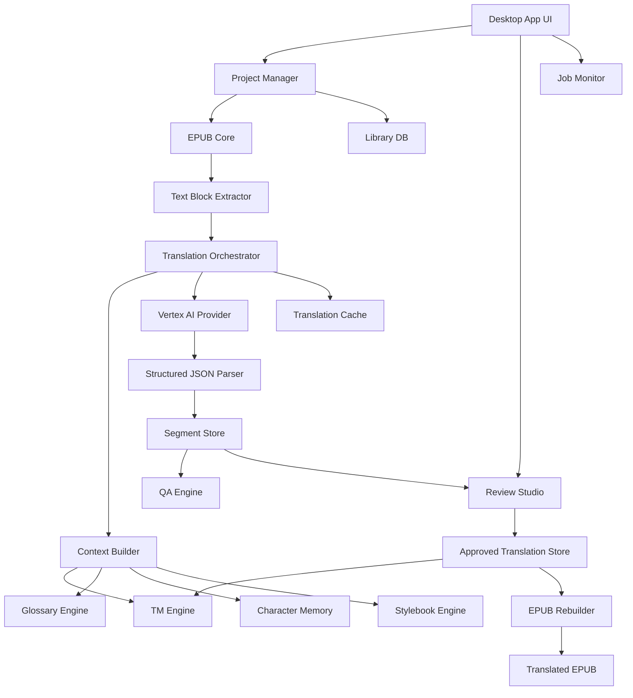
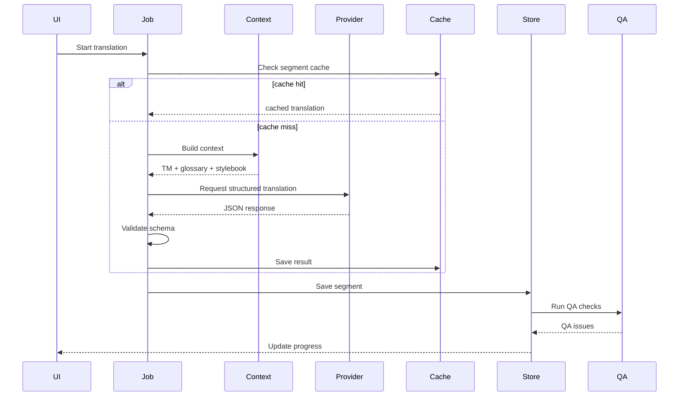
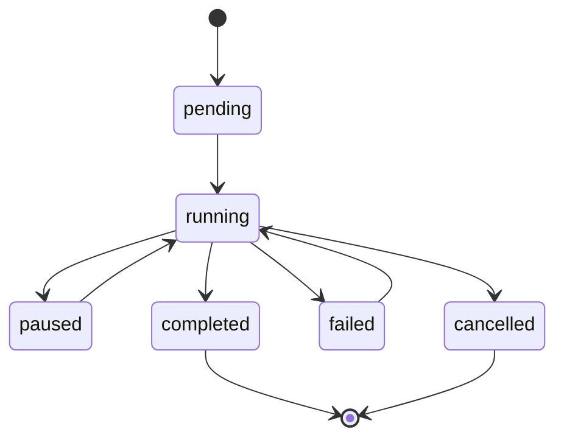
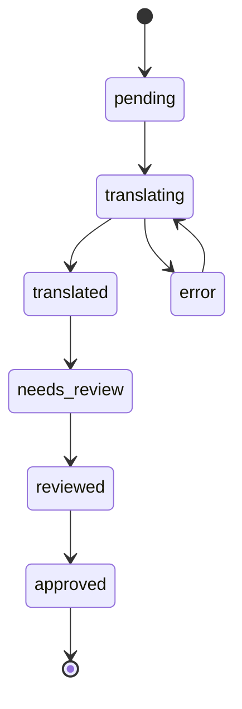

# Series Translation Studio 기획 및 시스템 설계서

## 0. 문서 개요

이 문서는 영어 EPUB 장편 시리즈를 한국어로 개인 감상용 번역하기 위한 데스크톱 앱의 기획서와 시스템 설계서다.

초기 목표 작품군은 루이스 맥마스터 부졸드의 보르코시건 시리즈를 상정한다. 다만 설계는 특정 작품에 종속되지 않고, 장편 시리즈 전반에 재사용 가능한 구조로 잡는다.

핵심 개념은 단순한 EPUB 자동번역기가 아니라 다음과 같은 흐름을 제공하는 **장편 시리즈 번역 스튜디오**다.

```text
기존 번역권 분석
→ TM / glossary / stylebook 구축
→ 신규 권 초벌 번역
→ 사람 감수
→ TM / glossary 업데이트
→ 시리즈 전체 일관성 유지
→ EPUB 출력
```

---

## 1. 제품 정의

### 1.1 제품명

가칭: **Series Translation Studio**

프로젝트 내부 코드명: **STS**

### 1.2 한 줄 설명

기존 번역본과 원서를 정렬하여 번역 메모리와 용어집을 구축하고, 이를 기반으로 미번역 장편 시리즈를 일관된 문체와 용어로 한국어 EPUB로 번역·감수하는 데스크톱 앱.

### 1.3 문제 정의

장편 시리즈 소설을 AI로 번역할 때 다음 문제가 발생한다.

1. 권마다 고유명사 번역이 흔들린다.
2. 인물 말투와 호칭이 일관되지 않는다.
3. 기존 정발 번역본과 용어가 맞지 않는다.
4. 번역 중간에 비용이 많이 든다.
5. 번역을 중단했다가 재개하기 어렵다.
6. AI 번역문을 사람이 감수하기 위한 UI가 부족하다.
7. 미발간권 번역 전에 기존 번역권의 자산을 재활용하기 어렵다.
8. EPUB 구조, 목차, 이미지, 스타일을 유지한 채 번역본을 재생성하기 어렵다.

### 1.4 해결 방향

Series Translation Studio는 다음 방식으로 문제를 해결한다.

1. 기존 영어 원문과 한국어 번역본을 정렬하여 TM을 만든다.
2. 인명, 지명, 가문명, 계급, 함선명, 행성명, 기술용어를 glossary로 관리한다.
3. 작품별, 시리즈별 stylebook을 만든다.
4. 번역 시 TM, glossary, character profile, stylebook을 검색하여 프롬프트에 삽입한다.
5. AI 응답은 JSON 구조로 받아 번역문, 불확실 용어, QA 경고를 분리 저장한다.
6. Review Studio에서 원문, AI 번역, 기존 번역, TM 추천, glossary hit를 나란히 본다.
7. 감수 결과를 다시 TM과 glossary에 반영한다.
8. 최종적으로 원본 EPUB 구조를 유지한 한국어 EPUB를 생성한다.

---

## 2. 사용자 시나리오

### 2.1 대표 사용자

- 영어 원서를 구매했지만 영어로 장편을 읽기 힘든 독자
- 정발 번역이 중단된 시리즈를 개인 감상용으로 계속 읽고 싶은 독자
- 기존 정발 번역의 용어와 문체를 참고하여 미번역권을 일관되게 번역하고 싶은 사용자
- AI 번역을 그대로 쓰는 것이 아니라 직접 감수하면서 품질을 올리고 싶은 사용자

### 2.2 주요 사용 흐름

#### 흐름 A: 기존 번역권에서 TM 구축

```text
1. 새 시리즈 프로젝트 생성
2. 영어 EPUB 추가
3. 한국어 EPUB 또는 TXT 추가
4. 챕터 자동 매칭
5. 문단 자동 정렬
6. 낮은 confidence 구간 수동 보정
7. 승인된 align pair를 TM으로 저장
8. 용어 후보 추출
9. glossary 확정
10. stylebook 초안 생성
```

#### 흐름 B: 기존 한국어판이 있는 권을 재번역/감수

```text
1. 영어 EPUB와 기존 한국어판 입력
2. Phase 1 TM / glossary / stylebook 로드
3. AI 초벌 번역
4. 기존 한국어판과 비교
5. 사용자가 더 좋은 표현으로 감수
6. 감수본을 TM에 반영
7. 새 용어와 캐릭터 정보를 업데이트
```

#### 흐름 C: 미발간권 번역

```text
1. 미발간 영어 EPUB 입력
2. 시리즈 프로필 선택
3. 챕터별 자동 번역 실행
4. QA 검사
5. Review Studio에서 감수
6. 최종 EPUB 생성
```

---

## 3. 개발 목표와 비목표

### 3.1 목표

- EPUB 원본 구조를 최대한 유지한 번역 EPUB 생성
- Vertex AI Gemini 기반 한국어 문학 번역
- TM / glossary / stylebook 기반의 일관성 유지
- 기존 영어-한국어 번역권 정렬 기능
- 감수 UI 제공
- 중단 후 재개 가능한 job system
- 번역 비용 절감을 위한 cache와 TM 재사용
- 로컬 중심의 개인용 앱

### 3.2 비목표

초기 버전에서는 다음을 하지 않는다.

- DRM 해제 기능
- 상업적 번역 출판 워크플로우
- 여러 사용자가 동시에 쓰는 서버형 SaaS
- 온라인 공유용 TM 마켓
- 자동 완성된 “출판 품질” 번역 보장
- PDF 스캔 OCR 기반 번역
- 만화/웹툰 이미지 번역
- TTS 오디오북 생성

### 3.3 법적/윤리적 사용 제한

앱은 개인이 합법적으로 보유한 원서와 번역본을 개인 감상용으로 처리하는 도구로 설계한다.

기본 정책:

```text
- DRM 해제 기능은 제공하지 않는다.
- 사용자가 합법적으로 보유한 파일만 입력한다.
- 생성된 번역 EPUB는 개인 감상용으로만 사용한다.
- 원문, 정발 번역문, TM, glossary를 외부 배포하지 않는다.
- 클라우드 AI 전송 전 사용자에게 전송 범위를 명확히 표시한다.
- 프로젝트 데이터는 기본적으로 로컬에 저장한다.
```

---

## 4. Phase 전략

## 4.1 Phase 0: 기반 번역기 MVP

목표: 영어 EPUB를 한국어 EPUB로 번역할 수 있는 최소 기능을 만든다.

기능:

- EPUB 드래그앤드롭
- EPUB unpack
- spine 순서 분석
- XHTML에서 번역 대상 block 추출
- Vertex AI provider 연결
- chunk 단위 번역
- SQLite cache
- 중단 후 재개
- TXT / EPUB 출력
- 기본 glossary CSV 적용

산출물:

```text
translated.epub
translation_job.sqlite
manifest.json
```

완료 기준:

- 영어 EPUB 1권을 입력하면 한국어 EPUB가 생성된다.
- 작업 중단 후 같은 설정으로 재실행하면 완료된 chunk를 재사용한다.
- glossary에 등록된 고유명사가 번역 중 반영된다.

---

## 4.2 Phase 1: 신뢰 가능한 기존 번역권 기반 TM 구축

대상 예시:

```text
Shards of Honor
Barrayar
```

목표:

- 신뢰도가 높은 기존 번역권으로 gold TM과 핵심 glossary를 구축한다.
- 시리즈의 기본 명칭, 호칭, 문체 기준을 만든다.

기능:

- 영어 EPUB와 한국어 EPUB/TXT 동시 입력
- 챕터 자동 매칭
- 문단 정렬
- 문장 정렬 옵션
- 정렬 confidence 계산
- 낮은 confidence 구간 수동 보정
- TM 승인/거부 UI
- 용어 후보 추출
- glossary 편집
- 캐릭터 프로필 생성
- stylebook 초안 생성

산출물:

```text
series.tm.sqlite
series.glossary.csv
series.characters.json
series.stylebook.md
alignment_report.json
```

완료 기준:

- 챕터 단위 95% 이상 자동 매칭 가능
- 문단 단위 80% 이상 자동 정렬 가능
- 승인된 TM을 번역 프롬프트에서 검색 가능
- 주요 인명/지명/계급/가문명 glossary 등록 가능

---

## 4.3 Phase 2: 기존 한국어판이 있는 권의 재번역/감수

대상 예시:

```text
The Warrior's Apprentice
The Vor Game
Cetaganda
Ethan of Athos
Brothers in Arms
Borders of Infinity
Mirror Dance
Memory
```

목표:

- 기존 한국어판을 참고자료로 사용한다.
- 역자별 용어 차이와 문체 차이를 정리한다.
- Phase 1의 TM / glossary / stylebook을 확장한다.

기능:

- 영어 원문, 기존 한국어판, AI 번역 3-way 비교
- 기존 번역과 AI 번역 차이 표시
- glossary 불일치 경고
- 캐릭터 호칭/말투 경고
- 사용자가 선택/수정한 최종문을 TM으로 승격
- 역자별 번역 표현 metadata 저장
- silver TM과 gold TM 구분

완료 기준:

- 기존 한국어판을 그대로 정답으로 삼지 않고 reference로만 표시한다.
- 사용자가 승인한 감수문만 gold TM으로 등록한다.
- 권이 진행될수록 glossary와 stylebook이 누적 개선된다.

---

## 4.4 Phase 3: 미발간권 본번역

목표:

- 기존 축적 자산을 기반으로 한국 미발간권을 자연스럽고 일관되게 번역한다.

기능:

- 시리즈 프로필 로드
- 권별 번역 전략 선택
- TM retrieval
- glossary retrieval
- character profile retrieval
- stylebook retrieval
- chapter summary memory
- cross-chapter term memory
- QA 자동 검사
- 최종 EPUB export

완료 기준:

- 미발간권 1권을 처음부터 끝까지 번역 가능
- 주요 고유명사/호칭 일관성 검사 가능
- 누락 문단/숫자/이름 흔들림 검사 가능
- 감수 후 최종 EPUB 생성 가능

---

## 5. 참고 프로젝트 분석 및 적용 방향

참조 프로젝트: `jesselau76/ebook-GPT-translator`

이 프로젝트에서 참고할 핵심 아이디어는 다음과 같다.

```text
- EPUB/TXT/DOCX/PDF 입력 처리
- 선택적 MOBI 입력
- TXT/EPUB 출력
- GUI 제공
- provider abstraction
- SQLite resume cache
- chunk/token limit
- glossary CSV/XLSX
- long-form consistency
- chapter memory
- rolling translated context
- automatic term memory
- structured JSON output
- manifest file
```

STS에서는 위 기능을 그대로 베끼기보다는 다음과 같이 확장한다.

| 참고 기능 | STS 적용 방향 |
|---|---|
| EPUB 번역 | EPUB 구조 보존형 번역 파이프라인으로 재구현 |
| SQLite cache | job cache + segment cache + TM DB로 분리 |
| glossary | series glossary + context-dependent term 관리 |
| chapter memory | chapter summary + 캐릭터 상태 + 관계 변화 저장 |
| structured JSON | translation / used_terms / uncertain_terms / qa_flags 분리 |
| GUI | 단순 실행 GUI가 아니라 Review Studio 중심 UI |
| provider abstraction | Vertex AI 우선, 추후 OpenAI-compatible 추가 가능 |

---

## 6. 전체 시스템 아키텍처

### 6.1 논리 아키텍처



### 6.2 물리 아키텍처

초기 추천 스택:

```text
Electron
React
TypeScript
Node.js
SQLite
Vertex AI Gemini
Local filesystem project workspace
```

구성:

```text
Electron Main Process
- 파일 접근
- EPUB unpack/repack
- SQLite 접근
- job queue 실행
- Vertex AI 호출

Electron Renderer Process
- React UI
- 프로젝트 관리 화면
- 정렬 보정 화면
- 번역 진행 화면
- Review Studio
- glossary/TM 편집기

Preload Bridge
- 안전한 IPC API 노출
```

---

## 7. 모듈 설계

## 7.1 Project Manager

역할:

- 시리즈 프로젝트 생성/열기/삭제
- 프로젝트 workspace 관리
- 책 metadata 관리
- phase별 진행 상태 관리

주요 개념:

```text
Project
Series
Book
SourceDocument
TranslationJob
```

예시 workspace:

```text
~/SeriesTranslationStudio/projects/vorkosigan/
 ├─ project.sqlite
 ├─ config.json
 ├─ source/
 │   ├─ en/
 │   └─ ko/
 ├─ extracted/
 ├─ cache/
 ├─ output/
 ├─ exports/
 └─ logs/
```

---

## 7.2 EPUB Core

역할:

- EPUB 파일 분석
- spine 순서 파악
- XHTML 추출
- 이미지/CSS/폰트/메타데이터 보존
- 번역된 XHTML 재삽입
- EPUB 재패키징

주의점:

- `mimetype` 파일은 EPUB zip 첫 번째 entry로 무압축 저장해야 한다.
- 원본 CSS와 이미지 asset은 유지한다.
- 본문 block만 번역한다.
- 목차/nav 문서는 별도 처리한다.
- Ruby annotation, italic, bold, footnote link 같은 inline markup은 최대한 유지한다.

번역 대상 block 유형:

```text
p
h1~h6
blockquote
li
div 중 텍스트 중심 block
```

초기에는 복잡한 inline markup을 완벽하게 보존하려 하기보다, block 단위 텍스트 추출과 재삽입을 안정화한다.

---

## 7.3 Text Block Extractor

역할:

- XHTML에서 번역 대상 텍스트 block 추출
- block id 부여
- 원문 위치 보존
- 번역 후 재삽입 가능하도록 mapping 생성

block 예시:

```json
{
  "block_id": "book01_ch03_b0123",
  "book_id": "book01",
  "chapter_id": "ch03",
  "spine_index": 5,
  "xpath": "/html/body/section/p[23]",
  "source_text": "Cordelia looked at him for a long moment.",
  "html_before": "<p>",
  "html_after": "</p>",
  "text_hash": "sha256..."
}
```

---

## 7.4 Alignment Engine

역할:

- 영어 원문과 한국어 번역본 정렬
- 챕터 단위, 문단 단위, 문장 단위 매칭
- confidence score 계산
- 사용자가 수동 보정할 수 있는 후보 제공

정렬 단계:

```text
1. 챕터 제목/순서 기반 rough matching
2. 문단 길이 비율 기반 coarse alignment
3. 의미 embedding 기반 후보 검색
4. dynamic programming으로 순서 정렬
5. low-confidence pair 표시
6. 사용자가 승인/분할/병합/거부
```

정렬 결과:

```json
{
  "alignment_id": "align_000123",
  "source_block_ids": ["en_ch01_b010"],
  "target_block_ids": ["ko_ch01_b012"],
  "source_text": "...",
  "target_text": "...",
  "confidence": 0.91,
  "method": "length+embedding+order",
  "status": "approved"
}
```

정렬 상태:

```text
pending
approved
rejected
needs_review
split_required
merge_required
```

---

## 7.5 TM Engine

역할:

- 승인된 원문-번역문 pair 저장
- 유사 문장 검색
- 번역 시 관련 TM 예문 제공
- gold/silver/reference TM 구분

TM 등급:

| 등급 | 의미 | 사용 방식 |
|---|---|---|
| gold | 사용자가 승인한 고품질 TM | 프롬프트에 강하게 반영 |
| silver | 기존 번역본에서 자동 추출, 검수 미완료 | 참고 예문으로만 사용 |
| reference | 역자/권별 비교용 | Review UI에 표시 |
| rejected | 사용자가 부적절하다고 표시 | 검색 제외 |

TM 검색 기준:

```text
- exact hash match
- fuzzy text similarity
- embedding similarity
- glossary overlap
- same character / same term / same scene type
```

검색 결과 예시:

```json
{
  "source_text": "He was a Vor lord, after all.",
  "target_text": "어쨌든 그는 보르 귀족이었다.",
  "similarity": 0.87,
  "grade": "gold",
  "book": "Barrayar",
  "chapter": "12"
}
```

---

## 7.6 Glossary Engine

역할:

- 고유명사와 반복 용어 관리
- 번역 전 glossary hit 검색
- 문맥 의존 용어 처리
- 금지 번역어 관리
- CSV/TBX export 준비

용어 카테고리:

```text
person
family
place
planet
ship
rank
title
organization
technology
weapon
culture
idiom
other
```

용어 데이터 예시:

```json
{
  "source_term": "Vor",
  "canonical_ko": "보르",
  "category": "culture",
  "aliases": ["Vor caste", "Vor class"],
  "do_not_translate": false,
  "forbidden_targets": ["볼", "보어"],
  "notes": "바라야 귀족 계층/접두 개념. 인명 접두와 구분 필요.",
  "confidence": "gold"
}
```

문맥 의존 용어 예시:

```json
{
  "source_term": "armsman",
  "canonical_ko": "무장가신",
  "category": "rank/title",
  "context_rules": [
    {
      "condition": "Vor household retainer",
      "target": "무장가신"
    },
    {
      "condition": "generic guard",
      "target": "호위병"
    }
  ],
  "needs_review": true
}
```

---

## 7.7 Character Memory

역할:

- 인물명, 호칭, 말투, 관계를 관리
- 번역 중 대사 톤과 호칭 일관성 유지

예시:

```json
{
  "character_id": "cordelia_naismith",
  "canonical_name_en": "Cordelia Naismith",
  "canonical_name_ko": "코델리아 네이스미스",
  "aliases": ["Cordelia", "Captain Naismith"],
  "speech_style": "침착하고 이성적이며, 과장된 감정 표현을 피한다.",
  "relationship_notes": [
    {
      "with": "aral_vorkosigan",
      "note": "초기에는 거리감, 이후 친밀감 증가"
    }
  ],
  "honorific_rules": [
    {
      "speaker": "miles_vorkosigan",
      "listener": "aral_vorkosigan",
      "rule": "아버지/각하 등 문맥별 확인"
    }
  ]
}
```

---

## 7.8 Stylebook Engine

역할:

- 시리즈 전체 번역 스타일 기준 유지
- 프롬프트에 짧은 style summary 삽입
- 사용자가 직접 편집 가능

stylebook 항목:

```text
- 기본 문체
- 대사 처리 방식
- 군사용어 처리 방식
- 귀족 호칭 처리 방식
- 문장 길이 선호
- 고유명사 표기 원칙
- 금지 표현
- 역자별 차이 기록
```

예시:

```markdown
# Vorkosigan Series Stylebook

## 기본 문체
- 현대 한국어 문학 번역체를 사용한다.
- 지나치게 웹소설식 표현을 피한다.
- 원문의 건조한 유머와 아이러니를 살린다.

## 대사
- 인물별 말투 차이를 유지한다.
- 군인 캐릭터는 간결하고 직접적인 표현을 우선한다.
- 설명적인 의역을 남발하지 않는다.

## 고유명사
- glossary의 canonical_ko를 최우선으로 따른다.
- 미확정 명칭은 번역하지 말고 uncertain_terms에 보고한다.
```

---

## 7.9 Translation Orchestrator

역할:

- 번역 job 실행
- chunk 생성
- context 구성
- provider 호출
- retry 처리
- cache 저장
- 결과 검증

처리 흐름:



---

## 7.10 Vertex AI Provider

역할:

- Vertex AI Gemini API 호출
- structured output schema 적용
- 비용/토큰 사용량 기록
- safety/retry/error 처리

Provider interface:

```ts
export interface TranslationProvider {
  name: string;
  translateSegment(input: TranslationRequest): Promise<TranslationResponse>;
  estimateCost?(input: TranslationRequest): Promise<CostEstimate>;
  validateConfig(config: ProviderConfig): Promise<ValidationResult>;
}
```

Request 예시:

```ts
export interface TranslationRequest {
  jobId: string;
  segmentId: string;
  sourceLang: 'en';
  targetLang: 'ko';
  sourceText: string;
  previousContext: ContextBlock[];
  tmMatches: TmMatch[];
  glossaryHits: GlossaryHit[];
  characterProfiles: CharacterProfile[];
  stylebookSummary: string;
  outputSchema: JsonSchema;
}
```

Response 예시:

```ts
export interface TranslationResponse {
  translation: string;
  usedTerms: UsedTerm[];
  uncertainTerms: UncertainTerm[];
  qaFlags: QaFlag[];
  notes?: string;
  usage?: TokenUsage;
}
```

---

## 7.11 QA Engine

역할:

- 번역 결과의 자동 품질 검사
- Review Studio에 경고 표시

검사 항목:

| 검사 | 설명 |
|---|---|
| missing_text | 원문의 일부가 누락되었을 가능성 |
| untranslated_text | 영어가 번역문에 그대로 남음 |
| glossary_mismatch | glossary와 다른 번역어 사용 |
| forbidden_term | 금지 번역어 사용 |
| name_inconsistency | 인명/지명 표기 흔들림 |
| number_mismatch | 숫자/연도/나이/거리 불일치 |
| quote_mismatch | 따옴표/대사 구조 불일치 |
| paragraph_count_mismatch | 문단 수 불일치 |
| suspicious_expansion | 원문보다 지나치게 긴 설명 추가 |
| suspicious_compression | 원문보다 지나치게 짧은 번역 |
| honorific_warning | 호칭/말투 확인 필요 |

QA issue 예시:

```json
{
  "issue_id": "qa_00123",
  "segment_id": "seg_00456",
  "type": "glossary_mismatch",
  "severity": "warning",
  "message": "'Barrayar'는 glossary에서 '바라야'로 등록되어 있으나 현재 번역은 '바라야르'입니다.",
  "suggestion": "바라야로 수정"
}
```

---

## 7.12 Review Studio

역할:

- 번역문 감수
- 기존 번역과 비교
- TM/glossary 수정
- QA issue 해결

화면 구성:

```text
┌──────────────────── 원문 ────────────────────┐
│ English source paragraph                      │
└───────────────────────────────────────────────┘

┌──────────── AI 번역 ────────────┐ ┌──────── 기존 번역 ────────┐
│ 현재 AI 번역문                  │ │ 정발/참고 번역문           │
└────────────────────────────────┘ └───────────────────────────┘

┌──────────── 최종 감수문 ──────────────────────┐
│ 사용자가 수정하는 최종 번역문                 │
└───────────────────────────────────────────────┘

┌──── TM 추천 ────┐ ┌──── Glossary Hit ────┐ ┌──── QA ────┐
│ 유사 예문       │ │ 용어 목록             │ │ 경고 목록   │
└────────────────┘ └──────────────────────┘ └───────────┘

[저장] [승인하고 다음] [TM 등록] [용어 등록] [QA 해결]
```

단축키:

```text
Ctrl+Enter: 승인하고 다음
Ctrl+S: 저장
Ctrl+G: 선택어 glossary 등록
Ctrl+T: 선택문 TM 등록
Alt+Left/Right: 이전/다음 segment
```

---

## 8. 데이터베이스 설계

초기 DB는 SQLite 하나로 시작한다. 단, cache와 project data는 논리적으로 분리한다.

```text
project.sqlite
- projects
- books
- source_documents
- chapters
- text_blocks
- alignments
- tm_units
- glossary_terms
- character_profiles
- stylebook_entries
- translation_jobs
- translation_segments
- qa_issues
- provider_usage
- manifests
```

---

## 8.1 projects

```sql
CREATE TABLE projects (
  id TEXT PRIMARY KEY,
  name TEXT NOT NULL,
  description TEXT,
  source_lang TEXT NOT NULL DEFAULT 'en',
  target_lang TEXT NOT NULL DEFAULT 'ko',
  created_at TEXT NOT NULL,
  updated_at TEXT NOT NULL
);
```

---

## 8.2 books

```sql
CREATE TABLE books (
  id TEXT PRIMARY KEY,
  project_id TEXT NOT NULL,
  title TEXT NOT NULL,
  original_title TEXT,
  series_order REAL,
  author TEXT,
  publication_year INTEGER,
  phase TEXT,
  status TEXT,
  created_at TEXT NOT NULL,
  updated_at TEXT NOT NULL,
  FOREIGN KEY(project_id) REFERENCES projects(id)
);
```

phase:

```text
phase0_test
phase1_gold_source
phase2_reference_review
phase3_unpublished_translation
```

---

## 8.3 source_documents

```sql
CREATE TABLE source_documents (
  id TEXT PRIMARY KEY,
  book_id TEXT NOT NULL,
  lang TEXT NOT NULL,
  file_path TEXT NOT NULL,
  file_type TEXT NOT NULL,
  file_hash TEXT NOT NULL,
  role TEXT NOT NULL,
  imported_at TEXT NOT NULL,
  FOREIGN KEY(book_id) REFERENCES books(id)
);
```

role:

```text
source_original
reference_translation
generated_translation
```

---

## 8.4 chapters

```sql
CREATE TABLE chapters (
  id TEXT PRIMARY KEY,
  book_id TEXT NOT NULL,
  document_id TEXT NOT NULL,
  chapter_index INTEGER NOT NULL,
  title TEXT,
  spine_href TEXT,
  created_at TEXT NOT NULL,
  FOREIGN KEY(book_id) REFERENCES books(id),
  FOREIGN KEY(document_id) REFERENCES source_documents(id)
);
```

---

## 8.5 text_blocks

```sql
CREATE TABLE text_blocks (
  id TEXT PRIMARY KEY,
  chapter_id TEXT NOT NULL,
  document_id TEXT NOT NULL,
  block_index INTEGER NOT NULL,
  xpath TEXT,
  html_tag TEXT,
  source_text TEXT NOT NULL,
  normalized_text TEXT,
  text_hash TEXT NOT NULL,
  created_at TEXT NOT NULL,
  FOREIGN KEY(chapter_id) REFERENCES chapters(id),
  FOREIGN KEY(document_id) REFERENCES source_documents(id)
);
```

---

## 8.6 alignments

```sql
CREATE TABLE alignments (
  id TEXT PRIMARY KEY,
  project_id TEXT NOT NULL,
  book_id TEXT NOT NULL,
  source_block_ids TEXT NOT NULL,
  target_block_ids TEXT NOT NULL,
  source_text TEXT NOT NULL,
  target_text TEXT NOT NULL,
  confidence REAL NOT NULL,
  method TEXT NOT NULL,
  status TEXT NOT NULL,
  reviewer_note TEXT,
  created_at TEXT NOT NULL,
  updated_at TEXT NOT NULL,
  FOREIGN KEY(project_id) REFERENCES projects(id),
  FOREIGN KEY(book_id) REFERENCES books(id)
);
```

---

## 8.7 tm_units

```sql
CREATE TABLE tm_units (
  id TEXT PRIMARY KEY,
  project_id TEXT NOT NULL,
  book_id TEXT,
  chapter_id TEXT,
  source_text TEXT NOT NULL,
  target_text TEXT NOT NULL,
  source_hash TEXT NOT NULL,
  source_lang TEXT NOT NULL,
  target_lang TEXT NOT NULL,
  grade TEXT NOT NULL,
  translator_profile TEXT,
  alignment_id TEXT,
  approved INTEGER NOT NULL DEFAULT 0,
  notes TEXT,
  created_at TEXT NOT NULL,
  updated_at TEXT NOT NULL,
  FOREIGN KEY(project_id) REFERENCES projects(id)
);
```

Index:

```sql
CREATE INDEX idx_tm_project_grade ON tm_units(project_id, grade);
CREATE INDEX idx_tm_source_hash ON tm_units(source_hash);
```

---

## 8.8 glossary_terms

```sql
CREATE TABLE glossary_terms (
  id TEXT PRIMARY KEY,
  project_id TEXT NOT NULL,
  source_term TEXT NOT NULL,
  canonical_ko TEXT NOT NULL,
  category TEXT NOT NULL,
  aliases TEXT,
  forbidden_targets TEXT,
  context_rules TEXT,
  notes TEXT,
  confidence TEXT NOT NULL,
  do_not_translate INTEGER NOT NULL DEFAULT 0,
  needs_review INTEGER NOT NULL DEFAULT 0,
  created_at TEXT NOT NULL,
  updated_at TEXT NOT NULL,
  FOREIGN KEY(project_id) REFERENCES projects(id)
);
```

---

## 8.9 character_profiles

```sql
CREATE TABLE character_profiles (
  id TEXT PRIMARY KEY,
  project_id TEXT NOT NULL,
  canonical_name_en TEXT NOT NULL,
  canonical_name_ko TEXT NOT NULL,
  aliases TEXT,
  speech_style TEXT,
  relationship_notes TEXT,
  honorific_rules TEXT,
  notes TEXT,
  created_at TEXT NOT NULL,
  updated_at TEXT NOT NULL,
  FOREIGN KEY(project_id) REFERENCES projects(id)
);
```

---

## 8.10 translation_jobs

```sql
CREATE TABLE translation_jobs (
  id TEXT PRIMARY KEY,
  project_id TEXT NOT NULL,
  book_id TEXT NOT NULL,
  provider TEXT NOT NULL,
  model TEXT NOT NULL,
  status TEXT NOT NULL,
  config_json TEXT NOT NULL,
  started_at TEXT,
  completed_at TEXT,
  created_at TEXT NOT NULL,
  updated_at TEXT NOT NULL,
  FOREIGN KEY(project_id) REFERENCES projects(id),
  FOREIGN KEY(book_id) REFERENCES books(id)
);
```

status:

```text
pending
running
paused
completed
failed
cancelled
```

---

## 8.11 translation_segments

```sql
CREATE TABLE translation_segments (
  id TEXT PRIMARY KEY,
  job_id TEXT NOT NULL,
  block_id TEXT NOT NULL,
  source_text TEXT NOT NULL,
  ai_translation TEXT,
  reviewed_translation TEXT,
  final_translation TEXT,
  status TEXT NOT NULL,
  response_json TEXT,
  source_hash TEXT NOT NULL,
  prompt_hash TEXT NOT NULL,
  created_at TEXT NOT NULL,
  updated_at TEXT NOT NULL,
  FOREIGN KEY(job_id) REFERENCES translation_jobs(id),
  FOREIGN KEY(block_id) REFERENCES text_blocks(id)
);
```

status:

```text
pending
translated
needs_review
reviewed
approved
error
```

---

## 8.12 qa_issues

```sql
CREATE TABLE qa_issues (
  id TEXT PRIMARY KEY,
  segment_id TEXT NOT NULL,
  type TEXT NOT NULL,
  severity TEXT NOT NULL,
  message TEXT NOT NULL,
  suggestion TEXT,
  status TEXT NOT NULL,
  created_at TEXT NOT NULL,
  resolved_at TEXT,
  FOREIGN KEY(segment_id) REFERENCES translation_segments(id)
);
```

---

## 9. 프롬프트 설계

### 9.1 번역 프롬프트 기본 구조

```text
SYSTEM:
너는 장편 SF 소설 전문 영한 문학 번역가다.
목표는 원문의 의미, 분위기, 대사 톤, 서술 리듬을 보존하면서 자연스러운 한국어 문학 번역을 만드는 것이다.

절대 규칙:
- CURRENT_TEXT만 번역한다.
- 원문에 없는 설명을 추가하지 않는다.
- 문단 구조와 대사 구조를 보존한다.
- glossary의 canonical target을 우선한다.
- 불확실한 용어는 임의 확정하지 말고 uncertain_terms에 보고한다.
- 출력은 지정된 JSON schema만 따른다.

STYLEBOOK:
{{stylebook_summary}}

GLOSSARY:
{{glossary_hits}}

TM EXAMPLES:
{{tm_matches}}

CHARACTER PROFILES:
{{character_profiles}}

PREVIOUS CONTEXT:
{{previous_context}}

CURRENT_TEXT:
{{source_text}}
```

---

### 9.2 JSON 응답 schema

```json
{
  "translation": "string",
  "used_terms": [
    {
      "source": "string",
      "target": "string",
      "source_type": "glossary | tm | inferred"
    }
  ],
  "uncertain_terms": [
    {
      "source": "string",
      "suggestion": "string",
      "reason": "string"
    }
  ],
  "qa_flags": [
    {
      "type": "string",
      "severity": "info | warning | error",
      "message": "string"
    }
  ],
  "notes": "string"
}
```

---

## 10. UI 설계

## 10.1 메인 화면

구성:

```text
좌측: 프로젝트 목록
중앙: 선택 프로젝트의 책 목록
우측: 현재 작업 상태 / 최근 job / 빠른 실행
```

버튼:

```text
새 프로젝트
원서 추가
번역본 추가
TM 구축
번역 실행
Review Studio 열기
EPUB Export
```

---

## 10.2 프로젝트 설정 화면

항목:

```text
프로젝트명
시리즈명
소스 언어
대상 언어
기본 provider
기본 model
기본 glossary
기본 stylebook
workspace 위치
클라우드 전송 동의 설정
```

---

## 10.3 책 관리 화면

항목:

```text
권 제목
원제
시리즈 순서
저자
출판연도
phase
원서 파일
한국어 참고 파일
현재 번역 상태
```

---

## 10.4 Alignment 화면

구성:

```text
좌측: 영어 문단 목록
우측: 한국어 문단 목록
중앙: align pair 상태
하단: confidence / 승인 / 병합 / 분할 / 거부
```

필터:

```text
전체
낮은 confidence
승인 대기
승인됨
거부됨
```

---

## 10.5 Glossary 화면

기능:

```text
검색
카테고리 필터
용어 추가
용어 수정
금지 번역어 등록
문맥 규칙 추가
CSV import/export
```

---

## 10.6 Translation Job 화면

표시:

```text
전체 진행률
챕터별 진행률
현재 segment
cache hit 수
API 호출 수
예상 비용
실제 token 사용량
오류 목록
```

버튼:

```text
시작
일시정지
재개
취소
오류 segment만 재시도
```

---

## 10.7 Review Studio 화면

핵심 화면이다.

상단:

```text
책 제목 / 챕터 / segment 번호 / 진행률
```

본문:

```text
원문
AI 번역
기존 번역 참고문
최종 감수문
```

사이드패널:

```text
TM 추천
Glossary hit
Character profile
QA issue
변경 이력
```

하단:

```text
승인하고 다음
저장
용어 등록
TM 등록
QA issue 해결
다시 번역
```

---

## 11. 파일 및 패키지 구조

추천 monorepo 구조:

```text
series-translation-studio/
 ├─ apps/
 │   └─ desktop/
 │       ├─ src-main/
 │       ├─ src-renderer/
 │       ├─ src-preload/
 │       └─ package.json
 │
 ├─ packages/
 │   ├─ common/
 │   ├─ epub-core/
 │   ├─ aligner/
 │   ├─ tm-core/
 │   ├─ glossary-core/
 │   ├─ translator-core/
 │   ├─ vertex-provider/
 │   ├─ qa-core/
 │   └─ export-core/
 │
 ├─ docs/
 │   ├─ prd.md
 │   ├─ architecture.md
 │   ├─ db-schema.md
 │   ├─ prompts.md
 │   └─ roadmap.md
 │
 ├─ samples/
 ├─ scripts/
 ├─ tests/
 ├─ package.json
 ├─ pnpm-workspace.yaml
 └─ README.md
```

---

## 12. 주요 패키지 책임

### 12.1 `packages/epub-core`

책임:

```text
- EPUB unzip
- OPF parsing
- spine parsing
- nav/toc parsing
- XHTML block extraction
- translated XHTML rebuild
- EPUB zip packaging
```

API:

```ts
export async function importEpub(filePath: string): Promise<EpubImportResult>;
export async function extractTextBlocks(epubId: string): Promise<TextBlock[]>;
export async function rebuildEpub(input: RebuildEpubInput): Promise<string>;
```

---

### 12.2 `packages/aligner`

책임:

```text
- chapter alignment
- paragraph alignment
- sentence alignment
- confidence scoring
- alignment report generation
```

API:

```ts
export async function alignDocuments(input: AlignInput): Promise<AlignResult>;
export async function updateAlignment(input: ManualAlignmentUpdate): Promise<void>;
```

---

### 12.3 `packages/tm-core`

책임:

```text
- TM 저장
- TM 검색
- TM 등급 관리
- TMX export 준비
```

API:

```ts
export async function addTmUnit(unit: TmUnitInput): Promise<TmUnit>;
export async function searchTm(query: TmSearchQuery): Promise<TmMatch[]>;
export async function promoteToGold(tmUnitId: string): Promise<void>;
```

---

### 12.4 `packages/glossary-core`

책임:

```text
- glossary CRUD
- glossary hit detection
- forbidden term detection
- CSV import/export
```

API:

```ts
export async function findGlossaryHits(text: string, projectId: string): Promise<GlossaryHit[]>;
export async function importGlossaryCsv(filePath: string): Promise<ImportResult>;
export async function exportGlossaryCsv(projectId: string): Promise<string>;
```

---

### 12.5 `packages/translator-core`

책임:

```text
- job orchestration
- chunking
- context building
- provider call
- retry
- cache
- progress event
```

API:

```ts
export async function createTranslationJob(input: CreateJobInput): Promise<TranslationJob>;
export async function runTranslationJob(jobId: string): Promise<void>;
export async function pauseJob(jobId: string): Promise<void>;
export async function resumeJob(jobId: string): Promise<void>;
```

---

### 12.6 `packages/qa-core`

책임:

```text
- 번역 결과 검사
- glossary mismatch 검사
- 숫자/고유명사 검사
- 누락 검사
- QA issue 생성
```

API:

```ts
export async function runQaForSegment(input: QaSegmentInput): Promise<QaIssue[]>;
export async function runQaForBook(bookId: string): Promise<QaReport>;
```

---

## 13. 번역 작업 상태 머신



Segment 상태:



---

## 14. Cache 설계

cache key는 다음 요소를 포함해야 한다.

```text
source_text_hash
provider
model
prompt_template_version
glossary_version
stylebook_version
tm_context_hash
translation_options_hash
```

이유:

- 같은 원문이라도 glossary가 바뀌면 재번역 필요
- stylebook이 바뀌면 결과가 달라질 수 있음
- provider/model이 바뀌면 결과가 달라짐
- prompt template 변경 시 재번역 필요

cache entry:

```json
{
  "cache_key": "sha256...",
  "source_text": "...",
  "translation": "...",
  "response_json": {},
  "provider": "vertex-ai",
  "model": "gemini-...",
  "created_at": "..."
}
```

---

## 15. Export 설계

### 15.1 EPUB Export

입력:

```text
원본 EPUB workspace
translation_segments.final_translation
block xpath mapping
```

처리:

```text
1. 원본 EPUB workspace 복사
2. 각 XHTML 파일에서 block mapping 적용
3. title/nav/toc 번역 옵션 적용
4. OPF metadata 업데이트
5. EPUB 패키징
6. EPUB validation
7. manifest 생성
```

출력:

```text
BookTitle.ko.draft.epub
BookTitle.ko.reviewed.epub
BookTitle.ko.final.epub
manifest.json
```

### 15.2 보조 Export

```text
TXT
Markdown
CSV bilingual table
TMX
Glossary CSV
QA report HTML/Markdown
```

---

## 16. 품질 기준

### 16.1 자동 품질 지표

| 지표 | 목표 |
|---|---|
| EPUB import 성공률 | 90% 이상 |
| EPUB rebuild 성공률 | 90% 이상 |
| cache resume 성공률 | 95% 이상 |
| glossary mismatch 탐지 | 주요 용어 기준 95% 이상 |
| 숫자 불일치 탐지 | 95% 이상 |
| 미번역 영어 잔존 탐지 | 90% 이상 |
| job crash 후 재개 | 필수 |

### 16.2 사람이 보는 품질 기준

```text
- 주요 인명/지명/가문명 표기가 흔들리지 않는다.
- 대사 말투가 인물별로 크게 흔들리지 않는다.
- 기존 정발 번역의 핵심 용어와 충돌하지 않는다.
- 원문 문단 누락이 없다.
- EPUB 목차와 본문 순서가 깨지지 않는다.
```

---

## 17. 보안 및 개인정보 설계

기본 원칙:

```text
- 모든 프로젝트 파일은 로컬 저장
- API key는 OS credential store 또는 암호화 저장
- 원문/번역문 클라우드 전송 여부를 명확히 표시
- 로그에 API key 저장 금지
- crash report에 본문 포함 금지
- 프로젝트 export 시 원문 포함 여부 선택 가능
```

전송 전 경고 예시:

```text
이 작업은 선택한 원문 텍스트와 참고 번역 일부를 Vertex AI로 전송합니다.
DRM 해제 파일이나 공유 권한이 없는 파일은 사용하지 마세요.
생성 결과는 개인 감상용으로만 사용하세요.
```

---

## 18. 구현 로드맵

## 18.1 Milestone 1: EPUB 번역 MVP

기간 목표: 1차 개발

작업:

```text
- Electron + React 프로젝트 생성
- EPUB import
- text block extraction
- Vertex AI provider
- translation job runner
- SQLite cache
- translated EPUB export
- 기본 progress UI
```

완료 산출물:

```text
영어 EPUB → 한국어 EPUB 변환 가능
```

---

## 18.2 Milestone 2: Glossary 적용

작업:

```text
- glossary DB
- CSV import/export
- glossary hit detection
- prompt injection
- glossary mismatch QA
- glossary UI
```

완료 산출물:

```text
용어집 기반 번역 가능
```

---

## 18.3 Milestone 3: TM DB와 검색

작업:

```text
- tm_units table
- manual TM 등록
- fuzzy search
- translation prompt에 TM 예문 삽입
- TM UI
```

완료 산출물:

```text
과거 번역 예문을 참고한 번역 가능
```

---

## 18.4 Milestone 4: Alignment Engine

작업:

```text
- 영어/한국어 문서 동시 import
- 챕터 매칭
- 문단 매칭
- confidence score
- alignment review UI
- approved alignment → TM 등록
```

완료 산출물:

```text
기존 번역권에서 TM 자동 구축 가능
```

---

## 18.5 Milestone 5: Review Studio

작업:

```text
- 원문/AI번역/기존번역/최종문 UI
- QA issue panel
- TM 추천 panel
- glossary panel
- 승인 workflow
- final_translation 저장
```

완료 산출물:

```text
사람 감수를 통한 최종 번역본 생성 가능
```

---

## 18.6 Milestone 6: Series Memory

작업:

```text
- character profile DB
- stylebook editor
- chapter summary memory
- cross-chapter term memory
- prompt context builder 개선
```

완료 산출물:

```text
시리즈 장기 일관성 유지 가능
```

---

## 19. 첫 개발 순서 추천

가장 현실적인 순서:

```text
1. Electron shell 생성
2. EPUB import/extract/rebuild 성공시키기
3. SQLite project DB 생성
4. Vertex AI로 block 번역
5. cache/retry/resume 구현
6. glossary CSV 적용
7. 기본 EPUB export
8. Review Studio 최소 UI
9. TM 수동 등록
10. Alignment Engine 추가
```

처음부터 alignment와 Review Studio를 완벽히 만들려고 하면 너무 커진다. 우선 “원서 EPUB 하나를 번역 EPUB로 만들 수 있음”을 빠르게 확보해야 한다.

---

## 20. MVP 기능 범위 명세

### MVP에 포함

```text
- 영어 EPUB 입력
- 한국어 EPUB 출력
- Vertex AI 번역
- 기본 프롬프트
- glossary CSV import
- SQLite cache
- 중단 후 재개
- 간단한 job progress
- 원문/번역문 segment 목록
- segment 단위 수정
```

### MVP에서 제외

```text
- 자동 alignment
- character memory
- stylebook 자동 생성
- TMX/TBX export
- 고급 QA
- PDF/OCR
- MOBI/AZW3
- 모바일 앱
```

---

## 21. 위험 요소와 대응

| 위험 | 설명 | 대응 |
|---|---|---|
| EPUB 구조 다양성 | EPUB마다 XHTML 구조가 다름 | block extractor를 점진 개선 |
| 번역 비용 증가 | 장편 전체 API 호출 비용 | cache, TM, test mode, chapter 단위 실행 |
| 용어 흔들림 | AI가 glossary를 무시할 수 있음 | JSON used_terms + QA mismatch 검사 |
| 정렬 실패 | 기존 번역이 의역/편집되어 문단 대응 어려움 | confidence 기반 수동 보정 UI |
| 문체 불안정 | 권이 길수록 톤 흔들림 | stylebook + rolling context + chapter summary |
| 저작권 리스크 | 원문/번역문 데이터 취급 | 개인용 로컬 앱, 배포/공유 기능 제한 |
| provider 변경 | 모델 API 변화 | provider abstraction |

---

## 22. 개발 착수용 백로그

### Epic 1: 프로젝트 기반

```text
- [ ] pnpm monorepo 생성
- [ ] Electron + React + TypeScript 설정
- [ ] SQLite 연결
- [ ] project workspace 생성
- [ ] file import dialog / drag-and-drop
```

### Epic 2: EPUB Core

```text
- [ ] EPUB unzip
- [ ] OPF parser
- [ ] spine parser
- [ ] XHTML parser
- [ ] text block extraction
- [ ] translated XHTML rebuild
- [ ] EPUB zip packaging
```

### Epic 3: Translation Core

```text
- [ ] provider interface 정의
- [ ] Vertex AI provider 구현
- [ ] prompt template manager
- [ ] structured JSON parser
- [ ] retry/backoff
- [ ] token/cost logger
```

### Epic 4: Cache / Job

```text
- [ ] translation_jobs table
- [ ] translation_segments table
- [ ] cache key 생성
- [ ] resume logic
- [ ] pause/cancel
- [ ] job progress event
```

### Epic 5: Glossary

```text
- [ ] glossary_terms table
- [ ] CSV import/export
- [ ] glossary hit detection
- [ ] prompt injection
- [ ] mismatch QA
- [ ] glossary editor UI
```

### Epic 6: Review Studio

```text
- [ ] segment list
- [ ] source/translation editor
- [ ] save reviewed translation
- [ ] approve workflow
- [ ] QA panel
- [ ] TM/glossary side panel placeholder
```

### Epic 7: TM

```text
- [ ] tm_units table
- [ ] manual TM add
- [ ] exact/fuzzy search
- [ ] prompt TM insertion
- [ ] TM manager UI
```

### Epic 8: Alignment

```text
- [ ] bilingual document import
- [ ] chapter matching
- [ ] paragraph alignment
- [ ] confidence scoring
- [ ] alignment review UI
- [ ] approved alignment to TM
```

---

## 23. 최종 방향

Series Translation Studio는 단순 자동번역 툴이 아니라, 다음 세 가지를 결합한 앱이다.

```text
1. EPUB 구조 보존 번역기
2. 장편 시리즈용 TM / glossary / stylebook 관리기
3. 원문-번역문 비교 감수 스튜디오
```

개발 우선순위는 다음이 가장 안전하다.

```text
1. EPUB 번역 MVP
2. glossary 적용
3. cache/resume 안정화
4. Review Studio
5. TM 수동 등록
6. 기존 번역권 alignment
7. 시리즈 memory 고도화
```

이 순서로 가면 초반에 실제로 읽을 수 있는 결과물을 빨리 얻으면서, 이후 보르코시건 시리즈처럼 긴 작품군에 필요한 전문 기능을 단계적으로 얹을 수 있다.

