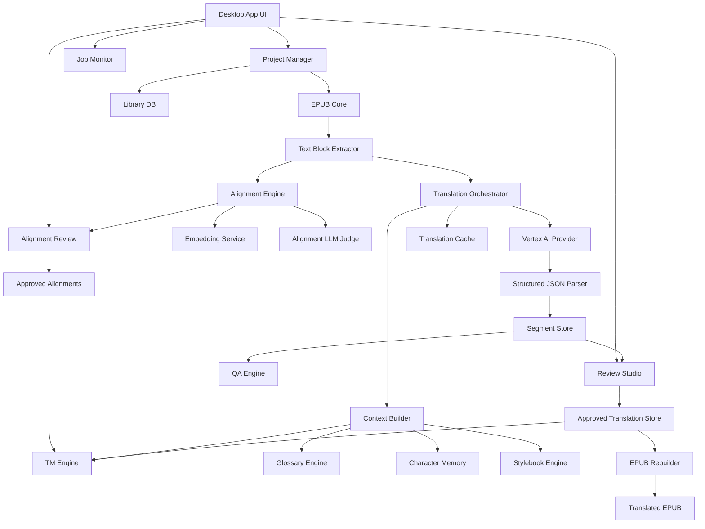
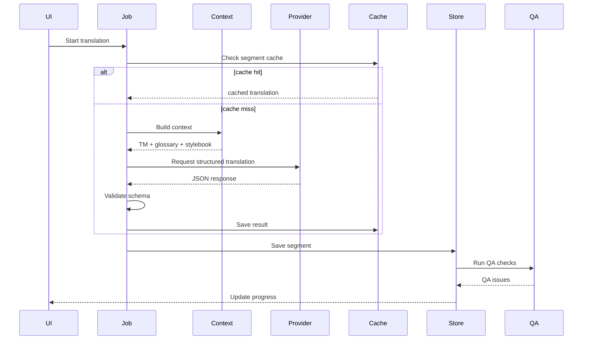
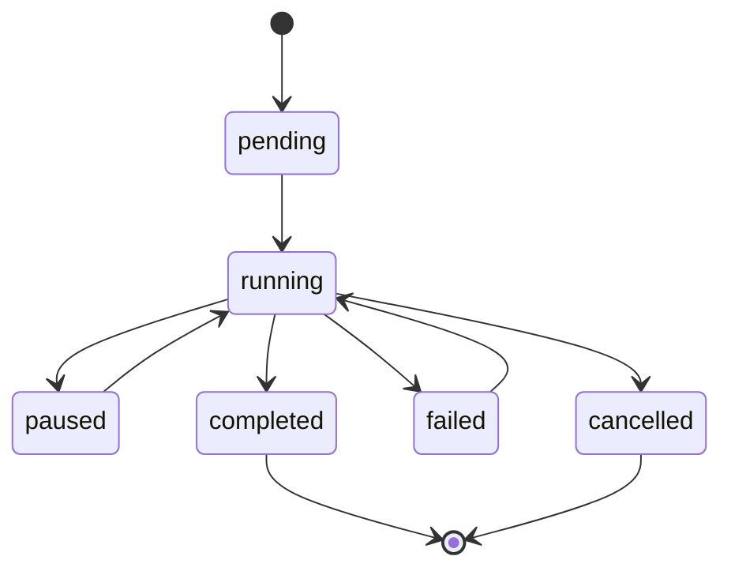
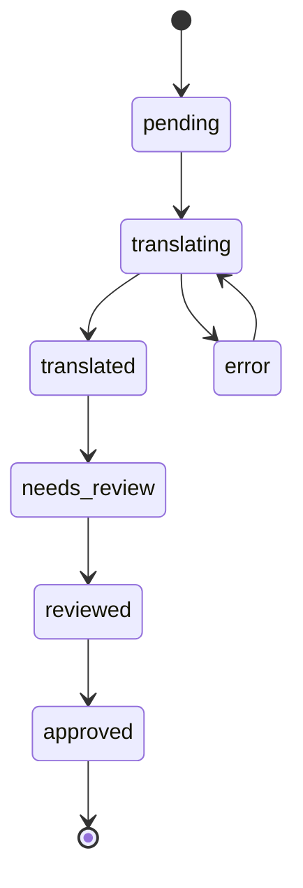
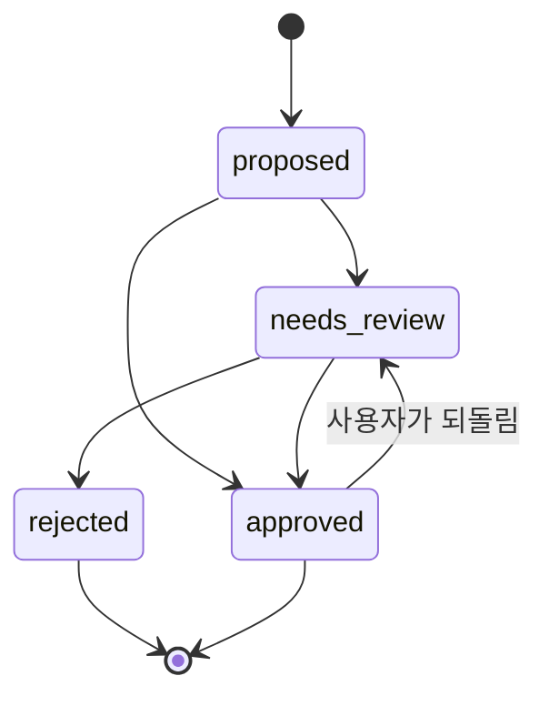
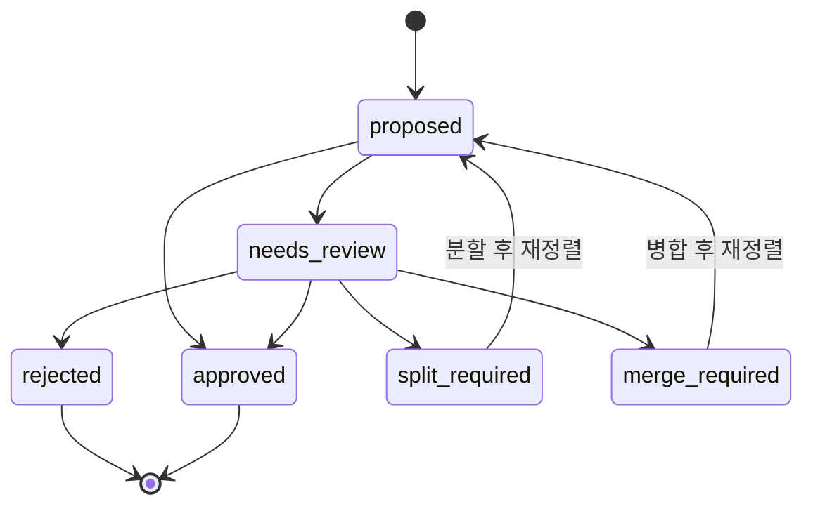

# Series Translation Studio 기획 및 시스템 설계서

## 0. 문서 개요

이 문서는 영어 EPUB 장편 시리즈를 한국어로 개인 감상용 번역하기 위한 데스크톱 앱의 기획서와 시스템 설계서다.

초기 목표 작품군은 루이스 맥마스터 부졸드의 보르코시건 시리즈를 상정한다. 다만 설계는 특정 작품에 종속되지 않고, 장편 시리즈 전반에 재사용 가능한 구조로 잡는다.

핵심 개념은 단순한 EPUB 자동번역기가 아니라 다음과 같은 흐름을 제공하는 **장편 시리즈 번역 스튜디오**다.

```text
기존 번역권을 임베딩과 LLM Judge로 정렬
→ TM / glossary / stylebook 구축
→ 신규 권 초벌 번역
→ AI 편집장 감수 또는 사람 감수
→ TM / glossary 업데이트
→ 시리즈 전체 일관성 유지
→ EPUB 출력
```

설계의 핵심 전제는 다음과 같다.

```text
영어 EPUB와 한국어 EPUB는 출판사가 다르고, 변환 도구가 다르고, 챕터 구분이 다르고,
역자별 문단 분할도 다르다. 따라서 파일 구조, spine 순서, 문단 길이비 같은
mechanical 신호만으로는 신뢰할 만한 정렬을 만들 수 없다.

정렬의 1차 도구는 다국어 문장 임베딩과 LLM Alignment Judge이며,
고유명사/숫자/대사 구조 같은 mechanical 신호는 보조 점수와 사후 검증용이다.
모든 자동 정렬은 "사람이 확인하는 초안"이고, 챕터 매핑은 사용자 확정 단계를 필수로 둔다.
```

---

### 0.1 개정 반영 요약

이번 개정에서는 검토 결과를 반영하여 다음을 명확히 했다.

```text
- MVP를 MVP-0 / MVP-1 / MVP-2 / MVP-3으로 재분할
- DB 설계의 중심을 chapters가 아니라 text_sections로 보강
- "자동 승인" 표현을 "일괄 승인 추천 후보"로 변경
- EPUB round-trip test와 roundtrip_report.json 산출물 추가
- inline markup 보존 수준(Level 0~2) 정책 추가
- LLM Judge 비용 추정을 낙관/보통/비관 3단계로 변경
- provider 실패 유형별 retry / pause 정책 추가
- 개인용 사용, DRM 해제 미지원, 배포 금지 안내를 주요 UX에 반영
- Cost & Usage, Character, Stylebook, AI Editorial 고도화는 MVP 이후로 분리
- 고정 모델명 예시는 project default model 중심으로 표현
```

---

## 1. 제품 정의

### 1.1 제품명

가칭: **Series Translation Studio**

프로젝트 내부 코드명: **STS**

### 1.2 한 줄 설명

기존 번역본과 원서를 정렬하여 번역 메모리와 용어집을 구축하고, 이를 기반으로 미번역 장편 시리즈를 일관된 문체와 용어로 한국어 EPUB로 번역·감수하는 데스크톱 앱.

### 1.3 문제 정의

장편 시리즈 소설을 AI로 번역할 때 다음 문제가 발생한다.

1. 권마다 고유명사 번역이 흔들린다.
2. 인물 말투와 호칭이 일관되지 않는다.
3. 기존 정발 번역본과 용어가 맞지 않는다.
4. 번역 중간에 비용이 많이 든다.
5. 번역을 중단했다가 재개하기 어렵다.
6. AI 번역문을 사람이 감수하기 위한 UI가 부족하다.
7. 미발간권 번역 전에 기존 번역권의 자산을 재활용하기 어렵다.
8. EPUB 구조, 목차, 이미지, 스타일을 유지한 채 번역본을 재생성하기 어렵다.
9. 영어 원서와 한국어 정발본은 출판사·역자·변환 도구·챕터 구분이 모두 달라, 파일 구조나 문단 길이비 기반의 mechanical 정렬만으로는 TM을 만들 수 없다.

### 1.4 해결 방향

Series Translation Studio는 다음 방식으로 문제를 해결한다.

1. 영어 원문과 한국어 번역본을 **다국어 문장 임베딩 + LLM Alignment Judge**로 정렬하여 TM을 만든다. mechanical 신호(고유명사, 숫자, 대사 위치, 길이비)는 보조 점수로만 쓴다.
2. 챕터 매핑은 LLM Judge가 후보를 제시하고 사용자가 명시적으로 확정한다. 챕터가 확정된 뒤에만 문단 정렬을 시도한다.
3. 인명, 지명, 가문명, 계급, 함선명, 행성명, 기술용어를 glossary로 관리한다.
4. 작품별, 시리즈별 stylebook을 만든다.
5. 번역 시 TM, glossary, character profile, stylebook을 검색하여 프롬프트에 삽입한다.
6. AI 응답은 JSON 구조로 받아 번역문, 불확실 용어, QA 경고를 분리 저장한다.
7. Review Studio에서 원문, AI 번역, 기존 번역, TM 추천, glossary hit를 나란히 본다.
8. 감수 결과를 다시 TM과 glossary에 반영한다.
9. 최종적으로 원본 EPUB 구조를 유지한 한국어 EPUB를 생성한다.

---

## 2. 사용자 시나리오

### 2.1 대표 사용자

- 영어 원서를 구매했지만 영어로 장편을 읽기 힘든 독자
- 정발 번역이 중단된 시리즈를 개인 감상용으로 계속 읽고 싶은 독자
- 기존 정발 번역의 용어와 문체를 참고하여 미번역권을 일관되게 번역하고 싶은 사용자
- AI 번역을 그대로 쓰는 것이 아니라 직접 감수하면서 품질을 올리고 싶은 사용자

### 2.2 주요 사용 흐름

#### 흐름 A: 기존 번역권 기반 Content-Aware TM 구축

```text
1. 새 시리즈 프로젝트 생성
2. 영어 EPUB 추가
3. 한국어 EPUB 또는 TXT 추가
4. 두 EPUB 내부 HTML을 모두 추출하고 Text Section 중간 구조로 변환
5. 파일명/번호/spine index는 낮은 신뢰도 metadata로만 보존
6. front matter / back matter / 역자 후기 / 감사의 글 / 광고 / 목차 후보 자동 분리
7. Body Start Detector가 실제 본문 시작 후보를 제안
8. 사용자가 필요할 때만 영어/한국어 본문 시작 anchor를 지정
9. Embedding Service가 모든 본문 문단의 다국어 임베딩을 생성하고 캐싱
10. Chapter Matcher가 챕터 단위 임베딩 요약과 길이비/순서 신호로 후보를 추리고, LLM Alignment Judge가 1:1 / 1:N / N:1 / N:M 챕터 매핑을 판정
11. 사용자가 챕터 매핑을 검토하고 명시적으로 확정 (필수 단계)
12. 확정된 챕터 내부에서 Paragraph Aligner가 임베딩 similarity matrix와 보조 신호(고유명사·숫자·대사 위치)로 1:1, 1:N, N:1, N:M, 1:0, 0:1 문단 정렬
13. 낮은 confidence window는 LLM Alignment Judge가 재검증
14. 사용자가 낮은 confidence 구간만 Alignment Review에서 승인/분할/병합/거부
15. 승인된 align pair만 TM으로 저장
16. 용어 후보 추출
17. glossary 확정
18. stylebook 초안 생성
```

#### 흐름 B: 기존 한국어판이 있는 권을 재번역/AI 편집장 감수

```text
1. 영어 EPUB와 기존 한국어판 입력
2. Phase 1 TM / glossary / stylebook 로드
3. 흐름 A와 동일한 방식으로 영어 원문 ↔ 기존 한국어판 alignment 수행
   (임베딩 + Chapter LLM Judge + 사용자 확정 + 문단 정렬)
4. 확정된 alignment를 reference TM (등급: reference)으로 저장
5. AI 초벌 번역 생성
6. AI 편집장이 AI 번역, 정렬된 기존 한국어판 문장, TM, glossary, stylebook 비교
7. AI 편집장이 최종 감수문 승인
8. 승인된 문장을 gold_candidate TM으로 등록
9. spoiler-safe mode로 사용자가 본문을 미리 보지 않고 EPUB 생성
10. 사용자는 완성 EPUB를 처음부터 독서
11. 완독 후 마음에 걸린 문장만 사후 수정
12. 사용자가 수정/명시 승인한 문장을 gold TM으로 확정
13. 새 용어와 캐릭터 정보를 업데이트
```

#### 흐름 C: 미발간권 번역

```text
1. 미발간 영어 EPUB 입력
2. 시리즈 프로필 선택
3. 챕터별 자동 번역 실행
4. QA 검사
5. Review Studio에서 감수
6. 최종 EPUB 생성
```

---

## 3. 개발 목표와 비목표

### 3.1 목표

- EPUB 원본 구조를 최대한 유지한 번역 EPUB 생성
- Vertex AI Gemini 기반 한국어 문학 번역
- TM / glossary / stylebook 기반의 일관성 유지
- 출판사·형식이 다른 영-한 EPUB를 다국어 임베딩과 LLM Judge로 정렬하여 Content-Aware TM 구축
- 감수 UI 제공 (AI 편집장 감수 + 사람 사후 보정 모두 지원)
- 중단 후 재개 가능한 job system
- 번역 비용 절감을 위한 cache (segment / translation / embedding / LLM Judge 응답)와 TM 재사용
- 로컬 중심의 개인용 앱

### 3.2 비목표

초기 버전에서는 다음을 하지 않는다.

- DRM 해제 기능
- 상업적 번역 출판 워크플로우
- 여러 사용자가 동시에 쓰는 서버형 SaaS
- 온라인 공유용 TM 마켓
- 자동 완성된 “출판 품질” 번역 보장
- PDF 스캔 OCR 기반 번역
- 만화/웹툰 이미지 번역
- TTS 오디오북 생성

### 3.3 법적/윤리적 사용 제한

앱은 개인이 합법적으로 보유한 원서와 번역본을 개인 감상용으로 처리하는 도구로 설계한다.

기본 정책:

```text
- DRM 해제 기능은 제공하지 않는다.
- 사용자가 합법적으로 보유한 파일만 입력한다.
- 생성된 번역 EPUB는 개인 감상용으로만 사용한다.
- 원문, 정발 번역문, TM, glossary를 외부 배포하지 않는다.
- 클라우드 AI 전송 전 사용자에게 전송 범위를 명확히 표시한다.
- 프로젝트 데이터는 기본적으로 로컬에 저장한다.
```

이 안내는 Welcome / Book Import Wizard / Export / 외부 전송 동의 다이얼로그에 반복 노출한다. 특히 Export 화면에서는 생성 EPUB가 개인 감상용이며 배포·공유를 전제로 하지 않는다는 문구를 명확히 표시한다.

---

## 4. Phase 전략


## 4.1 Phase 0: 기반 번역기 MVP

목표: 영어 EPUB를 한국어 EPUB로 번역할 수 있는 최소 기능을 만들되, 실제 개발 착수 시에는 MVP를 더 작은 검증 단위로 나눈다.

Phase 0은 하나의 거대한 MVP가 아니라 다음 네 단계로 쪼개어 진행한다.

### MVP-0: EPUB round-trip 검증

목표: 번역 API 없이도 EPUB를 안전하게 뜯고 다시 봉합할 수 있음을 먼저 검증한다.

기능:

```text
- EPUB drag-and-drop import
- EPUB unpack
- OPF / spine / nav 기본 분석
- XHTML text block extraction
- dummy translation 또는 marker 삽입
- EPUB rebuild
- 원본 CSS / 이미지 / 폰트 / metadata 보존
- round-trip report 생성
```

산출물:

```text
roundtrip.epub
roundtrip_report.json
manifest.json
```

완료 기준:

```text
- 원본 EPUB를 import한 뒤 dummy translation만 적용해 다시 EPUB로 패키징할 수 있다.
- mimetype entry가 EPUB zip의 첫 번째 항목이며 무압축으로 저장된다.
- META-INF/container.xml, OPF, spine, nav/toc가 깨지지 않는다.
- 이미지/CSS/font asset 누락이 없다.
- XHTML namespace와 기본 문서 구조가 유지된다.
- 변경된 파일과 변경 사유가 roundtrip_report.json에 기록된다.
```

### MVP-1: 실제 번역 실행

목표: Vertex AI provider를 붙여 block 단위 실제 번역을 수행한다.

기능:

```text
- Vertex AI provider 연결
- 기본 translation prompt
- block 또는 chunk 단위 번역
- structured JSON response parsing
- translation cache
- retry/backoff
- job progress 표시
- 중단 후 재개
- TXT / EPUB 출력
```

산출물:

```text
translated.draft.epub
translated.draft.txt
translation_job.sqlite
manifest.json
```

완료 기준:

```text
- 영어 EPUB 1권을 입력하면 한국어 draft EPUB가 생성된다.
- 작업 중단 후 같은 설정으로 재실행하면 완료된 segment를 재사용한다.
- provider 오류가 발생해도 segment 단위로 재시도하거나 건너뛸 수 있다.
```

### MVP-2: 최소 감수

목표: 생성된 번역문을 사람이 최소한으로 수정하고 final_translation으로 저장할 수 있게 한다.

기능:

```text
- segment list
- source text / translation editor 2-pane
- reviewed_translation / final_translation 저장
- segment 상태 관리
- 저장 / 승인하고 다음 단축키
- reviewed / final EPUB export
```

완료 기준:

```text
- 사용자가 segment 단위로 번역문을 수정하고 승인할 수 있다.
- 승인된 final_translation을 기반으로 EPUB를 다시 export할 수 있다.
```

### MVP-3: Glossary 적용

목표: 고유명사와 반복 용어를 번역 프롬프트에 반영한다.

기능:

```text
- glossary CSV import/export
- glossary_terms table
- glossary hit detection
- prompt injection
- glossary mismatch QA
- 간단한 glossary editor
```

완료 기준:

```text
- glossary에 등록된 고유명사가 번역 중 반영된다.
- glossary와 다른 번역어가 사용되면 QA warning으로 표시된다.
```

Phase 0의 핵심 원칙:

```text
처음부터 alignment, TM, stylebook, AI Editorial을 붙이지 않는다.
먼저 EPUB round-trip과 번역 job resume을 안정화한 뒤, 감수 UI와 glossary를 얹는다.
```

## 4.2 Phase 1: 기존 번역권 기반 Content-Aware TM 구축

대상 예시:

```text
Shards of Honor
Barrayar
```

목표:

- 신뢰도가 높은 기존 번역권으로 gold TM과 핵심 glossary를 구축한다.
- 시리즈의 기본 명칭, 호칭, 문체 기준을 만든다.
- EPUB 파일명, HTML 번호, spine 순서가 원서와 번역본에서 서로 다를 수 있음을 전제로 한다.
- 출판사·역자가 다르면 챕터 경계, 문단 분할, 고유명사 음차, 의역에 따른 누락/추가가 모두 비대칭이라는 점을 전제로 한다.
- 따라서 매칭의 1차 기준은 **다국어 문장 임베딩 유사도와 LLM Alignment Judge의 판정**이고, mechanical 신호(고유명사 겹침, 숫자, 길이비, 대사 위치, 순서)는 보조 점수와 사후 검증용이다.
- 자동 정렬은 "정답"이 아니라 "사람이 확인할 초안"이며, 챕터 매핑은 사용자 확정 단계를 필수로 둔다.

기능:

- 영어 EPUB와 한국어 EPUB/TXT 동시 입력
- EPUB 내부 HTML 전체 추출
- Text Section 중간 구조 생성
- front matter / body chapter / back matter / translator note / advertisement / toc 후보 분류
- Body Start Detector로 실제 본문 시작 후보 탐지
- 사용자가 필요할 때만 영어/한국어 본문 시작 anchor 지정
- Embedding Service: 다국어 문장 임베딩 생성 및 캐싱
- Chapter Matcher: 챕터 임베딩 요약 + 길이비/순서 신호로 후보 좁히기
- LLM Alignment Judge: 챕터 매핑 1차 판정 (1:1, 1:N, N:1, N:M)
- 챕터 매핑 글로벌 최적화 (단조 시퀀스 매핑)
- 챕터 매핑 사용자 확정 UI (필수)
- 확정된 챕터 내부에서 임베딩 similarity matrix 기반 문단 정렬
- 보조 신호 합산: 고유명사 정규화 겹침 / 숫자 / 대사 구조 / 챕터 내 상대 위치 / 길이비
- 1:1, 1:N, N:1, N:M, 1:0, 0:1 문단 정렬 허용
- 정렬 confidence 계산 (임베딩 점수 + 보조 신호 가중합)
- 낮은 confidence window를 LLM Alignment Judge로 재검증
- 낮은 confidence 구간만 사용자 보정
- TM 승인/거부 UI
- 용어 후보 추출
- glossary 편집
- 캐릭터 프로필 생성
- stylebook 초안 생성

산출물:

```text
series.tm.sqlite
series.glossary.csv
series.characters.json
series.stylebook.md
embedding_cache.sqlite
chapter_alignment.json
alignment_report.json
```

완료 기준:

- 본문 시작 후보를 자동 제안하고 사용자가 anchor로 확정 가능
- 출판사·챕터 구분이 다른 영-한 EPUB에서도 챕터 매핑 후보 1순위가 사용자 승인되는 비율 90% 이상
- 챕터 매핑은 사용자가 명시적으로 확정해야 다음 단계로 진행됨
- 확정된 챕터 내부에서 문단 단위 confidence ≥ 0.8 정렬 후보의 정확도 95% 이상
- 문단 정렬 후보 1순위가 사용자 승인되는 비율 70% 이상
- LLM Alignment Judge 호출은 챕터 매핑 + 낮은 confidence window로 제한되어 비용이 통제됨
- 승인된 TM을 번역 프롬프트에서 검색 가능
- 주요 인명/지명/계급/가문명 glossary 등록 가능

---

## 4.3 Phase 2: 기존 한국어판이 있는 권의 재번역/AI 편집장 감수

대상 예시:

```text
The Warrior's Apprentice
The Vor Game
Cetaganda
Ethan of Athos
Brothers in Arms
Borders of Infinity
Mirror Dance
Memory
```

목표:

- 기존 한국어판을 참고자료로 사용한다.
- 역자별 용어 차이와 문체 차이를 정리한다.
- Phase 1의 TM / glossary / stylebook을 확장한다.
- 사용자가 본문 내용을 미리 읽지 않아도 되도록, AI 편집장이 재번역문을 감수하고 승인한다.
- 사용자는 완성된 EPUB를 처음부터 독서하듯 읽고, 사후 수정 사항만 반영할 수 있다.
- AI 편집장이 기존 한국어판을 문장 단위 reference로 사용하려면, 그 권에 대해서도 Phase 1의 alignment 파이프라인(임베딩 + Chapter LLM Judge + 사용자 확정 + 문단 정렬)이 선행되어야 한다.

기능:

- 영어 원문 ↔ 기존 한국어판 alignment (Phase 1과 동일한 파이프라인)
- 영어 원문, 기존 한국어판, AI 번역 3-way 비교
- 기존 번역과 AI 번역 차이 표시
- glossary 불일치 경고
- 캐릭터 호칭/말투 경고
- AI 편집장이 AI 번역, 정렬된 기존 한국어판 문장, TM, glossary, stylebook을 비교하여 최종 감수문을 승인
- AI 편집장이 승인한 최종문을 gold_candidate TM으로 승격
- 사용자는 spoiler-safe mode에서 본문을 미리 보지 않고 EPUB 생성까지 진행 가능
- 사용자가 완독 후 수정한 문장은 사후 감수문으로 저장하고 TM에 반영 가능
- 역자별 번역 표현 metadata 저장
- silver / gold_candidate / gold TM 구분

완료 기준:

- 권별 alignment가 사용자 확정까지 완료된다.
- 기존 한국어판을 그대로 정답으로 삼지 않고 reference로만 표시한다.
- AI 편집장이 감수 승인한 문장은 gold_candidate TM으로 등록한다.
- 사용자가 완독 후 직접 수정하거나 명시 승인한 문장은 gold TM으로 확정한다.
- 사용자가 본문 내용을 미리 읽지 않아도 Phase 2 권의 재번역/감수/EPUB 생성이 가능하다.
- 권이 진행될수록 glossary와 stylebook이 누적 개선된다.

---

## 4.4 Phase 3: 미발간권 본번역

목표:

- 기존 축적 자산을 기반으로 한국 미발간권을 자연스럽고 일관되게 번역한다.

기능:

- 시리즈 프로필 로드
- 권별 번역 전략 선택
- TM retrieval
- glossary retrieval
- character profile retrieval
- stylebook retrieval
- chapter summary memory
- cross-chapter term memory
- QA 자동 검사
- 최종 EPUB export

완료 기준:

- 미발간권 1권을 처음부터 끝까지 번역 가능
- 주요 고유명사/호칭 일관성 검사 가능
- 누락 문단/숫자/이름 흔들림 검사 가능
- 감수 후 최종 EPUB 생성 가능

---

## 5. 참고 프로젝트 분석 및 적용 방향

참조 프로젝트: `jesselau76/ebook-GPT-translator`

이 프로젝트에서 참고할 핵심 아이디어는 다음과 같다.

```text
- EPUB/TXT/DOCX/PDF 입력 처리
- 선택적 MOBI 입력
- TXT/EPUB 출력
- GUI 제공
- provider abstraction
- SQLite resume cache
- chunk/token limit
- glossary CSV/XLSX
- long-form consistency
- chapter memory
- rolling translated context
- automatic term memory
- structured JSON output
- manifest file
```

STS에서는 위 기능을 그대로 베끼기보다는 다음과 같이 확장한다.

| 참고 기능 | STS 적용 방향 |
|---|---|
| EPUB 번역 | EPUB 구조 보존형 번역 파이프라인으로 재구현 |
| SQLite cache | job cache + segment cache + TM DB + embedding cache로 분리 |
| glossary | series glossary + context-dependent term 관리 |
| chapter memory | chapter summary + 캐릭터 상태 + 관계 변화 저장 |
| structured JSON | translation / used_terms / uncertain_terms / qa_flags 분리 |
| GUI | 단순 실행 GUI가 아니라 Review Studio 중심 UI |
| provider abstraction | Vertex AI 우선, 추후 OpenAI-compatible 추가 가능 |
| (참고 프로젝트에 없음) | 출판사가 다른 영-한 EPUB 사이의 다국어 임베딩 + LLM Judge 기반 alignment 엔진 |

---

## 6. 전체 시스템 아키텍처

### 6.1 논리 아키텍처



핵심 데이터 흐름은 두 개의 큰 파이프라인으로 나뉜다.

```text
Alignment 파이프라인:
EPUB → Text Block Extractor → Embedding Service → Alignment Engine
  → Alignment LLM Judge → Alignment Review → Approved Alignments → TM

Translation 파이프라인:
EPUB → Text Block Extractor → Translation Orchestrator (TM / Glossary / Stylebook 주입)
  → Vertex AI Provider → Segment Store → QA → Review Studio → EPUB Rebuilder
```

### 6.2 물리 아키텍처

초기 추천 스택:

```text
Electron
React
TypeScript
Node.js
SQLite
Vertex AI Gemini
Local filesystem project workspace
```

구성:

```text
Electron Main Process
- 파일 접근
- EPUB unpack/repack
- SQLite 접근
- job queue 실행
- Vertex AI 호출

Electron Renderer Process
- React UI
- 프로젝트 관리 화면
- 정렬 보정 화면
- 번역 진행 화면
- Review Studio
- glossary/TM 편집기

Preload Bridge
- 안전한 IPC API 노출
```

---

## 7. 모듈 설계

## 7.1 Project Manager

역할:

- 시리즈 프로젝트 생성/열기/삭제
- 프로젝트 workspace 관리
- 책 metadata 관리
- phase별 진행 상태 관리

주요 개념:

```text
Project
Series
Book
SourceDocument
TranslationJob
ChapterAlignment
```

예시 workspace:

```text
~/SeriesTranslationStudio/projects/vorkosigan/
 ├─ project.sqlite
 ├─ embedding_cache.sqlite
 ├─ judge_cache.sqlite
 ├─ config.json
 ├─ source/
 │   ├─ en/
 │   └─ ko/
 ├─ extracted/
 ├─ cache/
 │   └─ models/             # 로컬 임베딩 모델 파일
 ├─ alignment/
 │   ├─ chapter_alignment.json
 │   └─ alignment_report.json
 ├─ output/
 ├─ exports/
 └─ logs/
```

cache 파일 분리 원칙:

```text
project.sqlite        프로젝트 본체 데이터 (alignments / TM / glossary 등)
embedding_cache.sqlite 임베딩 벡터 (text_hash + model_id 키)
judge_cache.sqlite     LLM Alignment Judge 응답 (입력 hash → 출력 JSON)
```

embedding_cache와 judge_cache를 본체와 분리하는 이유는 (a) 모델/버전 교체 시 별도 파일을 통째로 교체할 수 있고, (b) 다른 프로젝트에서도 같은 모델로 만든 임베딩 cache는 재사용 가능하기 때문이다.

---

## 7.2 EPUB Core

역할:

- EPUB 파일 분석
- spine 순서 파악
- XHTML 추출
- 이미지/CSS/폰트/메타데이터 보존
- 번역된 XHTML 재삽입
- EPUB 재패키징

주의점:

- `mimetype` 파일은 EPUB zip 첫 번째 entry로 무압축 저장해야 한다.
- 원본 CSS와 이미지 asset은 유지한다.
- 본문 block만 번역한다.
- 목차/nav 문서는 별도 처리한다.
- Ruby annotation, italic, bold, footnote link 같은 inline markup은 최대한 유지한다.

EPUB round-trip test는 Phase 0의 첫 번째 품질 게이트다. 번역 API를 붙이기 전에 원본 EPUB를 다시 패키징했을 때 구조가 보존되는지 확인한다.

round-trip test 항목:

```text
- mimetype 첫 entry + 무압축 유지
- META-INF/container.xml 유지
- OPF spine 순서 유지
- nav/toc 유효성 유지
- 이미지/CSS/font asset 누락 없음
- XHTML namespace 유지
- 원본 대비 변경 파일 목록 출력
- epubcheck 또는 동등 검증 도구 통과 여부 기록
```

산출물:

```text
roundtrip_report.json
```

inline markup 보존 정책:

```text
Level 0: block 내부 textContent만 번역한다. inline markup은 제거될 수 있다. 실험용에만 허용한다.
Level 1: <em>, <i>, <strong>, <a> 등 기본 inline tag를 placeholder로 보존하고 번역 후 복원한다. MVP 목표 수준이다.
Level 2: footnote, ruby, nested inline, split text node까지 보존한다. 장기 고도화 목표다.
```

MVP에서는 Level 1을 목표로 한다. Level 0은 구현 검증에는 빠르지만 실제 독서 품질이 급격히 떨어질 수 있으므로 기본값으로 두지 않는다.

번역 대상 block 유형:

```text
p
h1~h6
blockquote
li
div 중 텍스트 중심 block
```

초기에는 복잡한 inline markup을 완벽하게 보존하려 하기보다, block 단위 텍스트 추출과 재삽입을 안정화한다.

---

## 7.3 Text Block Extractor

역할:

- XHTML에서 번역 대상 텍스트 block 추출
- block id 부여
- 원문 위치 보존
- 번역 후 재삽입 가능하도록 mapping 생성

중요한 개념 분리:

```text
source_document  원본 파일 단위 (EPUB/TXT 등)
document_item    EPUB 내부 item 단위 (XHTML, nav, css 등)
text_section     의미 단위 후보 (front matter, body chapter, appendix 등)
text_block       실제 번역·정렬 대상 block
logical_chapter  사용자가 확정한 본문 장/절 단위
```

실제 EPUB에서는 한 챕터가 여러 XHTML 파일로 나뉘거나, 여러 챕터가 하나의 XHTML 파일에 들어갈 수 있다. 따라서 DB와 파이프라인은 `chapters`를 최초 단위로 신뢰하지 않고, `text_sections`를 먼저 만든 뒤 사용자가 확정한 section 묶음을 logical chapter로 다룬다.

TextSection 예시:

```ts
type TextSection = {
  id: string;
  documentId: string;
  sectionIndex: number;
  sourceFile: string;
  spineIndex: number;
  headingText?: string;
  candidateType:
    | "front_matter"
    | "toc"
    | "body_chapter"
    | "appendix"
    | "translator_note"
    | "back_matter"
    | "unknown";
  bodyStartScore: number;
  userConfirmedType?: string;
};
```

block 예시:

```json
{
  "block_id": "book01_ch03_b0123",
  "book_id": "book01",
  "chapter_id": "ch03",
  "spine_index": 5,
  "xpath": "/html/body/section/p[23]",
  "source_text": "Cordelia looked at him for a long moment.",
  "html_before": "<p>",
  "html_after": "</p>",
  "text_hash": "sha256..."
}
```

---

## 7.4 Alignment Engine

역할:

- 영어 원문과 한국어 번역본을 **다국어 임베딩 + LLM Alignment Judge**를 1차 도구로 정렬한다.
- EPUB 내부 파일 구조를 그대로 신뢰하지 않고 Text Section 중간 구조로 정규화한다.
- 실제 본문 시작점을 탐지한다.
- 챕터 매핑은 LLM Judge가 후보를 제시하고 사용자가 명시적으로 확정한다.
- 확정된 챕터 내부에서만 문단 정렬을 시도한다.
- 정렬 confidence를 계산하고 낮은 구간을 사람과 LLM Judge가 검증할 수 있는 후보로 제공한다.

핵심 전제:

```text
나쁜 전제:
- 영어 EPUB의 2.html은 한국어 EPUB의 2.html 또는 비슷한 spine에 대응한다.
- 영어 챕터와 한국어 챕터는 1:1로 대응한다.
- 고유명사 2개 이상 겹침으로 신뢰할 만한 anchor를 만들 수 있다.

좋은 전제:
- EPUB 구조는 출판사, 변환 도구, 번역본 구성에 따라 완전히 다를 수 있다.
- 챕터 경계는 비대칭일 수 있다 (영문 1챕터 = 한국어 프롤로그 + 1장 등).
- 고유명사 음차는 역자별로 흔들린다 (Cordelia → 코델리아 / 코딜리아).
- 숫자/날짜는 의역되면서 표기가 달라진다 ("three days later" → "사흘 뒤" / "삼일 후").
- 의역, 생략, 추가가 흔하므로 mechanical 매칭은 신뢰할 수 없다.
- 매칭의 1차 신호는 다국어 문장 임베딩 유사도이고, mechanical 신호는 보조 점수다.
- LLM Alignment Judge는 챕터 매핑과 낮은 confidence window에서 결정 권한을 가진다.
- 모든 자동 정렬은 사람이 확인할 초안이며, 챕터 매핑은 사용자 확정이 필수다.
```

전체 정렬 파이프라인:

```text
Stage 0  Text Section 정규화
Stage 1  Embedding 생성과 캐싱
Stage 2  Chapter 단위 매칭 (임베딩 + LLM Judge + 사용자 확정)
Stage 3  Paragraph 단위 정렬 (확정된 챕터 내부에서만)
Stage 4  Low-confidence window 재검증
Stage 5  Alignment Review와 TM 등록
```

### Stage 0 — Text Section 정규화

EPUB 내부 HTML을 spine 순서가 아닌 의미 단위로 재구성한다.

Text Section 중간 구조:

```json
{
  "section_id": "ko_html_008_sec_001",
  "source_file": "8.html",
  "spine_index": 8,
  "heading": "1",
  "paragraphs": [
    "부드러운 회색빛을 발하는 안개 바다가...",
    "코델리아 네이스미스 중령은..."
  ],
  "candidate_type": "body_chapter",
  "confidence": 0.93
}
```

```json
{
  "section_id": "en_split_002_sec_001",
  "source_file": "Shards Of Honor_split_002.htm",
  "spine_index": 2,
  "heading": "CHAPTER ONE",
  "paragraphs": [
    "A sea of mist drifted through the cloud forest...",
    "Commander Cordelia Naismith glanced..."
  ],
  "candidate_type": "body_chapter",
  "confidence": 0.96
}
```

TextBlock 정규화:

```ts
type TextBlock = {
  id: string;
  file: string;
  spineIndex: number;
  htmlIndex: number;
  tag: "h1" | "h2" | "p" | "li" | "scene_break";
  text: string;
  normalizedText: string;
  isBodyCandidate: boolean;
  alignable: boolean;
  features: BlockFeatures;
};

type BlockFeatures = {
  entities: string[];
  numbers: string[];
  dialogueCount: number;
  quoteRatio: number;
  length: number;
  embeddingId?: string;
};
```

Scene break / noise 처리:

```text
<p>&nbsp;</p>, 빈 문단, "*", "＊", "※" 같은 장면 전환 표식은 일반 문단으로 세지 않는다.
scene_break는 위치 anchor 정보로는 보존하되 alignable=false로 두고 TM pair 대상에서는 제외한다.
이 규칙을 어기면 번역본에만 추가된 장면 전환 표식 때문에 이후 문단이 한 칸씩 밀린다.
```

Section candidate type:

```text
front_matter
toc
copyright
dedication
acknowledgements
translator_note
body_chapter
appendix
advertisement
back_matter
unknown
```

Body Start Detector 신호:

```text
- CHAPTER ONE / Chapter 1 / 1 / 제1장 / 제 1 장
- 첫 문단이 소설 서술문인지 여부
- 저작권/역자/감사의 글/목차/출판사 문구 여부
- 인물명 출현: Cordelia, Naismith, Dubauer, Rosemont
- 작품 고유명사 출현: Barrayar, Beta Colony, Vorkosigan
- 문단 길이와 대사 비율
- 앞뒤 HTML과의 문체 차이
```

### Stage 1 — Embedding 생성과 캐싱

다국어 문장 임베딩이 정렬의 1차 신호다. 자세한 설계는 7.14 Embedding Service를 참조한다.

핵심 요구사항:

```text
- 모든 body_chapter 문단에 대해 임베딩 벡터를 생성한다.
- 영어와 한국어를 같은 의미 공간에 매핑하는 다국어 모델을 사용한다 (LaBSE, BGE-M3, multilingual-e5 등).
- 텍스트 hash를 키로 임베딩을 캐싱하여 재실행 시 재계산하지 않는다.
- 챕터 단위 요약 임베딩은 (a) 챕터 첫 N문단 / (b) 챕터 마지막 N문단 / (c) LLM이 생성한 챕터 요약 임베딩의 합으로 계산한다.
```

### Stage 2 — Chapter 단위 매칭

챕터 매칭은 다음 4단계로 진행된다.

```text
Step 1. 후보 필터링
  - 영어 챕터 N개, 한국어 챕터 M개에 대해 모든 쌍을 평가하지 않는다.
  - 챕터 순서, 챕터 길이비, 책 내 상대 위치로 명백히 불가능한 쌍을 제외한다.

Step 2. 임베딩 유사도 매트릭스
  - 각 챕터의 요약 임베딩 간 cosine similarity 계산.
  - 영어 챕터마다 상위 K개 한국어 챕터 후보를 추린다 (K=3~5).

Step 3. LLM Alignment Judge로 챕터 쌍 판정
  - 각 후보 쌍에 대해 영어 챕터 앞부분 + 한국어 챕터 앞부분 + LLM이 생성한 양쪽 요약을 입력한다.
  - LLM이 "동일 챕터인가? 1:1, 1:N, N:1, N:M 중 어떤 매핑인가? 신뢰도와 근거는?"을 판정한다.
  - 비용을 통제하기 위해 임베딩 유사도가 매우 높은 쌍은 LLM 호출을 생략할 수 있다 (설정 가능).

Step 4. 글로벌 최적 매핑
  - 챕터는 단조 증가 시퀀스로 매핑되어야 한다는 제약 하에 DP / Needleman-Wunsch로 글로벌 최적해를 찾는다.
  - 1:1, 1:N, N:1, N:M, 1:0, 0:1 매핑을 모두 허용한다.
  - 결과는 chapter_alignments 테이블에 status=proposed로 저장된다.
```

LLM Alignment Judge 챕터 입력 예시:

```text
입력:
- 영어 챕터 헤딩 + 첫 500단어 + 마지막 200단어 + LLM 요약 1000자
- 한국어 챕터 후보 헤딩 + 첫 800자 + 마지막 400자 + LLM 요약 1500자
- 책 내 챕터 순서 정보

출력 (JSON):
{
  "is_same_chapter": true,
  "mapping_type": "1:1 | 1:N | N:1 | N:M | none",
  "confidence": 0.93,
  "rationale": "오프닝 장면 묘사가 일치하며 등장인물 코델리아, 더바우어, 로즈먼트가 동일하게 등장한다."
}
```

사용자 확정 단계:

```text
- 챕터 매핑은 사용자가 명시적으로 확정한 후에만 다음 단계로 진행된다.
- 사용자는 매핑 후보를 보고 그대로 승인하거나, 1:1 → 1:N으로 분할, N:1로 병합, 또는 제외할 수 있다.
- 확정된 매핑만 chapter_alignments 테이블의 status를 approved로 바꾼다.
```

### Stage 3 — Paragraph 단위 정렬

챕터 매핑이 사용자 승인으로 확정된 뒤에야 시작한다.

```text
Step 1. 임베딩 similarity matrix 생성
  - 챕터 내 영어 문단 N개와 한국어 문단 M개에 대해 N×M similarity matrix 계산.
  - 임베딩은 Stage 1에서 이미 캐싱되어 있어 비용이 없다.

Step 2. 보조 신호 합산
  - 임베딩 점수 외에 다음을 가중 합산한다:
      embedding similarity     0.50
      entity overlap            0.20  (정규화된 음차 일치 카운트)
      number overlap            0.10
      dialogue shape            0.10  (따옴표 비율과 대사 위치)
      length ratio              0.05
      position consistency      0.05

Step 3. DP 정렬
  - DP로 1:1, 1:2, 2:1, 2:2, 1:0, 0:1 매칭을 허용하며 글로벌 최적해를 찾는다.
  - 챕터 매핑이 1:N이거나 N:1이면 해당 영역을 합쳐서 DP를 수행한다.

Step 4. confidence 점수
  - 각 alignment pair에 0.0~1.0 confidence를 부여한다.
  - 0.85 이상: 일괄 승인 추천 후보
  - 0.65 ~ 0.85: review 권장
  - 0.65 미만: LLM Judge로 재검증 필요
```

DP 허용 operation:

```text
1:1   영어 1문단 ↔ 한국어 1문단
1:2   영어 1문단 ↔ 한국어 2문단
2:1   영어 2문단 ↔ 한국어 1문단
2:2   영어 2문단 ↔ 한국어 2문단
1:0   영어 문단 skip (한국어판 의역 삭제)
0:1   한국어 삽입 문단 skip (역자 보충, 단락 추가)
```

문단 정렬 금지 규칙:

```text
금지:
1. mechanical anchor만으로 정렬을 결정한다 (임베딩이 없으면 정렬을 시도하지 않는다).
2. HTML 파일명, spine index, 파일 번호를 강하게 믿는다.
3. scene break, 공백 문단, 별표 문단을 일반 문단으로 센다.
4. 1:1 정렬만 허용한다.
5. confidence 낮은 pair를 TM에 자동 등록한다.
6. 챕터 매핑이 확정되지 않은 상태에서 책 전체에 대해 문단 DP를 돌린다.

허용:
1. 챕터 매핑 확정 후 챕터 내부에서만 alignment.
2. 임베딩 유사도를 1차 신호로 사용.
3. mechanical 신호는 보조 가중치.
4. 순서 보존.
5. 1:N, N:1, N:M, 1:0, 0:1 허용.
6. 낮은 confidence window만 LLM Judge로 재검증.
```

### Stage 4 — Low-confidence window 재검증

```text
- confidence < 0.65 인 연속 구간을 window로 묶는다.
- 각 window의 양 끝에 고신뢰 anchor가 있으면 그 사이에서 다시 정렬한다.
- LLM Alignment Judge에게 (앞뒤 anchor + window 내 영어 문단 + 후보 한국어 문단)을 보내 1:1 / 1:N / N:1 / N:M 매핑을 제안받는다.
- LLM 결과의 confidence가 낮으면 needs_review로 표시하고 Alignment Review로 보낸다.
```

LLM Alignment Judge 문단 입력 예시:

```text
입력:
- 앞 anchor pair (확정된 영-한 문단)
- 영어 문단 5개
- 한국어 문단 후보 7개
- 뒤 anchor pair
- 챕터 컨텍스트 (캐릭터, 장면)

출력 (JSON):
- 1:1, 1:N, N:1, N:M 매칭 제안 리스트
- 각 매칭의 confidence
- needs_review 여부
- 짧은 사유
```

### Stage 5 — Alignment Review와 TM 등록

정렬 결과:

```json
{
  "alignment_id": "align_000123",
  "chapter_alignment_id": "chap_align_005",
  "source_block_ids": ["en_ch01_b010"],
  "target_block_ids": ["ko_ch01_b012"],
  "alignment_type": "1:1",
  "source_text": "...",
  "target_text": "...",
  "embedding_similarity": 0.92,
  "auxiliary_score": 0.84,
  "confidence": 0.91,
  "method": "embedding+aux",
  "status": "approved"
}
```

병합/분할 정렬 결과:

```json
{
  "alignment_id": "align_000124",
  "chapter_alignment_id": "chap_align_005",
  "source_block_ids": ["en_ch01_p010", "en_ch01_p011"],
  "target_block_ids": ["ko_ch01_p012"],
  "alignment_type": "2:1",
  "source_text": "...",
  "target_text": "...",
  "embedding_similarity": 0.78,
  "auxiliary_score": 0.81,
  "confidence": 0.79,
  "needs_review": true,
  "method": "embedding+aux+llm_judge",
  "status": "needs_review"
}
```

정렬 상태:

```text
proposed       자동 정렬 직후
needs_review   낮은 confidence, 사람 검토 필요
approved       사람 또는 LLM Judge 확정
rejected       사람이 거부
split_required 사람이 분할 요청
merge_required 사람이 병합 요청
```

Alignment Review UI 흐름:

```text
Phase A. 챕터 매핑 검토 (필수)
- 앱이 보여주는 것:
    - 영어 챕터 목록과 한국어 챕터 목록
    - LLM Judge가 제안한 매핑 (1:1, 1:N, N:1, N:M)
    - 각 매핑의 confidence와 근거
- 사용자가 하는 것:
    - 매핑 일괄 승인
    - 개별 매핑 수정 (분할/병합/제외)
    - 매핑 확정 (이후 단계로 진행)

Phase B. 챕터 내부 문단 검토 (선택)
- 앱이 보여주는 것:
    - 확정된 챕터 내부의 낮은 confidence window
    - 각 window의 후보 정렬과 LLM Judge 사유
- 사용자가 하는 것:
    - 필요한 window만 확인
    - 직접 anchor 추가 / 제외 / 수정
    - 승인된 pair만 TM 등록
```

비용 통제:

```text
- 임베딩은 한 번 계산하면 캐싱되어 재사용된다.
- LLM Alignment Judge 호출은 (a) 챕터 후보 쌍 (b) 낮은 confidence 문단 window로 제한된다.
- 챕터 매핑 단계에서 임베딩 유사도가 매우 높은 쌍은 LLM 호출 생략 옵션이 있다.
- 사용자가 챕터 매핑을 확정하기 전까지는 문단 단위 LLM 호출이 발생하지 않는다.
- 전체 LLM 호출 횟수는 chapter_count + low_confidence_window_count 수준으로 통제된다.
```

---

## 7.5 TM Engine

역할:

- 승인된 원문-번역문 pair 저장
- 유사 문장 검색
- 번역 시 관련 TM 예문 제공
- gold / gold_candidate / silver / reference TM 구분

TM 등급:

| 등급 | 의미 | 사용 방식 |
|---|---|---|
| gold | 사용자가 직접 승인한 고품질 TM | 프롬프트에 강하게 반영 |
| gold_candidate | AI 편집장이 감수 승인했지만 사용자가 아직 독서 후 확정하지 않은 TM | gold보다 약하게 반영 |
| silver | 기존 번역본에서 자동 추출, 검수 미완료 | 참고 예문으로만 사용 |
| reference | 역자/권별 비교용 | Review UI에 표시 |
| rejected | 사용자 또는 AI 편집장이 부적절하다고 표시 | 검색 제외 |

TM 검색 기준:

```text
- exact hash match
- fuzzy text similarity
- embedding similarity
- glossary overlap
- same character / same term / same scene type
```

검색 결과 예시:

```json
{
  "source_text": "He was a Vor lord, after all.",
  "target_text": "어쨌든 그는 보르 귀족이었다.",
  "similarity": 0.87,
  "grade": "gold",
  "book": "Barrayar",
  "chapter": "12"
}
```

---

## 7.6 Glossary Engine

역할:

- 고유명사와 반복 용어 관리
- 번역 전 glossary hit 검색
- 문맥 의존 용어 처리
- 금지 번역어 관리
- CSV/TBX export 준비

용어 카테고리:

```text
person
family
place
planet
ship
rank
title
organization
technology
weapon
culture
idiom
other
```

용어 데이터 예시:

```json
{
  "source_term": "Vor",
  "canonical_ko": "보르",
  "category": "culture",
  "aliases": ["Vor caste", "Vor class"],
  "do_not_translate": false,
  "forbidden_targets": ["볼", "보어"],
  "notes": "바라야 귀족 계층/접두 개념. 인명 접두와 구분 필요.",
  "confidence": "gold"
}
```

문맥 의존 용어 예시:

```json
{
  "source_term": "armsman",
  "canonical_ko": "무장가신",
  "category": "rank/title",
  "context_rules": [
    {
      "condition": "Vor household retainer",
      "target": "무장가신"
    },
    {
      "condition": "generic guard",
      "target": "호위병"
    }
  ],
  "needs_review": true
}
```

---

## 7.7 Character Memory

역할:

- 인물명, 호칭, 말투, 관계를 관리
- 번역 중 대사 톤과 호칭 일관성 유지

예시:

```json
{
  "character_id": "cordelia_naismith",
  "canonical_name_en": "Cordelia Naismith",
  "canonical_name_ko": "코델리아 네이스미스",
  "aliases": ["Cordelia", "Captain Naismith"],
  "speech_style": "침착하고 이성적이며, 과장된 감정 표현을 피한다.",
  "relationship_notes": [
    {
      "with": "aral_vorkosigan",
      "note": "초기에는 거리감, 이후 친밀감 증가"
    }
  ],
  "honorific_rules": [
    {
      "speaker": "miles_vorkosigan",
      "listener": "aral_vorkosigan",
      "rule": "아버지/각하 등 문맥별 확인"
    }
  ]
}
```

---

## 7.8 Stylebook Engine

역할:

- 시리즈 전체 번역 스타일 기준 유지
- 프롬프트에 짧은 style summary 삽입
- 사용자가 직접 편집 가능

stylebook 항목:

```text
- 기본 문체
- 대사 처리 방식
- 군사용어 처리 방식
- 귀족 호칭 처리 방식
- 문장 길이 선호
- 고유명사 표기 원칙
- 금지 표현
- 역자별 차이 기록
```

예시:

```markdown
# Vorkosigan Series Stylebook

## 기본 문체
- 현대 한국어 문학 번역체를 사용한다.
- 지나치게 웹소설식 표현을 피한다.
- 원문의 건조한 유머와 아이러니를 살린다.

## 대사
- 인물별 말투 차이를 유지한다.
- 군인 캐릭터는 간결하고 직접적인 표현을 우선한다.
- 설명적인 의역을 남발하지 않는다.

## 고유명사
- glossary의 canonical_ko를 최우선으로 따른다.
- 미확정 명칭은 번역하지 말고 uncertain_terms에 보고한다.
```

---

## 7.9 Translation Orchestrator

역할:

- 번역 job 실행
- chunk 생성
- context 구성
- provider 호출
- retry 처리
- cache 저장
- 결과 검증

처리 흐름:



---

## 7.10 Vertex AI Provider

역할:

- Vertex AI Gemini API 호출
- structured output schema 적용
- 비용/토큰 사용량 기록
- safety/retry/error 처리

Provider 실패 처리 정책:

```text
rate_limit:
  exponential backoff를 적용하고 최대 N회 재시도한다.
  job은 running 상태를 유지하되, 해당 segment는 retrying으로 표시한다.

network_timeout:
  segment 단위로 재시도한다.
  반복 실패 시 해당 segment만 error로 두고 job은 계속 진행할 수 있다.

schema_validation_failed:
  JSON repair prompt를 1회 시도한다.
  실패하면 segment를 needs_review 또는 error로 저장하고 원본 응답을 보존한다.

safety_block:
  자동 재시도하지 않는다.
  segment를 blocked 또는 needs_review로 저장하고 사용자가 직접 확인하게 한다.

auth_failed:
  job을 paused로 전환한다.
  Settings → Providers & API Keys로 이동하는 CTA를 표시한다.

quota_exceeded:
  job을 paused로 전환하고 다음 재개 가능 시점 또는 provider 안내 메시지를 표시한다.
```

Provider interface:

```ts
export interface TranslationProvider {
  name: string;
  translateSegment(input: TranslationRequest): Promise<TranslationResponse>;
  estimateCost?(input: TranslationRequest): Promise<CostEstimate>;
  validateConfig(config: ProviderConfig): Promise<ValidationResult>;
}
```

Request 예시:

```ts
export interface TranslationRequest {
  jobId: string;
  segmentId: string;
  sourceLang: 'en';
  targetLang: 'ko';
  sourceText: string;
  previousContext: ContextBlock[];
  tmMatches: TmMatch[];
  glossaryHits: GlossaryHit[];
  characterProfiles: CharacterProfile[];
  stylebookSummary: string;
  outputSchema: JsonSchema;
}
```

Response 예시:

```ts
export interface TranslationResponse {
  translation: string;
  usedTerms: UsedTerm[];
  uncertainTerms: UncertainTerm[];
  qaFlags: QaFlag[];
  notes?: string;
  usage?: TokenUsage;
}
```

---

## 7.11 QA Engine

역할:

- 번역 결과의 자동 품질 검사
- Review Studio에 경고 표시

검사 항목:

| 검사 | 설명 |
|---|---|
| missing_text | 원문의 일부가 누락되었을 가능성 |
| untranslated_text | 영어가 번역문에 그대로 남음 |
| glossary_mismatch | glossary와 다른 번역어 사용 |
| forbidden_term | 금지 번역어 사용 |
| name_inconsistency | 인명/지명 표기 흔들림 |
| number_mismatch | 숫자/연도/나이/거리 불일치 |
| quote_mismatch | 따옴표/대사 구조 불일치 |
| paragraph_count_mismatch | 문단 수 불일치 |
| suspicious_expansion | 원문보다 지나치게 긴 설명 추가 |
| suspicious_compression | 원문보다 지나치게 짧은 번역 |
| honorific_warning | 호칭/말투 확인 필요 |

QA issue 예시:

```json
{
  "issue_id": "qa_00123",
  "segment_id": "seg_00456",
  "type": "glossary_mismatch",
  "severity": "warning",
  "message": "'Barrayar'는 glossary에서 '바라야'로 등록되어 있으나 현재 번역은 '바라야르'입니다.",
  "suggestion": "바라야로 수정"
}
```

---

## 7.12 Review Studio

역할:

- 번역문 감수
- 기존 번역과 비교
- TM/glossary 수정
- QA issue 해결
- Phase 2에서는 사용자가 한 문장씩 선감수하지 않아도 되도록 AI 편집장 감수 결과를 표시한다.
- 사용자는 spoiler-safe mode를 통해 본문 노출 없이 EPUB 생성까지 진행하고, 완독 후 필요한 문장만 사후 보정할 수 있다.

화면 구성:

```text
┌──────────────────── 원문 ────────────────────┐
│ English source paragraph                      │
└───────────────────────────────────────────────┘

┌──────────── AI 번역 ────────────┐ ┌──────── 기존 번역 ────────┐
│ 현재 AI 번역문                  │ │ 정발/참고 번역문           │
└────────────────────────────────┘ └───────────────────────────┘

┌──────────── 최종 감수문 ──────────────────────┐
│ 사용자가 수정하는 최종 번역문                 │
└───────────────────────────────────────────────┘

┌──── TM 추천 ────┐ ┌──── Glossary Hit ────┐ ┌──── QA ────┐
│ 유사 예문       │ │ 용어 목록             │ │ 경고 목록   │
└────────────────┘ └──────────────────────┘ └───────────┘

[저장] [승인하고 다음] [TM 등록] [용어 등록] [QA 해결]
```

단축키:

```text
Ctrl+Enter: 승인하고 다음
Ctrl+S: 저장
Ctrl+G: 선택어 glossary 등록
Ctrl+T: 선택문 TM 등록
Alt+Left/Right: 이전/다음 segment
```

---

## 7.13 AI Editorial Engine

역할:

- Phase 2의 핵심 감수 주체
- AI 번역, 기존 한국어판, TM, glossary, character profile, stylebook을 비교한다.
- 기존 번역을 정답으로 복사하지 않고 reference로만 사용한다.
- 최종 감수문을 생성하고, 승인 근거와 위험 플래그를 남긴다.
- 확신이 낮은 문장은 gold_candidate가 아니라 needs_review 상태로 둔다.
- 명백히 부적절한 기존 번역 또는 AI 번역은 rejected 후보로 표시한다.

처리 흐름:

```text
1. source_text 로드
2. ai_translation 로드
3. reference_translation 로드
4. TM matches 검색
5. glossary hits 검색
6. stylebook / character profile 삽입
7. AI 편집장에게 비교 감수 요청
8. editorial_translation 생성
9. editorial_confidence 계산
10. QA issue 생성
11. confidence가 충분하면 gold_candidate TM 등록
12. 낮으면 needs_review로 보류
```

AI 편집장 응답 예시:

```json
{
  "editorial_translation": "최종 감수문",
  "decision": "approve | needs_review | reject",
  "tm_grade": "gold_candidate | none | rejected",
  "confidence": 0.91,
  "rationale": "AI 번역의 문장 흐름을 유지하되, 기존 번역본의 확립된 고유명사를 반영함.",
  "used_reference_parts": [
    {
      "type": "term",
      "source": "Barrayar",
      "target": "바라야"
    }
  ],
  "qa_flags": [
    {
      "type": "term_consistency",
      "severity": "info",
      "message": "기존 번역의 용어와 glossary가 일치함."
    }
  ]
}
```

spoiler-safe mode:

```text
- 본문 원문/번역문을 UI에 직접 노출하지 않는다.
- 진행률, QA 요약, 용어 변경 요약만 표시한다.
- 사용자는 EPUB 생성 후 처음부터 독서한다.
- 독서 중 발견한 어색한 문장만 사후 수정한다.
- 사후 수정 또는 명시 승인된 문장만 gold TM으로 확정한다.
```

핵심 원칙:

```text
사용자는 번역 생산자가 아니라 최종 독자다.
Phase 2의 감수 주체는 사용자가 아니라 AI 편집장이다.
사용자는 완성본을 읽은 뒤 마음에 걸린 부분만 사후 보정한다.
```

---

## 7.14 Embedding Service

역할:

- 영어/한국어 문단을 같은 의미 공간에 매핑하는 다국어 문장 임베딩 제공
- 텍스트 hash를 키로 임베딩을 SQLite cache에 저장하여 재계산 방지
- 챕터 요약 임베딩 계산 (첫 N문단 + 마지막 N문단 + LLM 요약의 평균)
- 임베딩 모델 추상화 (로컬 모델과 외부 API를 동일 인터페이스로)

지원 대상 모델:

```text
- LaBSE (Language-agnostic BERT Sentence Embedding)
- BGE-M3 (multilingual, multi-granularity)
- multilingual-e5-large
- Vertex AI text-embedding-004 (외부 호출, 비용 발생)
- 사용자 지정 OpenAI-compatible 임베딩 엔드포인트
```

로컬 모델을 기본으로 권장한다. 임베딩은 한 번 계산하면 재사용되므로, 초기 1회 비용을 로컬 GPU/CPU로 부담하는 편이 외부 API 반복 호출보다 저렴하다.

인터페이스:

```ts
export interface EmbeddingService {
  embedTexts(texts: string[], lang: 'en' | 'ko'): Promise<number[][]>;
  embedChapterSummary(chapter: ChapterInput): Promise<number[]>;
  similarity(a: number[], b: number[]): number;
}
```

cache 키:

```text
sha256(normalized_text) + model_id + model_version
```

cache hit 시 임베딩을 즉시 반환하고, miss 시에만 모델을 호출한다.

챕터 요약 임베딩:

```text
- 첫 N문단 임베딩의 평균 (N=5~10)
- 마지막 N문단 임베딩의 평균 (N=3~5)
- LLM이 생성한 챕터 요약 문장의 임베딩
- 위 세 벡터의 가중 평균을 챕터 요약 벡터로 사용
- 챕터 길이가 짧으면 LLM 요약을 생략하고 첫/마지막 문단만 사용
```

비용 추정:

```text
보르코시건 1권 기준 한국어판 약 4000 문단, 영어판 약 5000 문단.
로컬 LaBSE/BGE-M3로 처리 시 GPU 없이도 수 분 내 완료.
외부 API 사용 시 권당 약 100k~200k 토큰의 임베딩 호출 발생.
임베딩 cache로 재실행 비용은 0에 수렴.
```

---

## 7.15 Alignment LLM Judge

역할:

- 챕터 매핑 후보의 정답성 판정
- 낮은 confidence 문단 window의 재정렬
- 결정 근거와 신뢰도를 JSON으로 반환

전체 EPUB을 LLM에게 자유 정렬시키지 않는다. LLM 호출은 (a) 챕터 후보 쌍 (b) 낮은 confidence 문단 window 두 경우로 제한된다.

호출 빈도와 비용 추정:

LLM Judge 호출 수는 입력 EPUB 품질, 챕터 후보 수, 낮은 confidence window 수, JSON 재시도 여부에 따라 크게 달라진다. 따라서 단일 숫자가 아니라 낙관/보통/비관 3단계로 추정한다.

```text
낙관 추정:
  chapter_count + low_confidence_window_count

보통 추정:
  2~3 × chapter_count + low_confidence_window_count

비관 추정:
  5 × chapter_count + 2 × low_confidence_window_count
```

UI에서는 다음처럼 범위와 보수적 최대치를 함께 표시한다.

```text
예상 비용: $0.40 ~ $1.20
보수적 최대: $2.10
예상 호출: 80 ~ 160회
```

보르코시건 1권처럼 영어 챕터 20개, 한국어 후보 평균 3개, 낮은 confidence window 20~50개인 경우, 초기 추정은 80~120회가 될 수 있지만 후보 확장과 재시도로 150회 이상 늘어날 수 있다.

챕터 판정 입력/출력:

```text
입력:
- 영어 챕터 헤딩 + 첫 500단어 + 마지막 200단어 + LLM 요약
- 한국어 챕터 후보 헤딩 + 첫 800자 + 마지막 400자 + LLM 요약
- 책 내 챕터 순서 정보, 임베딩 유사도 점수

출력 (JSON):
{
  "is_same_chapter": true | false,
  "mapping_type": "1:1 | 1:N | N:1 | N:M | none",
  "confidence": 0.0 ~ 1.0,
  "rationale": "짧은 사유"
}
```

문단 window 판정 입력/출력:

```text
입력:
- 앞뒤 확정 anchor pair
- 영어 문단 5개 (window 내)
- 한국어 문단 후보 7개
- 챕터 컨텍스트 (등장인물, 장면)

출력 (JSON):
{
  "alignments": [
    {
      "source_block_ids": ["en_ch01_b034"],
      "target_block_ids": ["ko_ch01_b041", "ko_ch01_b042"],
      "alignment_type": "1:2",
      "confidence": 0.83,
      "rationale": "한국어판이 영문 한 문단을 두 문단으로 분할했다."
    }
  ],
  "needs_review": false
}
```

프롬프트 설계 원칙:

```text
- 절대 규칙으로 "기존 anchor를 가로질러 매핑하지 않는다" 명시
- 의역으로 인한 누락/추가는 1:0 / 0:1로 표시하도록 명시
- 1:N / N:1 매핑의 허용 한도 명시 (보통 1:3 이내, 그 이상은 needs_review)
- 응답은 정해진 JSON schema만 따르도록 강제
- 사유는 한 줄로 짧게 (비용 절감 + Review UI 가독성)
```

provider:

```text
- Vertex AI Gemini를 기본 provider로 사용
- AI Editorial Engine과 별도의 model/temperature 설정 가능
- 응답 caching: (입력 hash) → (출력 JSON)
- caching으로 같은 window를 재검증할 때 비용 0
```

---


## 8. 데이터베이스 설계

초기 DB는 SQLite 하나로 시작한다. 단, cache와 project data는 논리적으로 분리한다.

```text
project.sqlite
- projects
- books
- source_documents
- document_items
- text_sections
- logical_chapters
- text_blocks
- embeddings
- chapter_alignments
- alignments
- tm_units
- glossary_terms
- character_profiles
- stylebook_entries
- prompt_templates
- translation_jobs
- translation_segments
- qa_issues
- provider_usage
- manifests
```

중요한 설계 원칙:

```text
- EPUB의 spine, XHTML 파일, heading을 곧바로 chapter로 확정하지 않는다.
- 먼저 document_items와 text_sections를 생성한다.
- 사용자가 본문 시작과 챕터 매핑을 확정한 뒤 logical_chapters를 만든다.
- paragraph alignment는 항상 approved chapter_alignment를 기준으로 수행한다.
```

---

## 8.1 projects

```sql
CREATE TABLE projects (
  id TEXT PRIMARY KEY,
  name TEXT NOT NULL,
  description TEXT,
  source_lang TEXT NOT NULL DEFAULT 'en',
  target_lang TEXT NOT NULL DEFAULT 'ko',
  created_at TEXT NOT NULL,
  updated_at TEXT NOT NULL
);
```

## 8.2 books

```sql
CREATE TABLE books (
  id TEXT PRIMARY KEY,
  project_id TEXT NOT NULL,
  title TEXT NOT NULL,
  original_title TEXT,
  series_order REAL,
  author TEXT,
  publication_year INTEGER,
  phase TEXT,
  status TEXT,
  created_at TEXT NOT NULL,
  updated_at TEXT NOT NULL,
  FOREIGN KEY(project_id) REFERENCES projects(id)
);
```

phase:

```text
phase0_test
phase1_gold_source
phase2_reference_review
phase3_unpublished_translation
```

## 8.3 source_documents

```sql
CREATE TABLE source_documents (
  id TEXT PRIMARY KEY,
  book_id TEXT NOT NULL,
  lang TEXT NOT NULL,
  file_path TEXT NOT NULL,
  file_type TEXT NOT NULL,
  file_hash TEXT NOT NULL,
  role TEXT NOT NULL,
  imported_at TEXT NOT NULL,
  FOREIGN KEY(book_id) REFERENCES books(id)
);
```

role:

```text
source_original
reference_translation
generated_translation
```

## 8.4 document_items

EPUB 내부 item을 보존하기 위한 테이블이다. XHTML뿐 아니라 CSS, nav, image, font도 기록한다.

```sql
CREATE TABLE document_items (
  id TEXT PRIMARY KEY,
  document_id TEXT NOT NULL,
  href TEXT NOT NULL,
  media_type TEXT,
  spine_index INTEGER,
  is_linear INTEGER NOT NULL DEFAULT 1,
  item_role TEXT,
  file_hash TEXT,
  created_at TEXT NOT NULL,
  FOREIGN KEY(document_id) REFERENCES source_documents(id)
);
```

item_role:

```text
xhtml
nav
toc
css
image
font
metadata
other
```

## 8.5 text_sections

EPUB 구조를 곧바로 chapter로 보지 않고, 의미 단위 후보로 정규화한다.

```sql
CREATE TABLE text_sections (
  id TEXT PRIMARY KEY,
  document_id TEXT NOT NULL,
  item_id TEXT,
  section_index INTEGER NOT NULL,
  source_file TEXT,
  spine_index INTEGER,
  heading_text TEXT,
  candidate_type TEXT NOT NULL,
  body_start_score REAL,
  user_confirmed_type TEXT,
  user_confirmed INTEGER NOT NULL DEFAULT 0,
  created_at TEXT NOT NULL,
  updated_at TEXT NOT NULL,
  FOREIGN KEY(document_id) REFERENCES source_documents(id),
  FOREIGN KEY(item_id) REFERENCES document_items(id)
);
```

candidate_type:

```text
front_matter
toc
copyright
dedication
acknowledgements
translator_note
body_chapter
appendix
advertisement
back_matter
unknown
```

## 8.6 logical_chapters

사용자가 확정한 본문 section 묶음이다. 하나의 logical chapter는 여러 text_section을 포함할 수 있다.

```sql
CREATE TABLE logical_chapters (
  id TEXT PRIMARY KEY,
  book_id TEXT NOT NULL,
  document_id TEXT NOT NULL,
  chapter_index INTEGER NOT NULL,
  title TEXT,
  section_ids TEXT NOT NULL,
  user_confirmed INTEGER NOT NULL DEFAULT 0,
  created_at TEXT NOT NULL,
  updated_at TEXT NOT NULL,
  FOREIGN KEY(book_id) REFERENCES books(id),
  FOREIGN KEY(document_id) REFERENCES source_documents(id)
);
```

## 8.7 text_blocks

```sql
CREATE TABLE text_blocks (
  id TEXT PRIMARY KEY,
  section_id TEXT NOT NULL,
  logical_chapter_id TEXT,
  document_id TEXT NOT NULL,
  block_index INTEGER NOT NULL,
  xpath TEXT,
  html_tag TEXT,
  source_text TEXT NOT NULL,
  normalized_text TEXT,
  text_hash TEXT NOT NULL,
  alignable INTEGER NOT NULL DEFAULT 1,
  block_role TEXT NOT NULL DEFAULT 'text',
  created_at TEXT NOT NULL,
  FOREIGN KEY(section_id) REFERENCES text_sections(id),
  FOREIGN KEY(logical_chapter_id) REFERENCES logical_chapters(id),
  FOREIGN KEY(document_id) REFERENCES source_documents(id)
);
```

block_role:

```text
text
heading
scene_break
footnote
caption
noise
```

## 8.8 embeddings

```sql
CREATE TABLE embeddings (
  id TEXT PRIMARY KEY,
  scope TEXT NOT NULL,
  ref_id TEXT NOT NULL,
  text_hash TEXT NOT NULL,
  model_id TEXT NOT NULL,
  model_version TEXT NOT NULL,
  dim INTEGER NOT NULL,
  vector BLOB NOT NULL,
  created_at TEXT NOT NULL
);
```

scope:

```text
text_block
text_section_summary
chapter_summary
```

Index:

```sql
CREATE INDEX idx_emb_hash_model ON embeddings(text_hash, model_id, model_version);
CREATE INDEX idx_emb_scope_ref ON embeddings(scope, ref_id);
```

이 테이블은 텍스트 hash + 모델 식별자를 키로 임베딩 벡터를 캐싱한다. cache hit 시 모델 호출을 생략한다.

## 8.9 chapter_alignments

```sql
CREATE TABLE chapter_alignments (
  id TEXT PRIMARY KEY,
  project_id TEXT NOT NULL,
  book_id TEXT NOT NULL,
  source_chapter_ids TEXT NOT NULL,
  target_chapter_ids TEXT NOT NULL,
  source_section_ids TEXT,
  target_section_ids TEXT,
  mapping_type TEXT NOT NULL,
  embedding_similarity REAL,
  llm_judge_confidence REAL,
  combined_confidence REAL NOT NULL,
  judge_rationale TEXT,
  status TEXT NOT NULL,
  user_confirmed INTEGER NOT NULL DEFAULT 0,
  confirmed_at TEXT,
  created_at TEXT NOT NULL,
  updated_at TEXT NOT NULL,
  FOREIGN KEY(project_id) REFERENCES projects(id),
  FOREIGN KEY(book_id) REFERENCES books(id)
);
```

mapping_type:

```text
1:1
1:N
N:1
N:M
1:0
0:1
none
```

status:

```text
proposed
needs_review
approved
rejected
```

핵심 제약:

```text
- user_confirmed = 1 인 chapter_alignment 만 paragraph alignment를 진행한다.
- 문단 단위 alignments 테이블은 항상 chapter_alignment_id 를 참조해야 한다.
- chapter_alignment가 되돌려지면 연결된 paragraph alignment는 stale 상태가 된다.
```

## 8.10 alignments

```sql
CREATE TABLE alignments (
  id TEXT PRIMARY KEY,
  project_id TEXT NOT NULL,
  book_id TEXT NOT NULL,
  chapter_alignment_id TEXT NOT NULL,
  source_block_ids TEXT NOT NULL,
  target_block_ids TEXT NOT NULL,
  source_text TEXT NOT NULL,
  target_text TEXT NOT NULL,
  alignment_type TEXT NOT NULL,
  embedding_similarity REAL,
  auxiliary_score REAL,
  llm_judge_confidence REAL,
  confidence REAL NOT NULL,
  method TEXT NOT NULL,
  status TEXT NOT NULL,
  reviewer_note TEXT,
  stale INTEGER NOT NULL DEFAULT 0,
  created_at TEXT NOT NULL,
  updated_at TEXT NOT NULL,
  FOREIGN KEY(project_id) REFERENCES projects(id),
  FOREIGN KEY(book_id) REFERENCES books(id),
  FOREIGN KEY(chapter_alignment_id) REFERENCES chapter_alignments(id)
);
```

method:

```text
embedding+aux
embedding+aux+llm_judge
manual
```

status:

```text
proposed
needs_review
approved
rejected
split_required
merge_required
```

## 8.11 tm_units

```sql
CREATE TABLE tm_units (
  id TEXT PRIMARY KEY,
  project_id TEXT NOT NULL,
  book_id TEXT,
  logical_chapter_id TEXT,
  source_text TEXT NOT NULL,
  target_text TEXT NOT NULL,
  source_hash TEXT NOT NULL,
  source_lang TEXT NOT NULL,
  target_lang TEXT NOT NULL,
  grade TEXT NOT NULL,
  translator_profile TEXT,
  alignment_id TEXT,
  approved INTEGER NOT NULL DEFAULT 0,
  notes TEXT,
  created_at TEXT NOT NULL,
  updated_at TEXT NOT NULL,
  FOREIGN KEY(project_id) REFERENCES projects(id)
);
```

Index:

```sql
CREATE INDEX idx_tm_project_grade ON tm_units(project_id, grade);
CREATE INDEX idx_tm_source_hash ON tm_units(source_hash);
```

## 8.12 glossary_terms

```sql
CREATE TABLE glossary_terms (
  id TEXT PRIMARY KEY,
  project_id TEXT NOT NULL,
  source_term TEXT NOT NULL,
  canonical_ko TEXT NOT NULL,
  category TEXT NOT NULL,
  aliases TEXT,
  forbidden_targets TEXT,
  context_rules TEXT,
  notes TEXT,
  confidence TEXT NOT NULL,
  do_not_translate INTEGER NOT NULL DEFAULT 0,
  needs_review INTEGER NOT NULL DEFAULT 0,
  created_at TEXT NOT NULL,
  updated_at TEXT NOT NULL,
  FOREIGN KEY(project_id) REFERENCES projects(id)
);
```

## 8.13 character_profiles

```sql
CREATE TABLE character_profiles (
  id TEXT PRIMARY KEY,
  project_id TEXT NOT NULL,
  canonical_name_en TEXT NOT NULL,
  canonical_name_ko TEXT NOT NULL,
  aliases TEXT,
  speech_style TEXT,
  relationship_notes TEXT,
  honorific_rules TEXT,
  notes TEXT,
  created_at TEXT NOT NULL,
  updated_at TEXT NOT NULL,
  FOREIGN KEY(project_id) REFERENCES projects(id)
);
```

## 8.14 prompt_templates

프롬프트 변경이 cache key와 번역 결과에 영향을 주므로 template version을 DB에 저장한다.

```sql
CREATE TABLE prompt_templates (
  id TEXT PRIMARY KEY,
  name TEXT NOT NULL,
  scope TEXT NOT NULL,
  version TEXT NOT NULL,
  template_text TEXT NOT NULL,
  created_at TEXT NOT NULL
);
```

scope:

```text
translation
alignment_chapter_judge
alignment_paragraph_judge
ai_editorial
qa
```

## 8.15 translation_jobs

```sql
CREATE TABLE translation_jobs (
  id TEXT PRIMARY KEY,
  project_id TEXT NOT NULL,
  book_id TEXT NOT NULL,
  provider TEXT NOT NULL,
  model TEXT NOT NULL,
  status TEXT NOT NULL,
  config_json TEXT NOT NULL,
  started_at TEXT,
  completed_at TEXT,
  created_at TEXT NOT NULL,
  updated_at TEXT NOT NULL,
  FOREIGN KEY(project_id) REFERENCES projects(id),
  FOREIGN KEY(book_id) REFERENCES books(id)
);
```

status:

```text
pending
running
paused
completed
failed
cancelled
```

## 8.16 translation_segments

```sql
CREATE TABLE translation_segments (
  id TEXT PRIMARY KEY,
  job_id TEXT NOT NULL,
  block_id TEXT NOT NULL,
  source_text TEXT NOT NULL,
  ai_translation TEXT,
  reviewed_translation TEXT,
  final_translation TEXT,
  status TEXT NOT NULL,
  response_json TEXT,
  source_hash TEXT NOT NULL,
  prompt_hash TEXT NOT NULL,
  created_at TEXT NOT NULL,
  updated_at TEXT NOT NULL,
  FOREIGN KEY(job_id) REFERENCES translation_jobs(id),
  FOREIGN KEY(block_id) REFERENCES text_blocks(id)
);
```

status:

```text
pending
translating
translated
needs_review
reviewed
approved
error
blocked
```

## 8.17 qa_issues

```sql
CREATE TABLE qa_issues (
  id TEXT PRIMARY KEY,
  segment_id TEXT NOT NULL,
  type TEXT NOT NULL,
  severity TEXT NOT NULL,
  message TEXT NOT NULL,
  suggestion TEXT,
  status TEXT NOT NULL,
  created_at TEXT NOT NULL,
  resolved_at TEXT,
  FOREIGN KEY(segment_id) REFERENCES translation_segments(id)
);
```

## 9. 프롬프트 설계

### 9.1 번역 프롬프트 기본 구조

```text
SYSTEM:
너는 장편 SF 소설 전문 영한 문학 번역가다.
목표는 원문의 의미, 분위기, 대사 톤, 서술 리듬을 보존하면서 자연스러운 한국어 문학 번역을 만드는 것이다.

절대 규칙:
- CURRENT_TEXT만 번역한다.
- 원문에 없는 설명을 추가하지 않는다.
- 문단 구조와 대사 구조를 보존한다.
- glossary의 canonical target을 우선한다.
- 불확실한 용어는 임의 확정하지 말고 uncertain_terms에 보고한다.
- 출력은 지정된 JSON schema만 따른다.

STYLEBOOK:
{{stylebook_summary}}

GLOSSARY:
{{glossary_hits}}

TM EXAMPLES:
{{tm_matches}}

CHARACTER PROFILES:
{{character_profiles}}

PREVIOUS CONTEXT:
{{previous_context}}

CURRENT_TEXT:
{{source_text}}
```

---

### 9.2 JSON 응답 schema

```json
{
  "translation": "string",
  "used_terms": [
    {
      "source": "string",
      "target": "string",
      "source_type": "glossary | tm | inferred"
    }
  ],
  "uncertain_terms": [
    {
      "source": "string",
      "suggestion": "string",
      "reason": "string"
    }
  ],
  "qa_flags": [
    {
      "type": "string",
      "severity": "info | warning | error",
      "message": "string"
    }
  ],
  "notes": "string"
}
```

---

## 10. UI 설계

## 10.1 메인 화면

구성:

```text
좌측: 프로젝트 목록
중앙: 선택 프로젝트의 책 목록
우측: 현재 작업 상태 / 최근 job / 빠른 실행
```

버튼:

```text
새 프로젝트
원서 추가
번역본 추가
TM 구축
번역 실행
Review Studio 열기
EPUB Export
```

---

## 10.2 프로젝트 설정 화면

항목:

```text
프로젝트명
시리즈명
소스 언어
대상 언어
기본 provider
기본 model
기본 glossary
기본 stylebook
workspace 위치
클라우드 전송 동의 설정
```

---

## 10.3 책 관리 화면

항목:

```text
권 제목
원제
시리즈 순서
저자
출판연도
phase
원서 파일
한국어 참고 파일
현재 번역 상태
```

---

## 10.4 Alignment 화면

두 단계로 구성된다.

### 10.4.1 Chapter Alignment 화면 (1단계, 필수)

구성:

```text
상단: 책 제목 / 사용 임베딩 모델 / LLM Judge model / 전체 매핑 confidence 요약
중앙 좌측: 영어 챕터 목록 (heading + 첫 문단 미리보기)
중앙 우측: LLM Judge가 매핑한 한국어 챕터 (heading + 첫 문단 미리보기)
중앙 가운데: 매핑 type (1:1, 1:N, N:1, N:M), confidence, 근거
하단: 일괄 승인 / 개별 수정 / 분할 / 병합 / 제외 / 확정
```

필터:

```text
전체
낮은 confidence (< 0.85)
사용자 수정됨
미확정
```

확정 버튼:

```text
"이 매핑으로 문단 정렬 시작"
- 확정된 chapter_alignments만 paragraph alignment 단계로 진행됨
- 확정 후에도 되돌릴 수 있으나, 되돌리면 해당 챕터 내부 alignments는 재계산됨
```

### 10.4.2 Paragraph Alignment 화면 (2단계, 선택)

확정된 챕터 단위로 진입한다.

구성:

```text
상단: 챕터 매핑 정보 / 전체 정렬 결과 confidence 분포
좌측: 영어 문단 목록
우측: 한국어 문단 목록
중앙: align pair 상태 (alignment_type, embedding_similarity, auxiliary_score, llm_judge_confidence, combined confidence)
하단: 승인 / 병합 / 분할 / 거부 / LLM Judge 재검증 요청
```

필터:

```text
전체
낮은 confidence
LLM Judge 재검증됨
승인 대기
승인됨
거부됨
```

비용 표시:

```text
- 현재까지 사용한 LLM Judge 호출 횟수
- 임베딩 cache hit 비율
- 예상 잔여 비용
```

---

## 10.5 Glossary 화면

기능:

```text
검색
카테고리 필터
용어 추가
용어 수정
금지 번역어 등록
문맥 규칙 추가
CSV import/export
```

---

## 10.6 Translation Job 화면

표시:

```text
전체 진행률
챕터별 진행률
현재 segment
cache hit 수
API 호출 수
예상 비용
실제 token 사용량
오류 목록
```

버튼:

```text
시작
일시정지
재개
취소
오류 segment만 재시도
```

---

## 10.7 Review Studio 화면

핵심 화면이다.

상단:

```text
책 제목 / 챕터 / segment 번호 / 진행률
```

본문:

```text
원문
AI 번역
기존 번역 참고문
최종 감수문
```

사이드패널:

```text
TM 추천
Glossary hit
Character profile
QA issue
변경 이력
```

하단:

```text
승인하고 다음
저장
용어 등록
TM 등록
QA issue 해결
다시 번역
AI 편집장 감수 실행
spoiler-safe EPUB 생성
완독 후 수정 반영
```

---

## 11. 파일 및 패키지 구조

추천 monorepo 구조:

```text
series-translation-studio/
 ├─ apps/
 │   └─ desktop/
 │       ├─ src-main/
 │       ├─ src-renderer/
 │       ├─ src-preload/
 │       └─ package.json
 │
 ├─ packages/
 │   ├─ common/
 │   ├─ epub-core/
 │   ├─ embedding-core/
 │   ├─ aligner/
 │   ├─ tm-core/
 │   ├─ glossary-core/
 │   ├─ translator-core/
 │   ├─ vertex-provider/
 │   ├─ qa-core/
 │   └─ export-core/
 │
 ├─ docs/
 │   ├─ prd.md
 │   ├─ architecture.md
 │   ├─ db-schema.md
 │   ├─ prompts.md
 │   └─ roadmap.md
 │
 ├─ samples/
 ├─ scripts/
 ├─ tests/
 ├─ package.json
 ├─ pnpm-workspace.yaml
 └─ README.md
```

---

## 12. 주요 패키지 책임

### 12.1 `packages/epub-core`

책임:

```text
- EPUB unzip
- OPF parsing
- spine parsing
- nav/toc parsing
- XHTML block extraction
- translated XHTML rebuild
- EPUB zip packaging
```

API:

```ts
export async function importEpub(filePath: string): Promise<EpubImportResult>;
export async function extractTextBlocks(epubId: string): Promise<TextBlock[]>;
export async function rebuildEpub(input: RebuildEpubInput): Promise<string>;
```

---

### 12.2 `packages/aligner`

책임:

```text
- 다국어 임베딩 기반 chapter 후보 추림
- LLM Alignment Judge 호출과 결과 파싱
- 사용자 확정 단계 관리
- 챕터 내부 paragraph alignment (임베딩 + 보조 신호 + DP)
- low-confidence window 재정렬 요청
- confidence scoring
- alignment report generation
```

내부 의존성:

```text
- packages/embedding-core: 임베딩 생성과 caching
- packages/vertex-provider 또는 LLM Judge 호환 provider: 챕터/문단 판정
```

API:

```ts
export async function buildChapterAlignments(
  input: ChapterAlignmentInput
): Promise<ChapterAlignmentResult>;

export async function confirmChapterAlignments(
  bookId: string,
  edits: ChapterAlignmentEdit[]
): Promise<void>;

export async function alignParagraphsForChapter(
  chapterAlignmentId: string,
  options?: ParagraphAlignOptions
): Promise<ParagraphAlignResult>;

export async function reviewLowConfidenceWindows(
  chapterAlignmentId: string
): Promise<JudgeResult[]>;

export async function updateAlignment(
  input: ManualAlignmentUpdate
): Promise<void>;
```

---

### 12.3 `packages/embedding-core`

책임:

```text
- 다국어 문장 임베딩 생성
- 임베딩 모델 추상화 (로컬 / 외부 API)
- embedding_cache.sqlite 관리
- 챕터 요약 임베딩 빌더
- similarity 계산 유틸
```

지원 모델:

```text
local-labse
local-bge-m3
local-multilingual-e5-large
vertex-text-embedding
openai-compatible
```

API:

```ts
export interface EmbeddingService {
  embedTexts(texts: string[], lang: 'en' | 'ko'): Promise<number[][]>;
  embedChapterSummary(chapter: ChapterInput): Promise<number[]>;
  similarity(a: number[], b: number[]): number;
}

export async function getEmbeddingService(
  config: EmbeddingConfig
): Promise<EmbeddingService>;

export async function bulkEmbedTextBlocks(
  blockIds: string[],
  serviceId: string
): Promise<EmbedResult>;
```

cache 무효화 정책:

```text
- 임베딩 모델 또는 버전이 바뀌면 cache 행을 무효화하지 않고 새 (model_id, model_version) 키로 별도 행 추가
- 두 모델의 결과를 병행 보관함으로써 비교/롤백 가능
- 사용자가 명시적으로 cache purge를 요청할 때만 삭제
```

---

### 12.4 `packages/tm-core`

책임:

```text
- TM 저장
- TM 검색
- TM 등급 관리
- TMX export 준비
```

API:

```ts
export async function addTmUnit(unit: TmUnitInput): Promise<TmUnit>;
export async function searchTm(query: TmSearchQuery): Promise<TmMatch[]>;
export async function promoteToGold(tmUnitId: string): Promise<void>;
```

---

### 12.5 `packages/glossary-core`

책임:

```text
- glossary CRUD
- glossary hit detection
- forbidden term detection
- CSV import/export
```

API:

```ts
export async function findGlossaryHits(text: string, projectId: string): Promise<GlossaryHit[]>;
export async function importGlossaryCsv(filePath: string): Promise<ImportResult>;
export async function exportGlossaryCsv(projectId: string): Promise<string>;
```

---

### 12.6 `packages/translator-core`

책임:

```text
- job orchestration
- chunking
- context building
- provider call
- retry
- cache
- progress event
```

API:

```ts
export async function createTranslationJob(input: CreateJobInput): Promise<TranslationJob>;
export async function runTranslationJob(jobId: string): Promise<void>;
export async function pauseJob(jobId: string): Promise<void>;
export async function resumeJob(jobId: string): Promise<void>;
```

---

### 12.7 `packages/qa-core`

책임:

```text
- 번역 결과 검사
- glossary mismatch 검사
- 숫자/고유명사 검사
- 누락 검사
- QA issue 생성
```

API:

```ts
export async function runQaForSegment(input: QaSegmentInput): Promise<QaIssue[]>;
export async function runQaForBook(bookId: string): Promise<QaReport>;
```

---

## 13. 번역 작업 상태 머신



Segment 상태:



Chapter Alignment 상태:



Paragraph Alignment 상태:



핵심 제약:

```text
- Paragraph Alignment는 그 챕터의 Chapter Alignment가 approved 상태일 때만 진행된다.
- Chapter Alignment가 approved → needs_review로 되돌아가면, 해당 챕터 내부의 모든
  Paragraph Alignment는 재계산 대상이 된다 (기존 approved도 검토 대상으로 표시).
```

---

## 14. Cache 설계

세 가지 cache를 분리해서 관리한다.

```text
translation_cache    번역 결과 cache (project.sqlite 또는 별도 파일)
embedding_cache      임베딩 벡터 cache (embedding_cache.sqlite)
judge_cache          LLM Alignment Judge 응답 cache (judge_cache.sqlite)
```

세 cache는 키 구성과 무효화 조건이 다르기 때문에 동일 파일에 두면 무효화 정책이 충돌한다.

### 14.1 Translation Cache

cache key 구성 요소:

```text
source_text_hash
provider
model
prompt_template_version
glossary_version
stylebook_version
tm_context_hash
translation_options_hash
```

이유:

- 같은 원문이라도 glossary가 바뀌면 재번역 필요
- stylebook이 바뀌면 결과가 달라질 수 있음
- provider/model이 바뀌면 결과가 달라짐
- prompt template 변경 시 재번역 필요

cache entry:

```json
{
  "cache_key": "sha256...",
  "source_text": "...",
  "translation": "...",
  "response_json": {},
  "provider": "vertex-ai",
  "model": "gemini-...",
  "created_at": "..."
}
```

### 14.2 Embedding Cache

cache key 구성 요소:

```text
normalized_text_hash
embedding_model_id
embedding_model_version
```

특징:

- glossary / stylebook / prompt 변경에 영향받지 않는다.
- 모델/버전이 같으면 다른 프로젝트에서도 재사용 가능하다.
- 임베딩 모델을 교체하면 cache 전체를 무효화하는 대신, 새 모델 ID로 새 cache 행을 추가한다 (병행 보관).

cache entry:

```json
{
  "cache_key": "sha256...",
  "text_hash": "sha256...",
  "model_id": "labse",
  "model_version": "v1",
  "dim": 768,
  "vector": "<binary blob>",
  "created_at": "..."
}
```

### 14.3 LLM Judge Cache

cache key 구성 요소:

```text
judge_input_hash       (영어 챕터/문단 + 한국어 후보 + 컨텍스트의 직렬화 hash)
judge_prompt_version
judge_model
```

특징:

- 같은 window를 재검증할 때 비용 0
- prompt 또는 모델이 바뀌면 자동으로 cache miss

cache entry:

```json
{
  "cache_key": "sha256...",
  "scope": "chapter_pair | paragraph_window",
  "input_hash": "sha256...",
  "response_json": {},
  "judge_prompt_version": "v2",
  "judge_model": "gemini-...",
  "created_at": "..."
}
```

---

## 15. Export 설계

### 15.1 EPUB Export

입력:

```text
원본 EPUB workspace
translation_segments.final_translation
block xpath mapping
```

처리:

```text
1. 원본 EPUB workspace 복사
2. 각 XHTML 파일에서 block mapping 적용
3. title/nav/toc 번역 옵션 적용
4. OPF metadata 업데이트
5. EPUB 패키징
6. EPUB validation
7. manifest 생성
```

출력:

```text
BookTitle.ko.draft.epub
BookTitle.ko.reviewed.epub
BookTitle.ko.final.epub
manifest.json
```

### 15.2 보조 Export

```text
TXT
Markdown
CSV bilingual table
TMX
Glossary CSV
QA report HTML/Markdown
```

---

## 16. 품질 기준

### 16.1 자동 품질 지표

| 지표 | 목표 |
|---|---|
| EPUB import 성공률 | 90% 이상 |
| EPUB rebuild 성공률 | 90% 이상 |
| EPUB round-trip 검증 통과율 | MVP 샘플 기준 95% 이상 |
| cache resume 성공률 | 95% 이상 |
| 임베딩 cache hit 비율 (재실행 시) | 99% 이상 |
| 챕터 매핑 1순위 사용자 승인률 | 90% 이상 |
| 문단 정렬 confidence ≥ 0.8 구간의 정확도 | 95% 이상 |
| 문단 정렬 1순위 사용자 승인률 | 70% 이상 |
| LLM Judge 호출 횟수/권 | chapter_count + low_confidence_window_count 이하 |
| glossary mismatch 탐지 | 주요 용어 기준 95% 이상 |
| 숫자 불일치 탐지 | 95% 이상 |
| 미번역 영어 잔존 탐지 | 90% 이상 |
| job crash 후 재개 | 필수 |

### 16.2 사람이 보는 품질 기준

```text
- 주요 인명/지명/가문명 표기가 흔들리지 않는다.
- 대사 말투가 인물별로 크게 흔들리지 않는다.
- 기존 정발 번역의 핵심 용어와 충돌하지 않는다.
- 원문 문단 누락이 없다.
- EPUB 목차와 본문 순서가 깨지지 않는다.
```

---

## 17. 보안 및 개인정보 설계

기본 원칙:

```text
- 모든 프로젝트 파일은 로컬 저장
- API key는 OS credential store 또는 암호화 저장
- 원문/번역문/임베딩 입력/LLM Judge 입력의 클라우드 전송 여부를 명확히 표시
- 로그에 API key 저장 금지
- crash report에 본문 포함 금지
- 프로젝트 export 시 원문 포함 여부 선택 가능
- 임베딩 모델 선택 화면에서 로컬/외부 구분을 명확히 표시
- 로컬 임베딩 모델 사용을 기본값으로 권장
```

외부 전송 동의 범위:

```text
번역 호출 (Translation Orchestrator → Vertex AI)
- 전송: CURRENT_TEXT + 일부 컨텍스트 + glossary/stylebook 발췌
- 빈도: segment 수만큼 (cache hit 시 제외)

임베딩 호출 (Embedding Service → 외부 API, 사용자가 외부 모델을 선택한 경우만)
- 전송: 본문 문단 텍스트 전체
- 빈도: 1회만 (이후 embedding_cache로 재사용)
- 권고: 본문 전체를 외부로 보내는 것이 부담되면 로컬 모델 사용

LLM Judge 호출 (Alignment LLM Judge → Vertex AI)
- 전송: 영어/한국어 챕터 일부 + 문단 후보 + 컨텍스트
- 빈도: chapter_count + low_confidence_window_count 수준
```

전송 전 경고 예시:

```text
이 작업은 선택한 원문 텍스트와 참고 번역 일부를 Vertex AI로 전송합니다.
DRM 해제 파일이나 공유 권한이 없는 파일은 사용하지 마세요.
생성 결과는 개인 감상용으로만 사용하세요.
```

임베딩 외부 모델 선택 시 추가 경고:

```text
외부 임베딩 API를 선택했습니다. 이 작업은 영어 EPUB와 한국어 EPUB의
모든 본문 문단을 임베딩 모델 제공자에게 1회 전송합니다 (재실행 시 cache 사용).
본문 전체 전송이 부담되면 로컬 임베딩 모델 (LaBSE / BGE-M3 등)을 사용하세요.
```

---

## 18. 구현 로드맵


## 18.1 Milestone 1: EPUB 번역 MVP

Milestone 1은 Phase 0의 MVP-0~MVP-2를 구현한다. 즉, EPUB round-trip, 실제 번역 실행, 최소 감수 UI까지를 하나의 1차 목표로 본다.

작업:

```text
MVP-0: EPUB round-trip
- Electron + React 프로젝트 생성
- EPUB import
- OPF / spine / nav parsing
- XHTML text block extraction
- dummy translation 적용
- EPUB rebuild
- roundtrip_report.json 생성

MVP-1: 실제 번역 실행
- Vertex AI provider
- prompt template manager
- structured JSON parser
- translation job runner
- SQLite cache
- retry/backoff
- pause/resume
- translated draft EPUB export

MVP-2: 최소 감수
- segment list
- source / translation 2-pane editor
- reviewed_translation / final_translation 저장
- 승인 workflow
- reviewed/final EPUB export
```

완료 산출물:

```text
roundtrip.epub
roundtrip_report.json
translated.draft.epub
translated.reviewed.epub
translated.final.epub
translation_job.sqlite
```

완료 기준:

```text
- 영어 EPUB를 구조 손상 없이 다시 EPUB로 패키징할 수 있다.
- 실제 번역 API를 통해 draft EPUB를 만들 수 있다.
- 중단 후 재개가 segment 단위로 동작한다.
- 사용자가 최소 감수 UI에서 번역문을 수정하고 final EPUB를 export할 수 있다.
```

## 18.2 Milestone 2: Glossary 적용

작업:

```text
- glossary DB
- CSV import/export
- glossary hit detection
- prompt injection
- glossary mismatch QA
- glossary UI
```

완료 산출물:

```text
용어집 기반 번역 가능
```

---

## 18.3 Milestone 3: TM DB와 검색

작업:

```text
- tm_units table
- manual TM 등록
- fuzzy search
- translation prompt에 TM 예문 삽입
- TM UI
```

완료 산출물:

```text
과거 번역 예문을 참고한 번역 가능
```

---

## 18.4 Milestone 4: Alignment Engine

Alignment Engine은 인프라 의존성이 크므로 세 단계로 나누어 점진 개발한다. 각 단계가 끝나면 실제 사용 가능한 상태가 되어야 한다.

### 18.4.1 Milestone 4a: Embedding Service

작업:

```text
- 영어/한국어 문서 동시 import
- EPUB HTML 전체 추출
- Text Section 중간 구조 생성
- front/back matter 자동 분류
- Body Start Detector
- 사용자 anchor 지정 UI
- EmbeddingService 인터페이스
- 로컬 다국어 모델 어댑터 (LaBSE 또는 BGE-M3)
- 외부 임베딩 API 어댑터 (옵션)
- embedding_cache.sqlite (text_hash + model_id 키)
- 챕터 요약 임베딩 빌더 (first/last/llm-summary 가중 평균)
- 모델 선택 / 외부 전송 동의 UI
```

완료 산출물:

```text
임의의 영-한 EPUB의 본문 임베딩이 cache에 저장되고 재실행 시 즉시 재사용된다.
```

### 18.4.2 Milestone 4b: Chapter Alignment

작업:

```text
- chapter_alignments 테이블
- chapter 후보 추림 (길이비 + 책 내 순서 + 임베딩 top-K)
- Alignment LLM Judge (챕터 판정 prompt + Vertex AI 호출)
- judge_cache.sqlite (입력 hash → 출력 JSON)
- 챕터 매핑 글로벌 최적화 (DP, 단조 시퀀스)
- Chapter Alignment Review UI (필수 확정 단계)
- 사용자 분할/병합/제외 조작
- LLM 호출 횟수 / 비용 표시
```

완료 산출물:

```text
출판사·역자가 다른 영-한 EPUB 사이에서 챕터 매핑 후보를 자동 제안하고
사용자가 1단계 확정까지 끝낼 수 있다.
```

### 18.4.3 Milestone 4c: Paragraph Alignment

작업:

```text
- 확정된 챕터 내부 임베딩 similarity matrix 계산
- 보조 신호 가중합 (entity / number / dialogue / length / position)
- DP 기반 1:1 / 1:N / N:1 / N:M / 1:0 / 0:1 문단 정렬
- confidence score 계산
- 낮은 confidence window 검출
- Alignment LLM Judge: 낮은 confidence window 재검증
- Paragraph Alignment Review UI
- approved alignment → TM 등록
- Chapter Alignment 되돌림 시 하위 Paragraph Alignment 재계산
```

완료 산출물:

```text
출판사·역자가 다른 영-한 EPUB로부터 Content-Aware TM 구축 가능
```

---

## 18.5 Milestone 5: Review Studio

작업:

```text
- 원문/AI번역/기존번역/최종문 UI
- QA issue panel
- TM 추천 panel
- glossary panel
- 승인 workflow
- final_translation 저장
```

완료 산출물:

```text
사람 감수를 통한 최종 번역본 생성 가능
```

---

## 18.6 Milestone 6: Series Memory

작업:

```text
- character profile DB
- stylebook editor
- chapter summary memory
- cross-chapter term memory
- prompt context builder 개선
```

완료 산출물:

```text
시리즈 장기 일관성 유지 가능
```

---

## 19. 첫 개발 순서 추천

가장 현실적인 순서:

```text
1. EPUB round-trip
2. TextBlock extraction
3. SQLite project DB
4. Dummy translation으로 EPUB rebuild
5. Vertex AI provider
6. Translation cache + resume
7. Minimal Job Monitor
8. Minimal Review Studio
9. Glossary CSV + prompt injection
10. Export final/reviewed/draft
11. TM 수동 등록
12. Embedding cache
13. Body Start Detector
14. Chapter Alignment
15. Paragraph Alignment
16. AI Editorial / spoiler-safe
17. Character memory / stylebook 고도화
```

처음부터 alignment와 Review Studio를 완벽히 만들려고 하면 너무 커진다. 우선 "EPUB를 안전하게 뜯고 다시 봉합할 수 있음"을 빠르게 확보한 뒤, 실제 번역과 최소 감수를 붙인다. alignment는 임베딩 인프라부터 단계적으로 쌓는다. 임베딩 캐시가 자리잡기 전에 LLM Judge를 먼저 붙이면 비용 통제가 깨진다.

---


## 20. MVP 기능 범위 명세

MVP는 하나의 큰 묶음이 아니라 검증 가능한 네 단계로 나눈다.

### MVP-0: EPUB round-trip

포함:

```text
- 영어 EPUB 입력
- EPUB unpack
- OPF / spine / nav 분석
- XHTML text block extraction
- dummy translation 적용
- EPUB rebuild
- roundtrip_report.json 생성
```

제외:

```text
- 실제 번역 API 호출
- glossary
- Review Studio
- TM
- alignment
```

### MVP-1: 실제 번역 실행

포함:

```text
- Vertex AI 번역
- 기본 프롬프트
- structured JSON parsing
- SQLite translation cache
- 중단 후 재개
- 간단한 job progress
- TXT / EPUB draft 출력
```

제외:

```text
- 자동 alignment
- TM retrieval
- character memory
- stylebook 자동 생성
- AI Editorial
```

### MVP-2: 최소 감수

포함:

```text
- segment 목록
- source / translation 2-pane editor
- segment 단위 수정
- reviewed_translation / final_translation 저장
- 승인하고 다음 단축키
- reviewed / final EPUB 출력
```

제외:

```text
- 4-pane Review Studio
- 기존 한국어판 비교
- TM 추천 side panel
- character profile side panel
- 고급 QA
```

### MVP-3: Glossary

포함:

```text
- glossary CSV import/export
- glossary hit detection
- prompt injection
- glossary mismatch QA
- 간단한 glossary editor
```

제외:

```text
- TMX/TBX export
- 자동 용어 후보 추출 고도화
- 문맥 의존 용어 규칙 UI 고도화
```

### MVP 이후로 명확히 분리

```text
- 자동 alignment
- Embedding Service + Chapter Alignment LLM Judge
- Paragraph Alignment + low-confidence window 재검증
- TM 자동 구축
- Character Memory
- Stylebook 자동 생성
- AI Editorial Engine
- spoiler-safe mode
- Cost & Usage 월별 통계와 차트
- PDF/OCR
- MOBI/AZW3
- 모바일 앱
```

## 21. 위험 요소와 대응

| 위험 | 설명 | 대응 |
|---|---|---|
| EPUB 구조 다양성 | EPUB마다 XHTML 구조가 다름 | block extractor를 점진 개선 |
| 번역 비용 증가 | 장편 전체 API 호출 비용 | cache, TM, test mode, chapter 단위 실행 |
| 용어 흔들림 | AI가 glossary를 무시할 수 있음 | JSON used_terms + QA mismatch 검사 |
| 정렬 실패 | 출판사/역자/형식이 다른 영-한 EPUB는 mechanical 매칭만으로는 실패함 (챕터 경계 비대칭, 음차 흔들림, 의역 누락/추가) | 임베딩 + LLM Judge + 사람 검수 3단계, 챕터 매핑은 사용자 확정 필수, 낮은 confidence window는 LLM Judge 재검증 |
| 임베딩 모델 품질 | 다국어 임베딩의 영-한 alignment 성능 한계 | 여러 모델 (LaBSE / BGE-M3 / multilingual-e5) 비교 가능하게 추상화, 보조 신호 가중치 튜닝 |
| LLM Judge 비용 | 챕터/문단 판정에 LLM 호출 누적 | 임베딩 유사도 높은 쌍은 LLM 호출 생략, 응답 cache, 호출 횟수 모니터링 |
| 문체 불안정 | 권이 길수록 톤 흔들림 | stylebook + rolling context + chapter summary |
| 저작권 리스크 | 원문/번역문 데이터 취급 | 개인용 로컬 앱, 배포/공유 기능 제한 |
| provider 변경 | 모델 API 변화 | provider abstraction |

---

## 22. 개발 착수용 백로그

### Epic 1: 프로젝트 기반

```text
- [ ] pnpm monorepo 생성
- [ ] Electron + React + TypeScript 설정
- [ ] SQLite 연결
- [ ] project workspace 생성
- [ ] file import dialog / drag-and-drop
```

### Epic 2: EPUB Core

```text
- [ ] EPUB unzip
- [ ] OPF parser
- [ ] spine parser
- [ ] XHTML parser
- [ ] text block extraction
- [ ] translated XHTML rebuild
- [ ] EPUB zip packaging
```

### Epic 3: Translation Core

```text
- [ ] provider interface 정의
- [ ] Vertex AI provider 구현
- [ ] prompt template manager
- [ ] structured JSON parser
- [ ] retry/backoff
- [ ] token/cost logger
```

### Epic 4: Cache / Job

```text
- [ ] translation_jobs table
- [ ] translation_segments table
- [ ] cache key 생성
- [ ] resume logic
- [ ] pause/cancel
- [ ] job progress event
```

### Epic 5: Glossary

```text
- [ ] glossary_terms table
- [ ] CSV import/export
- [ ] glossary hit detection
- [ ] prompt injection
- [ ] mismatch QA
- [ ] glossary editor UI
```

### Epic 6: Review Studio

```text
- [ ] segment list
- [ ] source/translation editor
- [ ] save reviewed translation
- [ ] approve workflow
- [ ] QA panel
- [ ] TM/glossary side panel placeholder
```

### Epic 7: TM

```text
- [ ] tm_units table
- [ ] manual TM add
- [ ] exact/fuzzy search
- [ ] prompt TM insertion
- [ ] TM manager UI
```

### Epic 8: Embedding Service

```text
- [ ] EmbeddingService 인터페이스 (embedTexts / embedChapterSummary / similarity)
- [ ] 로컬 다국어 모델 어댑터 (LaBSE / BGE-M3 / multilingual-e5)
- [ ] 외부 임베딩 API 어댑터 (Vertex AI text-embedding 등)
- [ ] embeddings 테이블 + embedding_cache.sqlite 분리 파일
- [ ] text_hash + model_id 기반 cache lookup
- [ ] 챕터 요약 임베딩 빌더 (first/last/llm-summary 가중 평균)
- [ ] 모델 선택 / 외부 전송 동의 UI
- [ ] 임베딩 진행률 / 처리량 표시
```

### Epic 9: Alignment

```text
- [ ] bilingual document import
- [ ] EPUB HTML extraction
- [ ] Text Section normalization
- [ ] front/back matter classifier
- [ ] Body Start Detector
- [ ] manual body-start anchor UI
- [ ] chapter_alignments 테이블
- [ ] chapter 후보 추림 (length ratio + 순서 + 임베딩 top-K)
- [ ] Alignment LLM Judge: 챕터 판정 (Vertex AI)
- [ ] judge_cache.sqlite 분리 파일 + 입력 hash 기반 cache
- [ ] 챕터 매핑 글로벌 최적화 (DP / monotonic sequence)
- [ ] Chapter Alignment Review UI (필수 확정 단계)
- [ ] 확정 후 paragraph similarity matrix 계산
- [ ] 보조 신호 가중합 (entity / number / dialogue / length / position)
- [ ] DP 1:1 / 1:N / N:1 / N:M / 1:0 / 0:1 paragraph alignment
- [ ] confidence scoring
- [ ] low-confidence window detection
- [ ] Alignment LLM Judge: 문단 window 재검증
- [ ] Paragraph Alignment Review UI
- [ ] approved alignment to TM
- [ ] 비용/호출 횟수 모니터링 UI
- [ ] Chapter Alignment 되돌림 시 하위 Paragraph Alignment 재계산 로직
```

---

## 23. 최종 방향

Series Translation Studio는 단순 자동번역 툴이 아니라, 다음 세 가지를 결합한 앱이다.

```text
1. EPUB 구조 보존 번역기
2. 장편 시리즈용 TM / glossary / stylebook 관리기
3. 다국어 임베딩 + LLM Judge 기반 원문-번역문 정렬 및 감수 스튜디오
```

개발 우선순위는 다음이 가장 안전하다.

```text
1. EPUB round-trip
2. EPUB 번역 MVP
3. cache/resume 안정화
4. 최소 Review Studio
5. glossary 적용
5. TM 수동 등록
6. Embedding Service + Chapter Alignment LLM Judge
7. Paragraph Alignment + Review UI
8. 시리즈 memory 고도화
```

이 순서로 가면 초반에 실제로 읽을 수 있는 결과물을 빨리 얻으면서, 이후 보르코시건 시리즈처럼 출판사가 다른 영-한 EPUB로부터 일관성 있는 시리즈 TM을 단계적으로 쌓을 수 있다.

설계 전반의 일관된 원칙은 다음 세 가지다.

```text
- 파일 구조와 mechanical 신호는 결코 신뢰할 수 있는 1차 정렬 신호가 될 수 없다.
- 임베딩과 LLM Judge가 1차 신호이고, mechanical 신호는 보조 점수다.
- 챕터 매핑은 사용자가 명시적으로 확정하고, 모든 자동 정렬은 사람이 확인할 초안이다.
```
