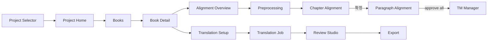
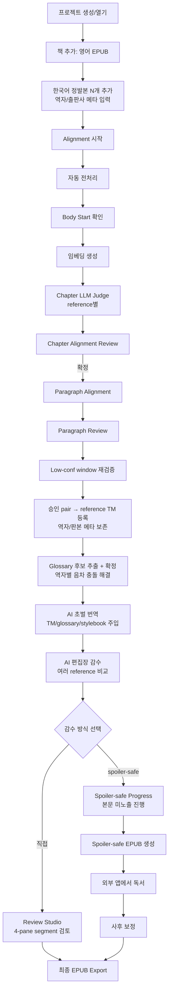
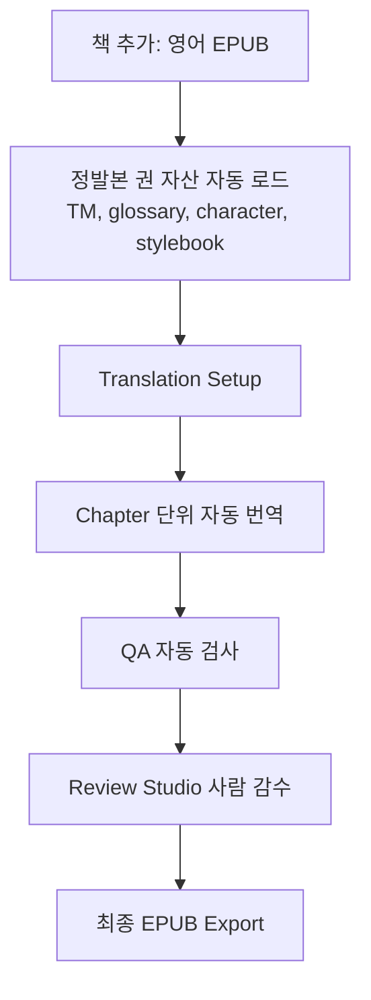

# Series Translation Studio — UI/UX 기획서 (화면 설계서)

## 0. 문서 개요

### 0.1 목적

이 문서는 `series_translation_studio_prd_design.md`의 기획·시스템 설계를 바탕으로, 실제 사용자가 보고 조작하는 화면·흐름·상호작용을 정의한다. PRD가 "무엇을 만들 것인가"를 다룬다면 이 문서는 "사용자가 어떻게 쓸 것인가"를 다룬다.

### 0.2 범위

- 데스크톱 앱 (Electron + React) UI 전반
- 주요 화면 레이아웃과 상태
- 사용자 흐름 (정발본 권 통합 흐름 / 미발간권)
- 공통 컴포넌트, 단축키, 외부 전송 동의 UX
- 디자인 토큰 (색/타이포/스페이싱)

범위 밖: 픽셀 단위 디자인 시안, 일러스트레이션, 모바일/웹, 마케팅 자료.

### 0.3 용어

| 용어 | 정의 |
|---|---|
| 프로젝트 | 한 시리즈 단위 작업 공간 (예: 보르코시건) |
| 책 (Book) | 시리즈의 한 권 |
| Phase | PRD의 Phase 구분 (Phase 0: MVP / Phase 1: 정발본 권 / Phase 2: 미발간권) |
| Job | 번역 작업 단위 |
| Segment | 번역 최소 단위 (문단 또는 그보다 작은 블록) |
| Alignment | 영어 원문과 한국어 참고문의 정렬 |
| Chapter Alignment | 챕터 단위 매핑 (사용자 확정 필수) |
| TM | Translation Memory |
| AI 편집장 | 정발본 권의 1차 감수 주체 (LLM) |
| spoiler-safe mode | 본문을 미리 보지 않고 EPUB 생성까지 진행하는 모드 |

### 0.4 핵심 사용자 가정

- 1인 개인 사용자 (앱 제작자 본인)
- 외부 공개/공유/배포는 비고려
- 로컬 데스크톱 사용
- 한국어 UI 기본, 원문은 영어
- 데스크톱 화면 최소 1440 × 900, 권장 1920 × 1080 이상
- 키보드 사용에 익숙함 (단축키 우대)
- 정보 밀도가 높은 전문가용 도구 톤 (CAT 툴, IDE 류) — 단, 1인 사용 전제이므로 협업·권한·공유 UI는 모두 제거

---

### 0.5 개정 반영 요약

이번 개정에서는 1인 개인 사용자 전제와 흐름 통합을 반영해 다음을 명확히 했다.

```text
- 핵심 사용자 가정을 "본인 1명, 외부 공개 비고려"로 단일화
- 흐름 A (TM 구축) + 흐름 B (재번역 + AI 편집장 감수)를 단일 통합 흐름으로 합침
- 정발본 권에서는 alignment + reference TM 등록 + AI 재번역·감수가 하나의 화면 트리에서 진행
- 동일 권에 여러 역자의 정발본을 reference로 등록하는 UX 반영
  (Book Import Wizard에서 한국어 reference N개 입력, Review Studio에서 역자별 탭)
- 외부 전송 동의 다이얼로그를 첫 설정 1회로 단순화
  (책별/프로젝트별 반복 동의 제거, Privacy 화면에서 일괄 해제만 제공)
- 화면 수와 사이드바 메뉴를 축소 (간결성 우선)
- MVP 화면 범위를 MVP-0 / MVP-1 / MVP-2 / MVP-3으로 재분할
- Welcome / Import / Export에 개인용·DRM·배포 금지 안내 유지 (간략 표현)
- Review Studio 초기형을 2-pane 최소 감수 화면으로 분리
- Cost & Usage, Character, Stylebook, AI Editorial 고도화는 MVP 이후 항목으로 이동
- 고정 모델명 예시를 Project default model 중심으로 변경
- LLM Judge 비용은 범위와 보수적 최대치로 표시
```

---

## 1. 정보 구조 (IA)

### 1.1 전체 화면 트리

```text
앱 시작
├─ Welcome / Onboarding (최초 실행 시만)
├─ Project Selector
└─ Main Workspace
   ├─ Project Home (대시보드)
   ├─ Books
   │   ├─ Book List
   │   ├─ Book Detail
   │   └─ Book Import Wizard
   ├─ Alignment
   │   ├─ Alignment Overview
   │   ├─ Preprocessing & Body Start
   │   ├─ Chapter Alignment Review
   │   ├─ Paragraph Alignment Review
   │   └─ LLM Judge Review Drawer
   ├─ Translation
   │   ├─ Translation Setup
   │   └─ Translation Job Monitor
   ├─ Review Studio
   │   ├─ Segment View (3-pane)
   │   ├─ AI Editorial Result (정발본 권)
   │   └─ Spoiler-safe Progress
   ├─ Series Memory
   │   ├─ Glossary
   │   ├─ TM Manager
   │   ├─ Character Profiles
   │   └─ Stylebook
   ├─ QA Report
   ├─ Export
   ├─ Job Monitor (전역)
   └─ Settings
       ├─ Project Settings
       ├─ Providers & API Keys
       ├─ Embedding Models
       ├─ Cost & Usage
       └─ Privacy & Transfer Policy
```

MVP에서는 Project Selector, Books, Translation, 최소 Review, Glossary를 우선 구현한다. Alignment, AI Editorial, Character Profiles, Stylebook, Cost & Usage 고도화는 MVP 이후 단계로 둔다.

### 1.2 좌측 사이드바

```text
┌─────────────────┐
│  📚 Project     │  현재 프로젝트명, 클릭 시 Project Selector
├─────────────────┤
│  🏠 Home        │
│  📖 Books       │
│  🧩 Alignment   │
│  🌐 Translation │
│  📝 Review      │
│  🧠 Memory      │  ▼ Glossary / TM / Characters / Stylebook
│  🩺 QA          │
│  📤 Export      │
├─────────────────┤
│  ⚙ Settings     │
│  ⏱ Jobs (2)     │
└─────────────────┘
```

사이드바는 collapse 가능. 가로 공간이 부족한 화면(예: Alignment Review)에서 사용자가 collapse한다.

### 1.3 화면 간 주요 전환



---

## 2. 디자인 원칙

1. **간결성 최우선.** 1인 개인용이므로 협업·권한·공유·다중 워크스페이스 UI를 만들지 않는다. 모든 화면을 본인 1명이 빠르게 다룰 수 있게 줄인다.
2. **밀도 우선, 화려함 후순위.** CAT 툴/IDE 톤. 화면 간 점프를 줄인다.
3. **3-pane은 깨지 않는다.** 원문/번역/참고는 옆으로 나란히. 위아래로 쌓지 않는다. 정발본 reference가 여러 역자인 경우 참고 패널은 탭으로 전환.
4. **자동의 결과는 항상 사람이 확인할 초안이다.** 자동 매칭, AI 편집장 감수, QA 모두 승인/거부 가능한 형태로.
5. **확정 단계는 절대 우회하지 않는다.** Chapter Alignment 확정은 명시적 버튼. "자동으로 다음 단계로" 없음.
6. **비용은 상시 표시.** 외부 API 호출의 누적 비용과 추정 잔여 비용을 헤더에 표시.
7. **외부 전송 동의는 1회.** 1인 사용자임을 전제로 첫 설정에서 외부 전송 정책을 1회 동의받고, 이후에는 비용 표시로만 모니터링한다. 매 호출/매 책/매 프로젝트마다 다이얼로그를 띄우지 않는다.
8. **키보드 우선.** 매 segment마다 마우스가 필요하면 감수가 멈춘다. 핵심 동작은 모두 단축키.
9. **중단/재개는 1급 시민.** 모든 긴 작업은 안전하게 중단/재개. 진행률·중단·재개 버튼이 같은 위치.

톤 & 보이스:

- 카피는 사무적이고 짧다. 마케팅 톤·이모지 회피
- 에러 메시지는 "무엇이 일어났는지 + 사용자가 할 수 있는 일" 구조
- 상태값은 한국어로 번역하되 코드 영역에서는 영문 원본 유지

---

## 3. 공통 컴포넌트 & 패턴

### 3.1 헤더

모든 메인 화면 상단에 고정.

```text
┌──────────────────────────────────────────────────────────────────────────┐
│ ≡  Books › Shards of Honor › Alignment    [🔍]   $ 0.42 / 추정 ~$1.10  🔔│
└──────────────────────────────────────────────────────────────────────────┘
   ↑   ↑                                  ↑    ↑                       ↑
 toggle  breadcrumb                     검색  비용 표시              알림
```

- 사이드바 토글, breadcrumb (클릭 가능), 글로벌 검색(Ctrl+K), 비용 표시, 알림 벨

### 3.2 사이드 패널

Review Studio, Alignment Review에서 우측에 보조 패널. 폭 320~400px, 드래그 조절·collapse 가능.

### 3.3 상태 배지

| 상태값 | 표기 | 색 토큰 |
|---|---|---|
| pending / proposed | 대기 | `--color-state-pending` (회색) |
| running / translating | 진행중 | `--color-state-running` (파랑) |
| needs_review | 검토 필요 | `--color-state-review` (노랑) |
| approved | 승인됨 | `--color-state-approved` (녹색) |
| rejected | 거부됨 | `--color-state-rejected` (적색, 약함) |
| failed / error | 실패 | `--color-state-error` (적색) |
| paused | 일시정지 | `--color-state-paused` (회색, 줄무늬) |

### 3.4 confidence 표시

세 형태로 표시한다.

```text
1) 숫자 + 막대        0.91 ████████░░
2) 색 칩              [높음 0.91] / [중간 0.74] / [낮음 0.52]
3) 막대만 (목록 빽빽)   ████████░░
```

기준: 0.85+ 높음 · 0.65~0.85 중간 · 0.65- 낮음.

### 3.5 매핑 타입 뱃지

`[1:1] [1:N] [N:1] [N:M] [1:0] [0:1]` — 1:0 / 0:1은 옅은 회색 (의역에 의한 누락/추가).

### 3.6 진행률 바

```text
챕터 12 / 24                              45%
████████████░░░░░░░░░░░░░░░░    예상 잔여: 23분 · 잔여 비용: ~$0.38
```

요소: 현재/전체, 백분율, 진행바, 잔여 시간, 잔여 비용.

### 3.7 토스트 / 알림

- **토스트**: 우측 하단, 3초 후 사라짐. 비차단. "Segment 저장됨" 등
- **다이얼로그**: 차단형. 외부 전송 동의 등
- **드로어**: 우측 슬라이드. 비차단. QA Issue 상세 등

### 3.8 외부 전송 동의 (첫 설정 1회)

1인 개인 사용자 전제이므로 외부 전송 동의 다이얼로그는 Welcome / Onboarding에서 **딱 한 번** 표시한다. 책별·프로젝트별 반복 동의는 만들지 않는다.

Welcome 화면에 통합된 동의 영역:

```text
┌──────────────────────────────────────────────────────────────┐
│  외부 전송 정책 (첫 설정 1회)                                    │
├──────────────────────────────────────────────────────────────┤
│  이 앱은 본인 단말에서 본인 감상용으로만 사용합니다.                │
│  AI 번역과 LLM Alignment Judge 작업은 선택한 provider           │
│  (기본: Vertex AI)로 원문과 reference 일부를 전송합니다.            │
│  임베딩은 기본값으로 로컬 모델을 사용합니다 (외부 전송 없음).        │
│                                                              │
│  ☑ 위 내용을 이해했으며, 본인 사용을 위해 외부 전송에 동의합니다.    │
│                                                              │
│  헤더에서 누적 비용을 항상 확인할 수 있습니다.                      │
│  Settings → Privacy & Transfer Policy 에서 언제든 정책을         │
│  변경할 수 있습니다.                                            │
└──────────────────────────────────────────────────────────────┘
```

이후 외부 전송이 일어나는 모든 작업(번역, LLM Judge, 외부 임베딩 모델 변경)은 헤더의 비용 표시로만 모니터링한다. 외부 임베딩 모델로 전환할 때만 1회 추가 확인을 받는다 (기본 비활성 → 활성으로 변경되는 시점).

---

## 4. 사용자 여정

### 4.1 여정 1: 정발본이 있는 권 (통합 흐름)

대표 시나리오: "보르코시건 시리즈 정발본은 역자가 3명 이상이고 권별로 용어가 다르다. 영어 원서를 같이 입력하고, 같은 권에 대해 역자별 한국어 EPUB를 모두 reference로 등록한 다음, AI 재번역과 AI 편집장 감수까지 한 흐름에서 처리한다."



핵심 길목:

- **한국어 reference N개 입력**: Book Import Wizard에서 "한국어 참고문 추가" 버튼으로 N개 등록. 각 reference에 역자/출판사/출간연도/판본 라벨 부여
- **reference별 Alignment**: 각 reference에 대해 영어 원서와의 alignment 파이프라인을 독립 실행. 영어 임베딩은 한 번만 계산되고 cache 재사용
- **Body Start 확인**: 자동 탐지가 거의 맞지만 reference별로 한 번씩 확인 필요
- **Chapter Alignment 확정**: reference별로 가장 중요한 결정 지점
- **역자별 음차 충돌 해결**: Glossary 화면에서 canonical_ko를 정하고 다른 표기를 alias로 등록
- **감수 방식 선택**: 직접 segment 검토 vs spoiler-safe 둘 중 본인이 선택. 둘을 권별로 다르게 선택 가능

### 4.2 여정 2: 미발간권 본번역

대표 시나리오: "Cryoburn은 한국에 출간되지 않았다. 시리즈 자산으로 일관되게 번역하고 싶다."



---

## 5. 화면 명세

각 화면은 [목적 / 진입·이탈 / 레이아웃 / 주요 요소 / 인터랙션 / 상태 처리 / 단축키] 항목으로 명세한다.

### 5.0 Welcome / Onboarding

**목적**: 최초 실행 1회. API key 설정, 워크스페이스 위치 결정, 외부 전송 정책 1회 동의.

**진입**: 앱 최초 실행 시 자동 (`~/SeriesTranslationStudio/` 폴더 없으면)

**이탈**: 설정 완료 → Project Selector

```text
┌────────────────────────────────────────────────────────────┐
│                Series Translation Studio                   │
│      장편 SF 시리즈를 위한 개인용 번역·감수 스튜디오             │
│                                                            │
│  1. 워크스페이스 위치                                         │
│  ┌──────────────────────────────────────────┐ [변경]       │
│  │ ~/SeriesTranslationStudio/               │              │
│  └──────────────────────────────────────────┘              │
│                                                            │
│  2. Vertex AI 설정 (나중에 설정 가능)                          │
│  ┌──────────────────────────────────────────┐              │
│  │ Service Account JSON 파일을 끌어다 놓으세요    │              │
│  └──────────────────────────────────────────┘              │
│                                                            │
│  3. 임베딩 모델                                              │
│  ◉ 로컬 모델 (권장, 첫 실행 시 약 500MB 다운로드)              │
│  ○ Vertex AI 임베딩                                         │
│                                                            │
│  4. 외부 전송 정책 (1회 동의)                                  │
│  본인 단말에서 본인 감상용으로만 사용합니다.                       │
│  AI 번역과 LLM Alignment Judge는 선택한 provider로 원문 일부를   │
│  전송합니다. 임베딩 로컬 모델은 외부 전송이 없습니다.              │
│  ☑ 내용을 이해했으며 외부 전송에 동의합니다.                       │
│  (Settings → Privacy & Transfer Policy 에서 변경 가능)        │
│                                                            │
│                                  [건너뛰기]  [시작하기]      │
└────────────────────────────────────────────────────────────┘
```

요소: 워크스페이스 위치(기본값 제시), API key(드래그앤드롭 또는 파일 선택, 생략 가능), 임베딩 모델, 외부 전송 정책 1회 동의 체크박스.

하단 안내:

```text
이 앱은 본인이 합법적으로 보유한 파일을 본인 감상용으로 처리하기 위한 도구입니다.
DRM 해제 기능은 제공하지 않으며, 결과물의 외부 배포·공유를 전제로 하지 않습니다.
```

상태: API key 검증 중/실패 표시. 디스크 권한 없으면 다른 위치 권고.

---

### 5.1 프로젝트

#### 5.1.1 Project Selector

**목적**: 작업할 시리즈 프로젝트 선택

**진입**: 앱 시작 후 / 헤더 프로젝트명 클릭

**이탈**: 카드 클릭 → Project Home / "+ 새 프로젝트" → Wizard

```text
┌────────────────────────────────────────────────────────────┐
│  프로젝트                                  [+ 새 프로젝트]   │
├────────────────────────────────────────────────────────────┤
│  ┌──────────────────────────────────────────────────────┐ │
│  │ Vorkosigan                                           │ │
│  │ 책 5권 · TM 2,341 · Glossary 187                     │ │
│  │ 마지막 작업 2026-05-09                                │ │
│  └──────────────────────────────────────────────────────┘ │
│  ┌──────────────────────────────────────────────────────┐ │
│  │ Discworld                                            │ │
│  │ 책 1권 · TM 0 · Glossary 0   새 프로젝트                │ │
│  └──────────────────────────────────────────────────────┘ │
│  [📁 기존 프로젝트 가져오기]                                  │
└────────────────────────────────────────────────────────────┘
```

요소: 시리즈명·책 수·TM/Glossary 규모·마지막 작업일. 우클릭 메뉴: 삭제 / 폴더 열기 / 백업. 빈 상태: "아직 프로젝트가 없습니다" + 큰 CTA.

#### 5.1.2 Project Wizard

3단계 마법사. Step 1 기본정보(시리즈명·코드·설명), Step 2 언어와 기본 설정(소스 EN / 타깃 KO / provider / 임베딩 모델), Step 3 시작 자산(빈 Glossary / 다른 프로젝트 Glossary 가져오기 / TMX import / Stylebook 템플릿).

#### 5.1.3 Project Home (대시보드)

**목적**: 프로젝트 진입 첫 화면. 현재 상태 한눈 파악.

```text
┌────────────────────────────────────────────────────────────────────────┐
│ Vorkosigan                                                              │
├────────────────────────────────────────────────────────────────────────┤
│  ┌─── 책 현황 ──────────┐  ┌─── 시리즈 자산 ────────┐  ┌─── 진행 작업 ──┐│
│  │ 정발본 권    3 / 10  │  │ TM        2,341 pair  │  │ Job #43        ││
│  │ 미발간권     0 /  4  │  │ Glossary  187 terms   │  │ Translation     ││
│  │                      │  │ Characters 24         │  │ 67% · 23분 남음 ││
│  └──────────────────────┘  │ Stylebook v3          │  │ [열기]          ││
│                            └────────────────────────┘  └────────────────┘│
│                                                                          │
│  ┌─── 최근 활동 ──────────────────────────────────────────────────────┐ │
│  │ 2026-05-09 10:32  Cetaganda 챕터 정렬 완료 (24/24)                  │ │
│  │ 2026-05-09 09:15  Glossary: '무장가신' 등록                         │ │
│  │ 2026-05-08 22:01  Barrayar TM 47 pair 추가                         │ │
│  └────────────────────────────────────────────────────────────────────┘ │
│                                                                          │
│  ┌─── 다음 할 일 (제안) ───────────────────────────────────────────────┐│
│  │ • The Warrior's Apprentice: Alignment 80% 진행 중. 이어서 진행      ││
│  │ • Cetaganda: AI 편집장 감수 대기 23 segment                          ││
│  │ • Glossary 'cellovine': 후보로 추출됨. 확정 필요                       ││
│  └────────────────────────────────────────────────────────────────────┘│
└────────────────────────────────────────────────────────────────────────┘
```

요소: 책 현황(Phase별)/시리즈 자산/진행 작업 카드, 최근 활동 10개, 다음 할 일 자동 제안.

빈 상태: 책 0권이면 "첫 번째 책을 추가해 보세요" CTA.

---

### 5.2 책 관리

#### 5.2.1 Book List

**목적**: 프로젝트 내 책 목록과 상태

```text
┌────────────────────────────────────────────────────────────────────────┐
│ Books                                              [+ 책 추가] [필터 ▼] │
├────────────────────────────────────────────────────────────────────────┤
│ #  제목                       구분   진행률           상태   마지막 작업 │
│ 1  Shards of Honor            정발  ████████████ 완료  ✓   05-01      │
│ 2  Barrayar                   정발  ████████████ 완료  ✓   05-03      │
│ 3  The Warrior's Apprentice   정발  ████████░░░░ 70%  진행 05-09      │
│ 4  The Vor Game               정발  ░░░░░░░░░░░░ 0%   대기 -          │
│ 5  Cetaganda                  정발  ███░░░░░░░░░ 23%  진행 05-08      │
└────────────────────────────────────────────────────────────────────────┘
```

표 형식. 정렬은 시리즈 순서 기본, 컬럼 헤더 클릭으로 변경. 진행률은 전체 작업(alignment + translation + review) 기준. 필터: Phase별 / 상태별.

#### 5.2.2 Book Import Wizard

3단계. Step 1 영어 EPUB 드래그앤드롭 후 메타데이터 즉시 표시 (제목·저자·spine 수·추정 본문 분량). Step 2 한국어 참고문 입력 (정발본이 있는 권이면 1개 또는 N개, 미발간권이면 건너뛰기). Step 3 책 구분(정발본 권 / 미발간권) 및 메타(시리즈 순서·한국어 제목).

Step 2 화면 (다중 reference 지원):

```text
┌────────────────────────────────────────────────────────────────┐
│ 한국어 참고문 (정발본)                                            │
│ 정발본이 여러 역자에 의해 번역된 경우 모두 등록하세요.                │
│ 각 reference는 alignment를 독립 수행하고 TM에 역자/판본을 기록합니다. │
├────────────────────────────────────────────────────────────────┤
│ Reference 1                                                    │
│ 파일: ShardsOfHonor_KO_김OO_2010.epub      [변경] [제거]         │
│ 역자: 김OO                                                      │
│ 출판사: 황금가지                                                  │
│ 출간연도: 2010                                                  │
│ 판본 라벨: 초판                                                  │
├────────────────────────────────────────────────────────────────┤
│ Reference 2                                                    │
│ 파일: ShardsOfHonor_KO_박OO_2018.epub      [변경] [제거]         │
│ 역자: 박OO                                                      │
│ 출판사: 행복한 책읽기                                              │
│ 출간연도: 2018                                                  │
│ 판본 라벨: 개정판                                                 │
├────────────────────────────────────────────────────────────────┤
│ [+ 한국어 reference 추가]    또는    [정발본 없음 — 미발간권]        │
└────────────────────────────────────────────────────────────────┘
```

상태: EPUB 파싱 실패 시 어느 단계에서 실패했는지 명시 (mimetype 없음, OPF 파싱 오류 등). 중복 file_hash 경고. reference가 N개일 때 각각 독립적으로 검증.

Import Wizard 하단 고정 안내:

```text
본인이 합법적으로 보유한 파일만 추가하세요. DRM 해제 기능은 제공하지 않습니다.
생성된 번역본은 본인 감상용으로만 사용하세요.
```


#### 5.2.3 Book Detail

**목적**: 한 책의 모든 작업 진입점

```text
┌────────────────────────────────────────────────────────────────────────┐
│ ← Books  /  The Warrior's Apprentice                                    │
├────────────────────────────────────────────────────────────────────────┤
│  Phase 1 (정발본 권) · 시리즈 #3 · 원제: The Warrior's Apprentice        │
│                                                                        │
│  영어 원서:  WarriorsApprentice.epub  (1.2 MB · 7,234 paragraphs)       │
│                                                                        │
│  한국어 reference (2개):                          [+ reference 추가]    │
│   1. 전사의 견습생 (김OO / 황금가지 / 2008)  ✓ alignment 완료            │
│      980 KB · 5,891 paragraphs · TM 등록 4,512 pair                    │
│   2. 전사의 견습 (박OO / 행복한 책읽기 / 2017)  ⚐ alignment 72%          │
│      1.05 MB · 6,234 paragraphs · TM 등록 0 pair                       │
│                                                                        │
│  ┌─── Alignment ────────────────┐  ┌─── Translation ────────────────┐ │
│  │ reference 1  ✓ 완료              │  │ 초벌 번역  ░░░░░░  0%            │ │
│  │ reference 2  ███░░ 72%           │  │                                │ │
│  │ [Alignment 이어서]              │  │ [Translation 시작]              │ │
│  └─────────────────────────────────┘  └────────────────────────────────┘ │
│                                                                          │
│  ┌─── AI 편집장 감수 ──────────────┐  ┌─── Export ─────────────────────┐ │
│  │ 대기 0  진행 0  완료 0           │  │ 마지막 export: 없음              │ │
│  │ [감수 시작]   (Translation 후)   │  │ [EPUB Export]                   │ │
│  └─────────────────────────────────┘  └────────────────────────────────┘ │
│                                                                          │
│  추가일 2026-05-01   마지막 작업 2026-05-09 14:23                          │
│  reference TM 누적 4,512 pair    Glossary 추가됨 0 term                   │
│  [편집] [삭제] [워크스페이스 폴더 열기]                                       │
└────────────────────────────────────────────────────────────────────────┘
```

4개 작업 영역 카드. reference 목록에서 reference 클릭 시 해당 reference의 Alignment Overview로 진입. 가장 자연스러운 다음 액션을 강조 색으로 표시. Phase 2(미발간권) 책: Alignment 카드와 reference 목록이 빈 상태로 표시("정발본 없음").

---

### 5.3 Alignment

핵심 영역. 5개 하위 화면.

#### 5.3.1 Alignment Overview

**목적**: 한 책의 전체 alignment 진행 단계 파악

**진입**: Book Detail → "Alignment 이어서" / 사이드바 Alignment

```text
┌────────────────────────────────────────────────────────────────────────┐
│ The Warrior's Apprentice  /  Alignment                                  │
├────────────────────────────────────────────────────────────────────────┤
│  Stage 0  전처리                            ✓ 완료                       │
│    HTML 추출, front/back matter 분류, scene break 처리                    │
│    영어: body 24장 · 한국어: body 25장 · 부속 문서: 영어 4 / 한국어 5      │
│                                                                        │
│  Stage 1  임베딩 생성                        ✓ 완료 (cache 사용)          │
│    모델: local-labse-v1                                                  │
│    문단 12,890 / 챕터 요약 49                                             │
│    cache hit 100%                                                       │
│                                                                        │
│  Stage 2  Chapter Alignment                ✓ 확정                       │
│    매핑 24개 (1:1 22, 1:N 1, N:1 1)                                     │
│    LLM Judge 호출 31회 ($0.04)                                          │
│    [매핑 보기]                                                            │
│                                                                        │
│  Stage 3  Paragraph Alignment              진행중 18/24 챕터             │
│    승인 후보 4,512 · 검토 필요 287 · 낮은 confidence 92                    │
│    [이어서 진행]                                                          │
│                                                                        │
│  Stage 4  Low-confidence 재검증              대기                         │
│  Stage 5  TM 등록                            대기                          │
└────────────────────────────────────────────────────────────────────────┘
```

"이어서 진행" 버튼은 현재 활성 stage에만. 완료된 stage 클릭 시 "되돌리시겠습니까?" 경고 (Stage 2를 되돌리면 Stage 3 결과 영향받음).

---

#### 5.3.2 Preprocessing & Body Start

**목적**: 자동 전처리 결과 확인. 본문 시작 anchor가 잘못이면 수동 지정.

**이탈**: 양쪽 본문 시작 확정 → Stage 1 임베딩 자동 시작

```text
┌────────────────────────────────────────────────────────────────────────┐
│ Alignment / Preprocessing                                               │
├────────────────────────────────────────────────────────────────────────┤
│  ┌─── 영어 EPUB ─────────────────┐ ┌─── 한국어 EPUB ────────────────┐ │
│  │ □ titlepage      (front)      │ │ □ cover.html        (front)   │ │
│  │ □ copyright      (front)      │ │ □ contents.html     (toc)     │ │
│  │ □ dedication     (front)      │ │ □ translator_intro  (front)   │ │
│  │ □ toc            (toc)        │ │ ◉ ch01_prologue     (body) ⚐  │ │
│  │ ◉ chapter01      (body) ⚐    │ │ □ ch02              (body)     │ │
│  │ □ chapter02      (body)       │ │ □ ch03              (body)     │ │
│  │ □ acknowledgments (back)      │ │ □ translator_note   (back)     │ │
│  └───────────────────────────────┘ └────────────────────────────────┘ │
│                                                                        │
│  ⚐ = Body Start Detector가 본문 시작으로 추정한 지점                       │
│                                                                        │
│  [본문 시작이 맞나요?]                                                     │
│  영어:   chapter01      [✓ 맞음]  [다른 곳 지정]                          │
│  한국어: ch01_prologue  [⚠ 한국어판은 프롤로그가 추가됨]  [✓ 맞음] [지정]  │
│                                                                        │
│  ┌─── 미리보기 ──────────────────────────────────────────────────────┐ │
│  │ 영어 chapter01 첫 500자:                                            │ │
│  │ "Miles wished his father would just buy the planet..."             │ │
│  │ 한국어 ch01_prologue 첫 500자:                                     │ │
│  │ "마일즈는 아버지가 그냥 그 행성을 사 버리면 좋겠다고..."                │ │
│  └────────────────────────────────────────────────────────────────────┘ │
│                                          [되돌리기]   [이대로 임베딩 시작] │
└────────────────────────────────────────────────────────────────────────┘
```

좌우 분류 트리 클릭 → 하단 미리보기 갱신. 양쪽 ✓ 완료해야 "임베딩 시작" 활성화.

상태: Body Start 신뢰도 낮으면 노란 경고. 한국어판 챕터 구성이 비대칭이면 안내 ("한국어판에 프롤로그가 추가된 것 같습니다").

---

#### 5.3.3 Chapter Alignment Review

**가장 중요한 화면.** 정발본 권의 모든 후속 작업이 이 단계의 확정에 의존.

**목적**: LLM Judge가 제안한 챕터 매핑을 검토하고 사용자가 명시적으로 확정

**진입**: Alignment Overview → Stage 2 / 임베딩 완료 후 자동 진입 다이얼로그

**이탈**: 모든 매핑 확정 → Stage 3 자동 시작 / 부분 확정 후 저장

```text
┌────────────────────────────────────────────────────────────────────────────┐
│ Alignment / Chapter Mapping                          LLM Judge 호출 31회 $0.04│
├────────────────────────────────────────────────────────────────────────────┤
│ 필터: [전체 ▼]  [낮은 confidence]  [사용자 수정됨]  [미확정]    [일괄 승인] │
├────────────────────────────────────────────────────────────────────────────┤
│  EN 챕터          매핑   KO 챕터            confidence  type    상태   액션 │
│  ────────────────────────────────────────────────────────────────────       │
│  Prologue         ───    (없음)              -          0:1     ✓    [편집]│
│  Chapter 1        ───    1장 + 2장            0.92       1:N     ⚐    [열기]│
│  Chapter 2        ───    3장                  0.95       1:1     ✓    [열기]│
│  Chapter 3        ───    4장                  0.93       1:1     ✓    [열기]│
│  Chapter 4        ───    5장                  0.78       1:1     ⚐    [열기]│
│  Chapter 5+6      ───    6장                  0.81       N:1     ⚐    [열기]│
│  Chapter 7        ───    (없음)               0.42       1:0     ⚠    [열기]│
│  Chapter 8        ───    7장                  0.94       1:1     ✓    [열기]│
│                                                                            │
│  ⚐ 검토 필요   ⚠ 낮은 confidence   ✓ 확정 가능                             │
├────────────────────────────────────────────────────────────────────────────┤
│                       [전체 24개 중 18개 확정됨]  [일괄 확정] [선택 항목 확정]│
└────────────────────────────────────────────────────────────────────────────┘
```

행 클릭 시 우측 드로어:

```text
┌────────────────────────────────────────────────────────────────┐
│  Chapter 1 ↔ 1장 + 2장              [1:N · 0.92]    ⚐ 검토 필요 │
├────────────────────────────────────────────────────────────────┤
│  LLM Judge 사유                                                  │
│  "영문 Chapter 1이 한국어판에서 두 장으로 분할되어 있다.            │
│   둘 다 마일즈의 사관학교 첫날을 다루며, 등장인물과 사건이          │
│   순서대로 일치한다."                                              │
│                                                                  │
│  ┌─ EN Chapter 1 ──────────────┐ ┌─ KO 1장 ────────────────┐    │
│  │ 첫 500자 미리보기              │ │ 첫 400자 미리보기          │    │
│  └──────────────────────────────┘ └───────────────────────────┘  │
│                                   ┌─ KO 2장 ────────────────┐    │
│                                   │ 첫 400자 미리보기          │    │
│                                   └───────────────────────────┘    │
│                                                                  │
│  매핑 수정:                                                        │
│  영어:   ◉ Chapter 1                                              │
│  한국어: ☑ 1장   ☑ 2장   ☐ 3장 (추가 가능)                          │
│                                                                  │
│  [매핑 분할(1:1로)]  [매핑 병합 다른 영어 챕터 추가]  [매핑 제외]    │
│              [거부]              [확정]                          │
└────────────────────────────────────────────────────────────────┘
```

요소: 메인 테이블(모든 매핑 한눈), mapping_type 배지, confidence 색 칩, 일괄 확정(0.85+ 한번에).

인터랙션: 드로어에서 수정 시 즉시 auto-save (status=needs_review). 거부 시 해당 챕터 쌍의 paragraph alignment 진행 안 됨. 일괄 확정 시 "0.85 이상 confidence 18개 매핑을 일괄 승인 추천 후보로 확정합니다" 다이얼로그.

상태: empty 시 "임베딩 결과를 바탕으로 후보 계산 중" 로딩. LLM 호출 실패 시 "재시도" 버튼.

단축키:

```text
J / ↓        다음 행
K / ↑        이전 행
Enter        드로어 열기
A            확정
R            거부
Esc          드로어 닫기
Cmd/Ctrl+A   일괄 확정
```

---

#### 5.3.4 Paragraph Alignment Review

**목적**: 확정된 챕터 내부의 문단 정렬을 검토. 낮은 confidence 구간 위주.

**진입**: Alignment Overview → Stage 3 / Chapter Alignment 확정 후 자동

```text
┌────────────────────────────────────────────────────────────────────────────┐
│ Alignment / Paragraph (Chapter 4 of 24)             [< 이전 챕터] [다음 >] │
├────────────────────────────────────────────────────────────────────────────┤
│ 필터: [낮은 confidence ▼]  보기: [3-pane ▼]   chapter 4 confidence: 0.81  │
├────────────────────────────────────────────────────────────────────────────┤
│ # ⚐ EN paragraph                       KO paragraph              type conf │
│ ────────────────────────────────────────────────────────────────────       │
│ 47    Miles climbed the slope, his    마일즈는 비탈을 올랐다.       1:1  0.91│
│       breath fogging in the cold.    추위 속에 그의 숨이 하얗게      ████│
│                                       서렸다.                                │
│ ────────────────────────────────────────────────────────────────────       │
│ 48 ⚐ "Are you sure this is the       "정말 이 길이 맞느냐?"       1:2  0.71│
│       way?" he asked. He squinted    그가 물었다. 마일즈는 어둠       ████│
│       into the darkness.              속을 가늘게 보았다.                    │
│ ────────────────────────────────────────────────────────────────────       │
│ 49 ⚠ (영문 한 문단)                     (한국어 두 문단 추가됨)     1:2  0.42│
│       ...                              ...                          ████ │
│ ────────────────────────────────────────────────────────────────────       │
│ 50    "Yes, sir," Bothari grunted.   "그렇습니다." 보타리가          1:1  0.88│
│                                       으르렁대듯 답했다.              ████│
└────────────────────────────────────────────────────────────────────────────┘

[승인]  [병합]  [분할]  [거부]  [LLM Judge 재검증]
```

표 형식. 한 행이 하나의 align pair. ⚐ needs_review, ⚠ 낮은 confidence. 필터 기본 = "낮은 confidence" (사용자는 의심스러운 곳만 보면 됨).

보기 옵션: 3-pane / 2-pane / diff(번갈아 표시).

LLM Judge 재검증 시 동의 다이얼로그 (비용 표시).

단축키:

```text
J / K           다음 / 이전 align pair
A               승인
M               병합 (현재 + 다음)
S               분할
R               거부
L               LLM Judge 재검증
Cmd/Ctrl+→     다음 챕터
Cmd/Ctrl+←     이전 챕터
```

---

#### 5.3.5 LLM Judge Review Drawer

**목적**: 낮은 confidence window의 LLM Judge 결과 표시 + 채택 결정

**진입**: Paragraph Alignment에서 "LLM Judge 재검증"

```text
┌──────────────────────────────────────────────────────────────────┐
│  LLM Judge 결과 (window 12, Chapter 4)                  [닫기 ×] │
├──────────────────────────────────────────────────────────────────┤
│  앞 anchor: align #46  EN "Miles signaled to..." ↔ "마일즈가..."  │
│  뒤 anchor: align #51  EN "He turned to look..." ↔ "그가 돌아..." │
│                                                                  │
│  LLM 제안 (4 align pair)                                          │
│  ┌──────────────────────────────────────────────────────────┐    │
│  │ # type EN                          KO                conf │    │
│  │ 1 1:1  "Are you sure..." (47)     "정말..." (52)     0.84│    │
│  │ 2 1:2  "He squinted..." (48)      "그는..." + "마..." 0.79│    │
│  │ 3 0:1  -                          "보타리는..." (54) 0.65│    │
│  │ 4 1:1  "Bothari..." (49)          "보타리가..." (55)  0.81│    │
│  └──────────────────────────────────────────────────────────┘    │
│                                                                  │
│  LLM 사유: "한국어판이 영문 한 문장을 두 문장으로 분할했으며,          │
│            보타리의 짧은 추가 묘사가 한 문장 삽입되어 있다."            │
│                                                                  │
│             [모두 거부]              [모두 채택]                   │
│             [선택 채택]                                           │
└──────────────────────────────────────────────────────────────────┘
```

앞뒤 anchor 명시(어느 영역인지). 일괄/개별 채택 버튼.

---

### 5.4 Translation

#### 5.4.1 Translation Setup

**목적**: 번역 작업 시작 전 옵션 설정과 비용 추정

```text
┌────────────────────────────────────────────────────────────────────────┐
│ The Warrior's Apprentice / Translation Setup                            │
├────────────────────────────────────────────────────────────────────────┤
│  ┌─── 범위 ─────────────────────────────────────────────────────────┐ │
│  │ ◉ 책 전체 (24장, 7,234 문단)                                       │ │
│  │ ○ 챕터 선택   [선택...]                                            │ │
│  │ ○ 미번역 segment만 (cache hit 제외)  → 7,234 (cache 0%)            │ │
│  └────────────────────────────────────────────────────────────────────┘ │
│                                                                        │
│  ┌─── Provider ─────────────────────────────────────────────────────┐ │
│  │ Provider: [Vertex AI ▼]    Model: [Project default model ▼]              │ │
│  │ Temperature: [0.4]                                                │ │
│  └────────────────────────────────────────────────────────────────────┘ │
│                                                                        │
│  ┌─── Context 주입 ────────────────────────────────────────────────┐ │
│  │ ☑ TM 검색 (현재 시리즈, gold+gold_candidate)                       │ │
│  │ ☑ Glossary hit       ☑ Character profile                          │ │
│  │ ☑ Stylebook summary  ☑ Previous context (직전 3 문단)              │ │
│  └────────────────────────────────────────────────────────────────────┘ │
│                                                                        │
│  ┌─── 추정치 ───────────────────────────────────────────────────────┐ │
│  │ 호출 횟수:    7,234 segment                                       │ │
│  │ 추정 토큰:    약 3.2M input · 4.1M output                          │ │
│  │ 추정 비용:    $9.80 ~ $11.40 (보수적 최대 $15.00)                                      │ │
│  │ 예상 소요:    작업량과 provider 상태에 따라 변동                                             │ │
│  └────────────────────────────────────────────────────────────────────┘ │
│                                  [취소]   [번역 시작 — 동의 후 진행]     │
└────────────────────────────────────────────────────────────────────────┘
```

"번역 시작" → 외부 전송 동의 다이얼로그 (3.8) → 시작.

---

#### 5.4.2 Translation Job Monitor

**목적**: 진행 중 번역의 상태 모니터링

```text
┌────────────────────────────────────────────────────────────────────────┐
│ Translation Job #43 — The Warrior's Apprentice    [⏸ 일시정지] [✕ 취소]│
├────────────────────────────────────────────────────────────────────────┤
│  전체     ████████░░░░░░░░░░░░  4,512 / 7,234   62%   잔여 약 2시간 18분│
│  현재 챕터  Chapter 13          ███░░░░░ 38%                              │
│                                                                          │
│  ┌─── 통계 ────────────────────────────────────────────────────────┐  │
│  │ 누적 호출      4,512        cache hit       0  (이번이 첫 번역)    │  │
│  │ 누적 토큰 (in) 2.4M         누적 토큰 (out) 3.1M                   │  │
│  │ 누적 비용      $6.42        평균 segment 시간 1.4초                 │  │
│  │ TM 적용         432 hit     Glossary 적용   1,872 hit              │  │
│  └────────────────────────────────────────────────────────────────────┘  │
│                                                                          │
│  ┌─── 최근 segment ───────────────────────────────────────────────┐  │
│  │ ✓ #4512 "Miles drew himself up..."                              │  │
│  │ ✓ #4511 "Bothari laughed harshly."                              │  │
│  │ ✓ #4510 "The shuttle door hissed."                              │  │
│  │ ⚠ #4509 (uncertain_terms: 'cellovine')                          │  │
│  └────────────────────────────────────────────────────────────────────┘  │
│                                                                          │
│  ┌─── 오류 (3) ────────────────────────────────────────────────────┐  │
│  │ #3845  rate limit (자동 재시도 중)                                  │  │
│  │ #2918  JSON schema 위반 (재시도 1회 후 실패)  [재시도] [건너뛰기]   │  │
│  │ #1023  network timeout  [재시도]                                  │  │
│  └────────────────────────────────────────────────────────────────────┘  │
└────────────────────────────────────────────────────────────────────────┘
```

요소: 전체/현재 챕터 진행률, 통계 실시간, 최근 segment 로그, 오류 목록(개별 재시도). 완료 시 토스트 + Review Studio 진입 CTA.

상태: 일시정지(줄무늬 진행바), 오류로 중단(적색 헤더), 완료(녹색 헤더 + 후속 액션).

---

### 5.5 Review Studio

가장 오래 머무는 화면. 단축키와 정보 밀도가 핵심.

#### 5.5.0 Minimal Review Studio (MVP-2)

**목적**: MVP에서는 고급 4-pane 감수 화면보다 먼저, 원문과 번역문을 빠르게 수정할 수 있는 2-pane 최소 감수 화면을 제공한다.

```text
┌────────────────────────────────────────────────────────────────────────┐
│ Review — The Warrior's Apprentice        Seg 1,432 / 7,234              │
├────────────────────────────────────────────────────────────────────────┤
│ 필터:[전체 ▼] [미승인] [QA 있음]                  진행 42% [████░░░░] │
├───────────────────────────────────┬────────────────────────────────────┤
│ 원문                              │ 번역문 편집                         │
│ "Miles wished his father..."      │ 마일즈는 아버지가...                 │
│                                   │                                    │
│                                   │                                    │
├───────────────────────────────────┴────────────────────────────────────┤
│ [← 이전] [저장] [승인하고 다음 →] [재번역]                              │
└────────────────────────────────────────────────────────────────────────┘
```

MVP-2 포함 범위:

```text
- source / translation 2-pane
- segment list와 상태 필터
- 저장 / 승인하고 다음
- 재번역
- reviewed_translation / final_translation 저장
```

MVP-2 제외 범위:

```text
- 기존 한국어판 4-pane 비교
- TM 추천 side panel
- Character profile side panel
- AI Editorial Result
- spoiler-safe mode
```

아래 Segment View는 MVP 이후 고도화 화면이다.

#### 5.5.1 Segment View (정발본 권 — 다중 reference 지원)

**목적**: 원문 / AI 번역 / (있으면) 역자별 reference / 최종 감수문을 함께 보며 segment 단위 감수

```text
┌──────────────────────────────────────────────────────────────────────────────┐
│ Review Studio — The Warrior's Apprentice        Ch 13 / 24    Seg 1,432 / 7,234│
├──────────────────────────────────────────────────────────────────────────────┤
│ 필터:[전체 ▼]  [QA 있음] [TM 일치] [낮은 confidence]    검토 진행 62% [████░░░] │
├───────────────────────────────────────────┬──────────────────────────────────┤
│  ┌─ 원문 (EN) ─────────────────────────┐  │  TM 추천 (역자별)                  │
│  │ "Miles wished his father would just │  │  [gold] 0.81                      │
│  │  buy the planet, and have done      │  │  "Miles wished his father..."     │
│  │  with it."                          │  │   ↔  "마일즈는 아버지가..."          │
│  │  Naismith glanced at the boy,       │  │  김OO · Shards of Honor · ch 14   │
│  └─────────────────────────────────────┘  │                                   │
│                                           │  Glossary hit                     │
│  ┌─ AI 번역 ──────────────────────────┐  │  Miles → 마일즈        [gold]    │
│  │ "마일즈는 아버지가 그냥 그 행성을 사  │  │  Naismith → 네이스미스 [gold]    │
│  │  버리면 좋겠다고 생각했다."          │  │  cellovine → ?      [uncertain]  │
│  │  네이스미스는 소년을 흘긋 보았다.      │  │                                   │
│  └─────────────────────────────────────┘  │  QA Issues                        │
│                                           │  ⚠ uncertain_term 'cellovine'    │
│  ┌─ 기존 한국어판 [김OO][박OO][이OO] ─┐  │  AI가 임시 번역어를 제안했습니다.    │
│  │ (탭으로 역자별 전환)                  │  │  [용어 등록] [무시]                 │
│  │ "마일즈는 그냥 아버지가 행성을        │  │                                   │
│  │  사 버렸으면 했다." (김OO)          │  │  Reference 충돌                    │
│  │  네이스미스가 그를 슬쩍 보았다.       │  │  Cordelia:                        │
│  └─────────────────────────────────────┘  │   김OO=코델리아 / 박OO=코딜리아      │
│                                           │   → canonical: 코델리아             │
│  ┌─ 최종 감수문 ──────────────────────┐  │                                   │
│  │ 마일즈는 아버지가 그냥 그 행성을 사   │  │  Character                        │
│  │ 버리면 좋겠다고 생각했다.            │  │  Miles Vorkosigan                  │
│  │ |                                  │  │  말투: 직설적, 자기비하적 유머       │
│  │ 네이스미스는 소년을 흘긋 보았다.       │  │                                   │
│  └─────────────────────────────────────┘  │                                   │
├───────────────────────────────────────────┴──────────────────────────────────┤
│ [← 이전 Seg] [승인하고 다음 →]  [재번역]  [TM 등록]  [용어 등록]  [QA 해결]    │
└──────────────────────────────────────────────────────────────────────────────┘
```

요소:

- 좌측 3-pane 또는 4-pane (원문 / AI / reference 탭 / 최종)
- reference 패널은 등록된 reference 수에 따라:
  - 1개: 단일 패널
  - 2~3개: 탭 (역자명 표시)
  - 4개 이상: 드롭다운 + 탭
- 우측 사이드 패널(collapsible): TM(역자별 표시), Glossary hit, QA, Reference 충돌, Character
- 하단 액션 바
- 상단 진행 표시

보기 옵션:

- 4-pane (기본): 정발본 권
- 3-pane: 미발간권 (reference 없음)
- compact: 사이드 패널 collapse

인터랙션:

- 최종 감수문 패널 편집 가능, 자동 저장(debounce 500ms)
- "재번역" → 현재 segment만 재호출
- "TM 등록" → 최종 감수문을 gold TM으로 즉시 등록
- "용어 등록" → 드래그 선택 텍스트를 Glossary에 추가 (모달)
- reference 충돌 패널의 canonical 클릭 시 Glossary에서 canonical_ko 변경 가능

단축키:

```text
Cmd/Ctrl+Enter  승인하고 다음 segment
Cmd/Ctrl+S      저장
Cmd/Ctrl+G      선택어 Glossary 등록
Cmd/Ctrl+T      현재 segment TM 등록
Cmd/Ctrl+R      재번역
Alt+←  /  Alt+→  이전/다음 segment
Cmd/Ctrl+1~3    원문/AI/최종 감수문 패널 포커스
Cmd/Ctrl+[ / ] 이전/다음 reference 탭
Cmd/Ctrl+/      QA 패널 토글
Cmd/Ctrl+K      글로벌 검색
```

---

#### 5.5.2 AI Editorial Result (정발본 권 전용)

**목적**: AI 편집장이 감수 승인한 결과 검토. 본문을 미리 안 보고 싶다면 요약만 본다.

```text
┌────────────────────────────────────────────────────────────────────────┐
│ AI 편집장 감수 — The Warrior's Apprentice                                │
├────────────────────────────────────────────────────────────────────────┤
│  ⓘ Spoiler-safe 모드입니다. 본문은 표시되지 않습니다.                      │
│                                                                        │
│  ┌─── 감수 결과 요약 ──────────────────────────────────────────────┐ │
│  │ 총 segment    7,234                                              │ │
│  │ approved      6,891  (95.3%)                                     │ │
│  │ needs_review    287  (4.0%)                                      │ │
│  │ rejected         56  (0.8%)                                      │ │
│  └────────────────────────────────────────────────────────────────────┘ │
│                                                                        │
│  ┌─── 용어 변경 / 등록 ──────────────────────────────────────────┐ │
│  │ 새로 등록된 용어 47개                                             │ │
│  │ 기존 정발본과 다른 표기 12개                                       │ │
│  │ [용어 변경 요약 보기]   (본문 노출 없음)                              │ │
│  └────────────────────────────────────────────────────────────────────┘ │
│                                                                        │
│  ┌─── 우려 신호 ───────────────────────────────────────────────────┐ │
│  │ 캐릭터 호칭 불일치 의심 segment 14개                                │ │
│  │ 숫자 mismatch 3개                                                │ │
│  │ 의역 의심 크기 (paragraph_count_mismatch) 7개                      │ │
│  │ (detail은 본문이 보이므로 표시되지 않음 - 사후 보정에서 확인)        │ │
│  └────────────────────────────────────────────────────────────────────┘ │
│                                                                        │
│  ┌─── 다음 단계 ────────────────────────────────────────────────────┐ │
│  │ [Spoiler-safe EPUB 생성]                                         │ │
│  │ [Review Studio로 이동 (본문 노출 동의 필요)]                       │ │
│  └────────────────────────────────────────────────────────────────────┘ │
└────────────────────────────────────────────────────────────────────────┘
```

본문 노출이 필요한 액션은 별도 동의: "이 책의 본문이 화면에 표시됩니다. 미리 읽고 싶지 않다면 spoiler-safe 모드를 유지하세요".

---

#### 5.5.3 Spoiler-safe Progress

```text
┌────────────────────────────────────────────────────────────────────────┐
│ The Warrior's Apprentice / AI 편집장 감수 진행 중                          │
├────────────────────────────────────────────────────────────────────────┤
│  ⓘ Spoiler-safe 모드                                                    │
│  ▒▒▒▒▒▒▒▒▒▒▒▒▒▒▒▒▒▒▒▒▒▒▒▒▒▒▒▒▒▒▒▒▒▒▒▒▒▒▒▒▒▒▒▒▒▒▒▒▒▒▒  68%                │
│  4,920 / 7,234 segment 처리 중 · 잔여 약 1시간 14분                       │
│                                                                        │
│  최근 활동:                                                              │
│   ✓ 챕터 16 완료                                                          │
│   ⚠ 신규 용어 후보 'imperial regalia' (1 hit)                            │
│   ⚠ glossary mismatch: 'Vorkosigan' 표기 12회                            │
│                                                                        │
│  [감수 일시정지]   [용어 변경 요약 보기]                                     │
└────────────────────────────────────────────────────────────────────────┘
```

본문 미리보기는 절대 표시하지 않는다. 메타 정보(용어 후보, mismatch 카운트)만.

---

### 5.6 Series Memory

#### 5.6.1 Glossary

```text
┌────────────────────────────────────────────────────────────────────────┐
│ Glossary — Vorkosigan                          187 terms  [+ 용어 추가] │
├────────────────────────────────────────────────────────────────────────┤
│ [검색...]                                                               │
│ 카테고리:[전체 ▼]  등급:[전체 ▼]  ☐ needs_review만                    │
├────────────────────────────────────────────────────────────────────────┤
│ source_term       canonical_ko  category   등급   별칭                   │
│ Vor                보르          culture    gold    Vor caste, Vor class│
│ Vorkosigan         보르코시건     family     gold    -                  │
│ Cordelia Naismith  코델리아 네이  person     gold    Cordelia, Captain  │
│ Aral Vorkosigan    아랄 보르코시  person     gold    Aral, Lord Vorkos. │
│ Barrayar           바라야         place      gold    Barrayaran         │
│ Beta Colony        베타 콜로니     place      gold    Betan              │
│ armsman            무장가신       rank       gold    -  [context_rules] │
│ cellovine          ?             tech       needs   -  [needs_review]  │
├────────────────────────────────────────────────────────────────────────┤
│ [CSV import] [CSV export] [TBX export]                                  │
└────────────────────────────────────────────────────────────────────────┘
```

행 클릭 시 우측 드로어: source_term / canonical_ko / category / aliases / forbidden / context_rules / notes / occurrence(책별 등장 횟수, "용례 검색" 버튼).

#### 5.6.2 TM Manager

```text
┌────────────────────────────────────────────────────────────────────────┐
│ TM Manager — Vorkosigan                        2,341 units  [+ 수동 추가]│
├────────────────────────────────────────────────────────────────────────┤
│ [검색...]   등급:☑gold ☑g_cand ☑silver ☐ref   책:[전체 ▼]              │
├────────────────────────────────────────────────────────────────────────┤
│ # source                          target                grade book ch  │
│ 1 He was a Vor lord, after all.   어쨌든 그는 보르 귀족이었다. gold Bar 12│
│ 2 "Miles!" Bothari roared.        "마일즈!" 보타리가 외쳤다.   gold WA 04│
├────────────────────────────────────────────────────────────────────────┤
│ [TMX import] [TMX export]                                              │
└────────────────────────────────────────────────────────────────────────┘
```

행 액션: gold 승격 / gold_candidate 강등 / reject. source/target 양방향 검색.

#### 5.6.3 Character Profiles

목록 + 상세 편집. 상세 필드: 이름(EN/KO), 별칭, 말투, 호칭 규칙(상대별), 관계 변화(책별).

#### 5.6.4 Stylebook

좌측 목차 / 우측 마크다운 에디터. 버전 히스토리 지원.

---

### 5.7 QA Report

**목적**: 책 단위 QA issue 종합

```text
┌────────────────────────────────────────────────────────────────────────┐
│ QA Report — The Warrior's Apprentice                                    │
├────────────────────────────────────────────────────────────────────────┤
│ 요약:                                                                  │
│   missing_text         0    untranslated_text    2                      │
│   glossary_mismatch   14    number_mismatch      3                      │
│   name_inconsistency  12    honorific_warning   18                      │
│                                                                        │
│ 필터: [전체 ▼]  심각도:[전체 ▼]   상태:[미해결 ▼]                       │
├────────────────────────────────────────────────────────────────────────┤
│ # type                seg     message                                    │
│ 1 glossary_mismatch  #1432  'Barrayar'가 glossary와 다르게 번역됨        │
│ 2 number_mismatch    #2103  원문 'fifty-six' → 번역 '56'(OK)/'오십'(?)│
└────────────────────────────────────────────────────────────────────────┘
```

행 클릭 → Review Studio의 해당 segment로 점프.

---

### 5.8 Export

```text
┌────────────────────────────────────────────────────────────────────────┐
│ Export — The Warrior's Apprentice                                       │
├────────────────────────────────────────────────────────────────────────┤
│  버전 선택:                                                              │
│  ◉ Final (사용자 감수 완료된 final_translation)                          │
│  ○ Reviewed (사람 감수까지)                                              │
│  ○ Draft (AI 번역 그대로)                                                 │
│                                                                        │
│  포함 옵션:                                                              │
│  ☑ 원본 EPUB 구조 유지 (CSS, 이미지)                                       │
│  ☑ 목차 번역                                                              │
│  ☑ OPF metadata 한국어로 업데이트                                          │
│  ☐ 역자 후기 페이지 추가 (제목/날짜/도구명)                                 │
│  ☐ Glossary를 부록 챕터로 추가                                            │
│                                                                        │
│  파일명: [TheWarriorsApprentice.ko.final.epub]                          │
│  저장 위치: ~/SeriesTranslationStudio/projects/vorkosigan/exports/        │
│                                                                        │
│  검증:                                                                  │
│  ☑ EPUB validation 실행                                                  │
│  ☑ 누락 segment 확인                                                     │
│                                                                        │
│                              [취소]  [Export 시작]                       │
└────────────────────────────────────────────────────────────────────────┘
```

Export 진행 다이얼로그 → 완료 후 폴더 열기 옵션. 보조 export: TXT, CSV bilingual, TMX, Glossary CSV, QA Report HTML/MD.

---

### 5.9 Job Monitor (전역)

```text
┌────────────────────────────────────────────────────────────────────────┐
│ Jobs                                                                    │
├────────────────────────────────────────────────────────────────────────┤
│ 활성 (2)                                                                │
│ #43 Translation  WA          62%  잔여 2h 18m  $6.42                    │
│ #44 Embedding    Cetaganda   23%  잔여 8m     로컬 모델                  │
│                                                                        │
│ 일시정지 (1)                                                            │
│ #41 Alignment    The Vor Game  Chapter 12에서 정지   [재개]              │
│                                                                        │
│ 최근 완료 (5)                                                            │
│ #42 Translation  Cetaganda  완료 2026-05-09 10:32  $5.20  [Review]      │
└────────────────────────────────────────────────────────────────────────┘
```

행 클릭 → 해당 job monitor 화면.

---

### 5.10 Settings

#### 5.10.1 Project Settings

프로젝트명·설명·소스/타깃 언어 변경, 기본 provider/model, 기본 임베딩 모델 변경(변경 시 cache 재생성 안내), 워크스페이스 위치(이동/백업).

#### 5.10.2 Providers & API Keys

```text
Vertex AI:
  Service Account JSON [업로드]
  Project ID:  Region: us-central1
  [연결 테스트]

OpenAI-compatible (선택):
  Endpoint URL:
  API key:
```

API key는 OS credential store에 저장됨을 안내. 화면에서는 마스킹.

#### 5.10.3 Embedding Models

```text
설치된 모델:
  local-labse-v1        ✓ 설치됨    480 MB
  local-bge-m3          ─ 미설치     [설치]
  local-multilingual-e5 ─ 미설치     [설치]

외부 모델:
  vertex-text-embedding-004  연결됨
  openai-compatible          미설정  [설정]

현재 프로젝트 사용 모델: local-labse-v1
[변경 시 embedding cache는 별도 행으로 유지됨]
```

#### 5.10.4 Cost & Usage (MVP 이후)

MVP에서는 job별 호출 수, input/output token, provider usage 저장, job별 총액 표시까지만 구현한다. 월별 추이 차트와 프로젝트별 상세 통계는 MVP 이후에 구현한다.

```text
이번 달 누적 외부 호출 비용

Vertex AI Gemini (번역):  $12.40
Vertex AI Gemini (Judge):  $0.18
Vertex AI Embedding:       $0.00 (로컬 모델 사용)

프로젝트별:
  Vorkosigan      $12.40
  Discworld        $0.18

[월별 추이 차트]  [CSV export]
```

#### 5.10.5 Privacy & Transfer Policy

```text
외부 전송 정책 (1인 사용자 전제)

현재 상태:
  ✓ 첫 설정에서 외부 전송에 동의함 (2026-04-12)

provider별 전송 범위:
  Vertex AI Gemini (번역, LLM Judge)
    → 원문과 reference 일부를 호출마다 전송함

  Vertex AI Embedding (선택)
    → 활성 시 모든 본문 문단을 1회 전송함 (현재 비활성)

  로컬 임베딩 모델 (LaBSE / BGE-M3)
    → 외부 전송 없음 (현재 활성)

외부 임베딩 모델로 전환할 때 1회 추가 확인을 받습니다.

[ 외부 전송 동의 해제 ]   동의 해제 시 외부 호출이 모두 차단됩니다.
```

1인 사용자 전제이므로 매 책/매 호출 단위 동의 설정은 만들지 않습니다.

---

## 6. 상태 / 에러 / 빈 상태 / 로딩

### 6.1 빈 상태

```text
Books:    📚 아직 책이 없습니다. 영어 EPUB를 추가하여 시작하세요.   [+ 책 추가]
TM:       🧱 TM이 비어 있습니다. Alignment 후 자동 등록되거나 수동 등록.
Glossary: 🔖 Glossary가 비어 있습니다. Alignment 후 자동 후보 또는 CSV import.
```

### 6.2 로딩

세 패턴:

- **Skeleton**: 목록 화면 첫 로딩
- **Inline spinner**: drawer 상세 등 작은 fetch
- **Progress bar**: 명시적 진행 (번역, 임베딩, alignment) — 항상 % + 잔여 시간

지속 시간이 명확한 작업에는 반드시 잔여 시간과 잔여 비용 표시.

### 6.3 에러 패턴

| 상황 | UI |
|---|---|
| 일시적 네트워크 오류 | inline 경고 + 자동 재시도 + 수동 재시도 |
| 영구적 실패 (auth) | 차단형 다이얼로그. Settings 이동 CTA |
| 부분 실패 (segment 일부) | Job Monitor 오류 영역 누적. 개별 재시도 |
| 파일 손상 | import 단계에서 차단. 어느 파일 어느 부분이 문제인지 명시 |
| cache 손상 | 시작 시 자동 복구 시도, 실패 시 통보 |

에러 메시지 구조:

```text
[발생한 일]: Vertex AI 인증 실패
[원인]: Service Account JSON이 만료되었거나 잘못된 형식
[다음 조치]: Settings → Providers에서 새 JSON을 등록하세요
[기술 상세 펼치기 ▼]
```

### 6.4 작업 중단 처리

- 일시정지: 안전한 segment 경계에서 멈춤. 상태 저장
- 앱 강제 종료: 다음 시작 시 "이전 세션에서 중단된 작업이 있습니다. 재개?"
- 네트워크 끊김: 자동 paused. 복구 후 자동 재개 옵션
- 디스크 가득: 즉시 멈춤. 명확한 경고

---

## 7. 단축키 & 접근성

### 7.1 글로벌

```text
Cmd/Ctrl + K            글로벌 검색 (TM/Glossary/Segment)
Cmd/Ctrl + ,            Settings
Cmd/Ctrl + B            사이드바 토글
Cmd/Ctrl + 1~9          사이드바 메뉴 점프
Cmd/Ctrl + Shift + J    Jobs
?                      현재 화면 단축키 도움말
Esc                    다이얼로그/드로어 닫기
```

### 7.2 접근성 원칙

- 모든 핵심 조작은 키보드로 가능
- 색만으로 상태를 구분하지 않는다 (색 + 텍스트 또는 아이콘)
- 포커스 ring 항상 표시
- 핵심 영역에 aria-label

---

## 8. 다국어 처리

- UI 텍스트: 한국어 기본 (메뉴/버튼/라벨)
- 기술 용어 (TM, Glossary, EPUB, JSON 등): 영문 유지
- 원문 표시 영역: 영어
- 번역문 표시 영역: 한국어

폰트 스택:

```css
:root {
  --font-ui:     'Pretendard', 'Noto Sans KR', -apple-system, sans-serif;
  --font-en:     'Charter', 'Iowan Old Style', Georgia, serif;
  --font-ko:     'Pretendard', 'Noto Sans KR', sans-serif;
  --font-mono:   'JetBrains Mono', 'D2Coding', monospace;
}
```

UI는 산세리프, 원문은 세리프(책 분위기), 번역문은 산세리프 또는 사용자 선택, 코드/로그는 모노스페이스.

---

## 9. 외부 전송 동의 UX (1회 동의)

1인 개인 사용자 전제이므로 외부 전송 동의는 Welcome / Onboarding 화면에서 **단 1회**만 받는다. 책별/프로젝트별 반복 동의 다이얼로그는 만들지 않는다.

### 9.1 1회 동의 항목

```text
이 앱은 본인 단말에서 본인 감상용으로 사용합니다.
번역과 LLM Alignment Judge 작업은 선택한 provider로 원문 일부를 전송합니다.
임베딩은 기본값으로 로컬 모델을 사용합니다 (외부 전송 없음).
```

### 9.2 1회 추가 확인이 필요한 경우

- 외부 임베딩 모델로 전환 (기본 로컬 → 외부 API 변경 시점)
- provider 변경 (예: 다른 OpenAI-compatible endpoint 추가)

위 두 경우만 1회 추가 확인을 받고, 그 외 모든 외부 호출은 헤더의 누적 비용 표시로 모니터링한다.

### 9.3 동의 해제

Settings → Privacy & Transfer Policy에서 동의를 해제하면 모든 외부 호출이 차단된다. 이 경우 로컬 임베딩 외 기능은 사용 불가하다.

---

## 10. 알림 / 토스트 / 다이얼로그 패턴

- **토스트 (3초, 비차단)**: "Segment 저장됨" / "TM에 등록됨" / "Glossary 추가됨"
- **차단형 다이얼로그**: 외부 전송 동의 / 파괴적 작업 / 인증 오류
- **헤더 🔔 (비차단)**: Job 완료 / 새 용어 후보 / 동의 대기 작업
- **인앱 안내 (한 번만)**: 핵심 기능 첫 만남 시 짧은 inline 안내, "다시 보지 않기" 옵션

핵심 기능 안내 예:

```text
첫 alignment 시:
"챕터 매핑은 사용자가 확정해야 다음 단계로 진행됩니다.
 모든 매핑을 확인하고 일괄 또는 개별 확정 버튼을 눌러주세요."
[다시 보지 않기]
```

---

## 11. 디자인 토큰 & 시각 가이드

### 11.1 색 토큰

라이트/다크 모드 모두 지원. 토큰은 의미 단위로 정의한다.

```css
:root {
  /* 표면 */
  --color-bg:               #FAFAF7;
  --color-surface:          #FFFFFF;
  --color-surface-elevated: #FFFFFF;
  --color-border:           #E5E5E0;
  --color-border-strong:    #C8C8C2;

  /* 텍스트 */
  --color-text:             #1A1A18;
  --color-text-muted:       #6B6B65;
  --color-text-subtle:      #A0A09A;

  /* Brand (사용 최소화) */
  --color-accent:           #2E5BFF;

  /* 상태 */
  --color-state-pending:    #9A9A94;
  --color-state-running:    #2E5BFF;
  --color-state-review:     #C28A00;
  --color-state-approved:   #2C8A4B;
  --color-state-rejected:   #B83A3A;
  --color-state-error:      #B83A3A;
  --color-state-paused:     #9A9A94;

  /* confidence */
  --color-conf-high:        #2C8A4B;
  --color-conf-mid:         #C28A00;
  --color-conf-low:         #B83A3A;
}

[data-theme="dark"] {
  --color-bg:               #16161A;
  --color-surface:          #1E1E22;
  --color-surface-elevated: #25252A;
  --color-border:           #2A2A30;
  --color-border-strong:    #3A3A42;
  --color-text:             #E6E6E0;
  --color-text-muted:       #9A9A94;
  --color-text-subtle:      #6B6B65;
  --color-accent:           #6A8AFF;
  /* 상태 색은 약간 밝게 조정 */
}
```

### 11.2 타이포 스케일

```css
--font-size-xs:   11px;
--font-size-sm:   12px;
--font-size-base: 14px;
--font-size-md:   16px;
--font-size-lg:   18px;
--font-size-xl:   22px;
--font-size-2xl:  28px;

--line-height-tight: 1.3;
--line-height-base:  1.55;
--line-height-loose: 1.75;
```

UI 기본 14px. 본문 표시(Review Studio 패널) 16px, line-height 1.75. 헤더/제목 18~28px.

### 11.3 스페이싱

4px 베이스.

```css
--space-1:  4px;    --space-2:  8px;    --space-3:  12px;
--space-4:  16px;   --space-5:  20px;   --space-6:  24px;
--space-8:  32px;   --space-10: 40px;   --space-12: 48px;
```

### 11.4 라운드 / 그림자

```css
--radius-sm:  4px;
--radius-md:  6px;
--radius-lg:  10px;

--shadow-sm:  0 1px 2px rgba(0,0,0,0.05);
--shadow-md:  0 2px 8px rgba(0,0,0,0.08);
--shadow-lg:  0 8px 24px rgba(0,0,0,0.12);
```

### 11.5 아이콘

- 라이브러리: lucide-react 등 단일 라이브러리. 외부 아이콘 혼용 금지
- 크기: 16 / 20 / 24px 세 가지
- 스트로크 두께 통일

### 11.6 데이터 표

- 행 높이: 36px (compact) / 44px (default)
- 행 hover: `--color-surface-elevated`
- 행 selected: 약한 accent tint
- header: sticky, 약한 bottom border
- zebra striping 사용하지 않음 (밀도 너무 높아짐)

---

## 12. 화면 우선순위 (개발 순서)

PRD의 Milestone 흐름과 일치한다.

```text
1. Welcome / Project Selector / Project Wizard             (MVP-0 사전)
2. Book List / Book Import Wizard / Book Detail             (MVP-0)
3. EPUB round-trip 진행 화면 / report viewer                (MVP-0)
4. Translation Setup / Translation Job Monitor              (MVP-1)
5. Minimal Review Studio 2-pane                             (MVP-2)
6. Export draft/reviewed/final                              (MVP-2)
7. Glossary 화면 (CRUD, CSV)                                (MVP-3)
8. TM Manager (검색, 등록)                                  (Post-MVP)
9. Embedding 진행 화면 / Body Start 화면                    (Post-MVP)
10. Chapter Alignment Review                                (Post-MVP)
11. Paragraph Alignment Review / LLM Judge Drawer           (Post-MVP)
12. Review Studio 고도화 (4-pane, AI Editorial Result)      (Post-MVP)
13. Spoiler-safe Progress, Privacy 설정                     (Post-MVP)
14. Character / Stylebook 화면                              (Post-MVP)
15. QA Report, Job Monitor 전역, Cost & Usage 고도화        (Post-MVP)
```

---

## 13. 추후 검토 사항

구현 단계에서 다시 다룬다.

- **다국어 UI 영문 지원**: 현재는 한국어 UI만. 추후 영문 UI 옵션
- **Plugin / Extension 모델**: 다른 provider, 다른 워크플로우 확장
- **Reader 모드**: Spoiler-safe EPUB을 외부 앱 없이 앱 내에서 읽기
- **Diff 모드**: 같은 segment의 두 버전을 색 강조 비교
- **공동 작업**: 단일 사용자 전제. 다중 작업자 모드는 비목표 유지
- **자동 백업**: 프로젝트 단위 정기 백업 (cloud 미사용 전제 로컬 외부 드라이브 옵션)
